# Master Plan — AI-Job-Applier (whole project)

> Single source of truth across all 19 feature plans. Reads the same way as a `/feature-plan` output (11 steps, Mermaid diagrams, delta table) but covers the WHOLE project rather than one feature. Use this to onboard, to estimate, or as the index into the per-feature plans in [plan/](.).

---

## Source studied (Rule 12)

- [docs/Next_Phase1.docx](../docs/Next_Phase1.docx) — high-level architecture; core modules; MVP roadmap (Phase 1→4); recommended stack.
- [docs/Next_Phase2.docx](../docs/Next_Phase2.docx) — 19-task feature backlog (Signup → Future Enhancements).
- [AI_Job_Application_Agent_Documentation.docx](../AI_Job_Application_Agent_Documentation.docx) — original product spec, superseded by docs/Next_Phase1.docx.
- [.claude/commands/feature-plan.md](../.claude/commands/feature-plan.md) — the slash-command template this plan follows.
- [CLAUDE.md](../CLAUDE.md) — project-wide rules and stack overview.
- All per-feature plans below.

**Per-feature plans** (each linked below in the relevant step):

| #  | Plan                                                                | Title                                  | Status        |
|----|---------------------------------------------------------------------|----------------------------------------|---------------|
| 01 | [plan/01-signup-nylas-google.md](01-signup-nylas-google.md)         | Signup Flow using Nylas + Google       | Partial       |
| 02 | [plan/02-login-system.md](02-login-system.md)                       | Login System                           | Partial       |
| 03 | [plan/03-settings-page.md](03-settings-page.md)                     | Settings Page                          | Built (gaps)  |
| 04 | [plan/04-ai-provider-keys.md](04-ai-provider-keys.md)               | AI Agent API Key Management            | Built (gaps)  |
| 05 | [plan/05-connected-job-platforms.md](05-connected-job-platforms.md) | Connected Job Platforms                | New           |
| 06 | [plan/06-job-filters.md](06-job-filters.md)                         | Job Filters System                     | Built (gaps)  |
| 07 | [plan/07-ai-email-generator.md](07-ai-email-generator.md)           | AI Email Generator                     | Built (gaps)  |
| 08 | [plan/08-email-testing.md](08-email-testing.md)                     | Email Testing Page                     | Partial       |
| 09 | [plan/09-jsearch-integration.md](09-jsearch-integration.md)         | JSearch API Integration                | Built (gaps)  |
| 10 | [plan/10-smart-questions-auto-answer.md](10-smart-questions-auto-answer.md) | Smart Q&A / Auto Answer       | Built (gaps)  |
| 11 | [plan/11-ai-resume-answers.md](11-ai-resume-answers.md)             | AI Resume-Based Answers                | Built (gap)   |
| 12 | [plan/12-auto-apply-system.md](12-auto-apply-system.md)             | Auto Apply System                      | **New (biggest)** |
| 13 | [plan/13-smart-learning.md](13-smart-learning.md)                   | Smart Learning System                  | New           |
| 14 | [plan/14-admin-dashboard.md](14-admin-dashboard.md)                 | Admin Dashboard                        | Partial       |
| 15 | [plan/15-backend-architecture.md](15-backend-architecture.md)       | Backend Architecture (meta)            | Built         |
| 16 | [plan/16-frontend-architecture.md](16-frontend-architecture.md)     | Frontend Architecture (meta)           | Built         |
| 17 | [plan/17-tech-stack.md](17-tech-stack.md)                           | Tech Stack (meta)                      | Built         |
| 18 | [plan/18-database-schema.md](18-database-schema.md)                 | Database Schema (meta)                 | Built         |
| 19 | [plan/19-future-enhancements.md](19-future-enhancements.md)         | Future Enhancements                    | Mostly Built  |

---

## Step 1 — What is the project

**a. High-level description.** AI-Job-Applier is a personal AI career assistant. A user uploads their resume; the system extracts skills, ingests job postings from multiple sources (JSearch, LinkedIn, RemoteOK, etc.), scores match quality, tailors a per-job ATS-friendly resume + cover letter, drafts a recruiter outreach email via Nylas, automates the apply form via a headless browser, and improves over time by learning from every accepted/edited answer. An admin dashboard surfaces system health; a browser extension offers in-page answer suggestions on third-party job sites.

**b. Source citation (docs/Next_Phase1.docx).** Quoted verbatim:
> An AI-powered automation platform that helps users discover jobs, analyze job descriptions, generate ATS-friendly resumes, apply automatically or semi-automatically, and track applications.

**c. Status: Phase 1 + most of Phase 2 built; Phase 3 (auto-apply + smart learning) and Phase 4 (queues/notifications/funnel analytics) are the next milestones.**

---

## Step 2 — Pages (entire app)

| URL                          | Status            | Auth                            | Plan(s)               | Triad |
|------------------------------|-------------------|---------------------------------|-----------------------|-------|
| `/`                          | EXISTING          | public                          | (landing)             | ✓ error |
| `/login`                     | EXISTING (mod)    | public                          | [02](02-login-system.md) | ✓ |
| `/register`                  | EXISTING (mod)    | public                          | [01](01-signup-nylas-google.md) | ✓ |
| `/register/complete`         | NEW               | public                          | [01](01-signup-nylas-google.md) | ✓ |
| `/dashboard`                 | EXISTING          | requireUser                     | (existing)            | ✓ |
| `/jobs`                      | EXISTING (mod)    | requireUser                     | [06](06-job-filters.md)  | ✓ |
| `/jobs/[id]`                 | EXISTING (mod)    | requireUser                     | [07](07-ai-email-generator.md), [12](12-auto-apply-system.md) | ✓ |
| `/jobs/[id]/interview`       | EXISTING          | requireUser                     | (existing)            | ✓ |
| `/resume`                    | EXISTING          | requireUser                     | (existing)            | ✓ |
| `/answers`                   | EXISTING (mod)    | requireUser                     | [10](10-smart-questions-auto-answer.md), [11](11-ai-resume-answers.md) | ✓ |
| `/email`                     | EXISTING (mod)    | requireUser                     | [07](07-ai-email-generator.md) | ✓ |
| `/email/test`                | NEW               | requireUser                     | [08](08-email-testing.md) | ✓ |
| `/settings`                  | EXISTING (mod)    | requireUser                     | [03](03-settings-page.md), [04](04-ai-provider-keys.md), [09](09-jsearch-integration.md) | ✓ |
| `/settings/platforms`        | NEW               | requireUser                     | [05](05-connected-job-platforms.md) | ✓ |
| `/auto-apply`                | NEW               | requireUser + requireFeatureFlag | [12](12-auto-apply-system.md) | ✓ |
| `/auto-apply/[runId]`        | NEW               | requireUser + requireFeatureFlag | [12](12-auto-apply-system.md) | ✓ |
| `/learning`                  | NEW               | requireUser                     | [13](13-smart-learning.md) | ✓ |
| `/admin`                     | EXISTING (mod)    | requireAdmin                    | [14](14-admin-dashboard.md) | ✓ |
| `/admin/users/[userId]`      | NEW               | requireAdmin                    | [14](14-admin-dashboard.md) | ✓ |

**Triad** = `page.tsx` + `error.tsx` + `loading.tsx` (Rule 9). Counts: **19 pages** total (15 existing + 6 modified + 8 new).

**Verbatim copy is sourced per page in each per-feature plan's "Page → docs mapping" table.**

---

## Step 3 — User Journey (whole-app, non-technical)

```mermaid
flowchart LR
    Land[/] --> Choose{Returning}
    Choose -- yes --> Login[/login/]
    Choose -- no --> Register[/register/]
    Register --> RegComplete[/register/complete via Nylas/]
    Login --> Dash[/dashboard/]
    RegComplete --> Dash
    Dash --> Resume[/resume/]
    Resume --> Skills[AI extracts skills]
    Dash --> Jobs[/jobs/]
    Jobs --> JobDetail[/jobs/id/]
    JobDetail --> Match[Match score + tailored resume]
    Match --> Email[/email composer/]
    Email --> Send[Send via Nylas]
    JobDetail --> Queue[Add to auto-apply queue]
    Queue --> AutoApply[/auto-apply/]
    AutoApply --> Run[/auto-apply/runId/]
    Dash --> Answers[/answers/]
    Dash --> Learning[/learning/]
    Dash --> Settings[/settings/]
    Settings --> Platforms[/settings/platforms/]
    Settings --> EmailTest[/email/test/]
    Dash -. if admin .-> Admin[/admin/]
    Admin --> UserDetail[/admin/users/userId/]
```

---

## Step 4 — Database schema (consolidated)

> Authoritative reference: [plan/18-database-schema.md](18-database-schema.md). Summary:

**Collections (16 total — 9 existing + 7 new):**

| Collection           | Status                  | Owning plan(s) | Purpose |
|----------------------|-------------------------|----------------|---------|
| users                | existing (4 fields added) | [01](01-signup-nylas-google.md), [12](12-auto-apply-system.md), [13](13-smart-learning.md), [14](14-admin-dashboard.md) | Profile + auth + flags |
| jobs                 | existing (3 fields added) | [05](05-connected-job-platforms.md), [06](06-job-filters.md) | Job postings |
| resumes              | existing                  | (Phase 2) [12](12-auto-apply-system.md) | Parsed resume |
| matches              | existing (1 field added)  | [12](12-auto-apply-system.md) | Job ↔ resume scoring + artifacts |
| qnas                 | existing (5 fields added) | [10](10-smart-questions-auto-answer.md), [13](13-smart-learning.md) | Saved Q&A library |
| aiproviders          | existing                  | [04](04-ai-provider-keys.md) | Encrypted LLM keys |
| connectedemails      | existing (1 field added)  | [03](03-settings-page.md) | Nylas grant per user |
| emaillogs            | existing (2 fields added) | [07](07-ai-email-generator.md), [08](08-email-testing.md) | Send audit |
| jsearchkeys          | existing (3 fields added) | [09](09-jsearch-integration.md) | RapidAPI JSearch per user |
| refreshtokens        | **NEW**                   | [02](02-login-system.md) | Refresh-token rotation |
| connectedplatforms   | **NEW**                   | [05](05-connected-job-platforms.md) | LinkedIn / Naukri / RemoteOK creds |
| autoapplyruns        | **NEW**                   | [12](12-auto-apply-system.md) | One per auto-apply run |
| autoapplyattempts    | **NEW**                   | [12](12-auto-apply-system.md) | One per (run, job) |
| answerfeedback       | **NEW**                   | [13](13-smart-learning.md) | Per-question audit |
| auditlogs            | **NEW**                   | [14](14-admin-dashboard.md) | Admin-action audit |
| notifications        | **NEW (Phase 4)**         | [19](19-future-enhancements.md) | In-app + email notifications |

**Schema rules:** every Mongoose path camelCase (Rule 1); every API key sealed by [secretBox.ts](../src/server/crypto/secretBox.ts) (Rule 13); no row-level security — every read/write filters by `userId` in service code (Rule 5).

**Indexes (consolidated):** see [plan/18 § 4.d](18-database-schema.md#4d-indexes-consolidated). Highlights — text index on `(jobs.title, company, description)`; multikey on `jobs.skills`; TTL on `refreshtokens.expiresAt` and `auditlogs.createdAt` (180d).

**Migration plan:** Mongoose adds fields lazily — no migration files. Backfill scripts (e.g. `scripts/backfillJobMode.ts` in [plan/06](06-job-filters.md)) connect via [src/server/db/connect.ts](../src/server/db/connect.ts) and walk documents.

---

## Step 5 — Auth guards / cross-cutting (consolidated)

**Existing flat guards** (Rule 2 — all under [src/server/auth/](../src/server/auth/)):

| File                                                              | Purpose |
|-------------------------------------------------------------------|---------|
| [src/server/auth/jwt.ts](../src/server/auth/jwt.ts)               | HS256 sign/verify |
| [src/server/auth/session.ts](../src/server/auth/session.ts)       | `aja_session` HttpOnly cookie; `getSession()` reader |
| [src/server/auth/requireUser.ts](../src/server/auth/requireUser.ts) | page guard, redirects `/login` if anon |
| [src/server/auth/requireAdmin.ts](../src/server/auth/requireAdmin.ts) | page guard + `isCurrentAdmin()` API helper |

**New flat guards (from plans):**

| File                                       | Plan      | Purpose |
|--------------------------------------------|-----------|---------|
| `src/server/auth/requireFeatureFlag.ts`    | [12](12-auto-apply-system.md) | Per-user feature opt-in (auto-apply gate) |
| (modifications to `session.ts`)            | [02](02-login-system.md) | `setRefreshCookie` + 15-min access TTL |

**Cross-cutting concerns** are NOT a central middleware pipeline (Next.js App Router has no Express middleware); each route handler invokes them explicitly:

- **Rate limit:** per-IP login limiter (plan/02), per-user LLM/JSearch caps (plan/09), per-user daily email send cap (plan/07).
- **Audit log:** every admin state-changing handler writes an `AuditLog` row (plan/14).
- **Feature flag:** `requireFeatureFlag("autoApply")` (plan/12).
- **CSRF on Nylas OAuth:** short-lived `nylasOauthState` signed cookie (plan/01).

**Cookie rules (Rule 3):**
- HttpOnly cookies (`aja_session`, `aja_refresh`, `nylasOauthState`, `aja_signup_payload`) are set **server-side only** inside route handlers.
- Non-HttpOnly UI prefs (theme, last filter, sort order) MAY be set client-side.

---

## Step 6 — Routes (consolidated)

### a. Frontend routes — see Step 2.

### b. API routes (final state across all plans)

> Format: `METHOD path — purpose [guard] STATUS` — grouped by resource.

**Auth**
```
POST   /api/auth/register                       — Create account                                [public]                EXISTING (mod, plan/01)
POST   /api/auth/login                          — Login (email or mobile + password)           [public]                EXISTING (mod, plan/02)
POST   /api/auth/logout                         — Logout + revoke refresh                       [protected: getSession] EXISTING (mod, plan/02)
POST   /api/auth/refresh                        — Rotate access + refresh token                 [public]                NEW (plan/02)
GET    /api/auth/me                             — Current user DTO                              [protected: getSession] EXISTING
GET    /api/auth/nylas/start                    — Begin Nylas OAuth (intent=signup|connect)     [public]                NEW (plan/01)
GET    /api/auth/nylas/callback                 — Nylas OAuth callback                          [public]                NEW (plan/01)
```

**User**
```
GET    /api/user                                — Get my profile                                [protected]             EXISTING
PUT    /api/user                                — Update profile                                [protected]             EXISTING
POST   /api/user/password                       — Change password                               [protected]             EXISTING
```

**AI providers**
```
GET    /api/ai-providers                        — List provider keys                            [protected]             EXISTING
POST   /api/ai-providers/[provider]             — Add/update key (upsert)                       [protected]             EXISTING
DELETE /api/ai-providers/[provider]             — Remove key                                    [protected]             EXISTING
POST   /api/ai-providers/[provider]/activate    — Set active                                    [protected]             EXISTING
POST   /api/ai-providers/[provider]/test        — Probe key                                     [protected]             NEW (plan/04)
```

**JSearch**
```
GET    /api/jsearch                             — Get my JSearch status                         [protected]             EXISTING
POST   /api/jsearch                             — Set/update key                                [protected]             EXISTING
DELETE /api/jsearch                             — Remove key                                    [protected]             NEW (plan/03)
POST   /api/jsearch/activate                    — Activate/deactivate                           [protected]             NEW (plan/09)
POST   /api/jsearch/test                        — Probe quota                                   [protected]             NEW (plan/09)
```

**Nylas / Email**
```
GET    /api/nylas                               — Get connection status                         [protected]             EXISTING
GET    /api/nylas/auth                          — Initiate Nylas OAuth (connect inbox)          [protected]             EXISTING (mod, plan/03)
GET    /api/nylas/callback                      — Nylas OAuth callback (connect)                [protected]             EXISTING
POST   /api/nylas/draft                         — Generate body + subject                       [protected]             EXISTING (mod, plan/07)
POST   /api/nylas/draft/subject                 — Subject-only regenerate                       [protected]             NEW (plan/07)
POST   /api/nylas/send                          — Send via Nylas (with attachments)             [protected]             EXISTING (mod, plan/07)
POST   /api/nylas/send-test                     — Send sample email                             [protected]             NEW (plan/08)
POST   /api/nylas/disconnect                    — Disconnect inbox                              [protected]             NEW (plan/03)
GET    /api/email-logs                          — List my email logs                            [protected]             NEW (plan/07)
```

**Resume**
```
GET    /api/resume                              — Get current resume                            [protected]             EXISTING
POST   /api/resume                              — Upload resume (multipart)                     [protected]             EXISTING
POST   /api/resume/ats                          — ATS score vs job                              [protected]             EXISTING
```

**Jobs / Matches**
```
GET    /api/jobs                                — Query filtered jobs                           [protected]             EXISTING (mod, plan/06)
POST   /api/jobs                                — Ingest jobs (provider)                        [protected]             EXISTING
GET    /api/jobs/[id]                           — Job detail                                    [protected]             EXISTING
GET    /api/jobs/[id]/match                     — Get match                                     [protected]             EXISTING
POST   /api/jobs/[id]/match                     — Score                                         [protected]             EXISTING
POST   /api/jobs/[id]/tailor                    — Generate tailored resume                      [protected]             EXISTING
POST   /api/jobs/[id]/cover-letter              — Generate cover letter                         [protected]             EXISTING
POST   /api/jobs/[id]/interview-prep            — Generate interview questions                  [protected]             EXISTING
POST   /api/jobs/[id]/apply                     — Mark applied                                  [protected]             EXISTING
PATCH  /api/jobs/[id]/status                    — Update match status + history                 [protected]             EXISTING
```

**Q&A**
```
GET    /api/qna                                 — List my Q&As (filter by category)             [protected]             EXISTING (mod, plan/10)
POST   /api/qna                                 — Save Q&A                                      [protected]             EXISTING
DELETE /api/qna/[id]                            — Delete                                        [protected]             EXISTING
POST   /api/qna/[id]/use                        — Increment usageCount                          [protected]             NEW (plan/10)
POST   /api/qna/suggest                         — Similar + AI draft                            [protected]             EXISTING (mod, plan/10, plan/11)
POST   /api/qna/answer                          — Direct AI answer (no save)                    [protected]             NEW (plan/11)
POST   /api/qna/seed                            — Bulk-import templates                         [protected]             NEW (plan/10)
```

**Connected platforms (Phase 1: RemoteOK/WWR; Phase 2: LinkedIn/Naukri/Indeed/Workable)**
```
GET    /api/platforms                                — List my connections                       [protected]             NEW (plan/05)
DELETE /api/platforms/[platform]                     — Disconnect                                [protected]             NEW (plan/05)
POST   /api/platforms/[platform]/connect             — Save creds                                [protected]             NEW (plan/05)
POST   /api/platforms/[platform]/sync                — Trigger one-off sync                      [protected]             NEW (plan/05)
```

**Auto-apply (Phase 3)**
```
GET    /api/auto-apply                                                — List runs              [protected]   NEW (plan/12)
POST   /api/auto-apply                                                — Start a run            [protected]   NEW (plan/12)
GET    /api/auto-apply/[runId]                                        — Run detail             [protected]   NEW (plan/12)
POST   /api/auto-apply/[runId]/pause                                  — Pause                  [protected]   NEW (plan/12)
POST   /api/auto-apply/[runId]/resume                                 — Resume                 [protected]   NEW (plan/12)
POST   /api/auto-apply/attempts/[attemptId]/approve                   — Approve + submit       [protected]   NEW (plan/12)
POST   /api/auto-apply/attempts/[attemptId]/edit                      — Edit answers           [protected]   NEW (plan/12, plan/13 records feedback)
POST   /api/auto-apply/attempts/[attemptId]/skip                      — Skip                   [protected]   NEW (plan/12)
```

**Learning**
```
GET    /api/learning                            — Stats + confidence trend                      [protected]             NEW (plan/13)
GET    /api/learning/questions                  — Top edited / accepted                         [protected]             NEW (plan/13)
```

**Admin**
```
GET    /api/admin/stats                         — System stats + signals                        [admin]                 EXISTING (mod, plan/14)
GET    /api/admin/usage                         — Time-series                                   [admin]                 NEW (plan/14)
GET    /api/admin/users                         — Paginated user list                           [admin]                 NEW (plan/14)
GET    /api/admin/users/[userId]                — One user with stats                           [admin]                 NEW (plan/14)
POST   /api/admin/users/[userId]/disable        — Soft disable                                  [admin]                 NEW (plan/14)
POST   /api/admin/users/[userId]/enable         — Re-enable                                     [admin]                 NEW (plan/14)
POST   /api/admin/users/[userId]/revoke-sessions — Revoke all refresh tokens                    [admin]                 NEW (plan/14)
GET    /api/admin/audit                         — Audit log (paginated)                         [admin]                 NEW (plan/14)
GET    /api/admin/jsearch                       — All users' JSearch usage                      [admin]                 NEW (plan/09)
PATCH  /api/admin/jsearch/[userId]              — Bump totalLimit                               [admin]                 NEW (plan/09)
```

**Total: ~70 API routes** when every plan lands (28 existing, 5 modified, ~37 new).

Every NEW backend route declares `export const runtime = "nodejs"` (Rule 11). Every request/response body uses camelCase keys (Rule 1).

---

## Step 7 — Components (consolidated)

### a. Shared primitives in [src/components/](../src/components/)

**Existing (23 primitives):**
- Layout: `AppShell`, `AuthShell`, `NavBar`, `Logo`
- Forms: `Button`, `Input`, `FormMessage`
- Display: `Card`, `Badge`, `Notice`, `ErrorState`, `PageLoading`, `Spinner`, `Reveal`, `Icon`
- Brand: `GoogleAuthButton`
- Domain: `ScoreRing`, `SkillTags`

**New shared primitives (consolidated across plans):**

| File                                       | Plan      | Purpose                              |
|--------------------------------------------|-----------|--------------------------------------|
| `src/components/StatusBadge.tsx`           | [05](05-connected-job-platforms.md) | Color-coded status pill              |
| `src/components/Slider.tsx`                | [06](06-job-filters.md) | Range slider primitive               |
| `src/components/ConfidencePill.tsx`        | [12](12-auto-apply-system.md) | 0–100 confidence pill                |
| `src/components/MiniChart.tsx`             | [13](13-smart-learning.md) | Sparkline / mini SVG chart           |
| `src/components/Table.tsx`                 | [14](14-admin-dashboard.md) | Generic sortable table               |
| `src/components/SilentRefresh.tsx`         | [02](02-login-system.md) | Background access-token refresher     |
| `src/components/SideNav.tsx`               | [16](16-frontend-architecture.md) | Sidebar nav (mounted in AppShell)    |

### b. Page-local components (`_components/` per route)

Each per-feature plan lists its single-page components in detail. Counts (rough):

| Page area     | Existing | New in plans | Modified |
|---------------|----------|--------------|----------|
| `/` landing   | 7        | 0            | 0        |
| `(auth)`      | 2        | 4            | 2        |
| `/dashboard`  | 4        | 0            | 0        |
| `/jobs`       | 7        | 3            | 4        |
| `/jobs/[id]`  | 4        | 0            | 1        |
| `/jobs/[id]/interview` | 2 | 0           | 0        |
| `/resume`     | 5        | 0            | 0        |
| `/answers`    | 5        | 3            | 5        |
| `/email`      | 1        | 3            | 1        |
| `/email/test` | 0        | 3            | 0        |
| `/settings`   | 9        | 1            | 5        |
| `/settings/platforms` | 0 | 4           | 0        |
| `/auto-apply` | 0        | 6            | 0        |
| `/auto-apply/[runId]` | 0 | 4         | 0        |
| `/learning`   | 0        | 5            | 0        |
| `/admin`      | 1        | 4            | 1        |
| `/admin/users/[userId]` | 0 | 4         | 0        |

**Total: ~47 page-local components** (47 existing + 44 new + 19 modified).

Rule 8: any component used by 2+ pages is promoted to `src/components/` instead of duplicated. Plans flag promotion steps where they apply.

---

## Step 8 — Third-party integrations (consolidated)

Authoritative reference: [plan/17-tech-stack.md](17-tech-stack.md).

**Existing dependencies:**
- `next`, `react`, `react-dom`
- `mongoose`
- `jsonwebtoken`, `bcryptjs`
- `nylas` (v3 SDK)
- `@google/genai` (Gemini), `openai` (OpenAI + Groq), `@anthropic-ai/sdk` (Claude)
- `pdf-parse`, `mammoth`
- `zod`, `zod-to-json-schema`

**New dependencies (per plan):**

| Package                              | Plan                                 | Purpose |
|--------------------------------------|--------------------------------------|---------|
| `playwright`                         | [12](12-auto-apply-system.md)        | Headless browser for auto-apply form fill |
| `cheerio` + `@types/cheerio`         | [05](05-connected-job-platforms.md)  | HTML parsing for session-based scrapers |
| `fast-levenshtein` + types           | [13](13-smart-learning.md)           | Edit distance for confidence calibration |
| `winston` + `winston-daily-rotate-file` (optional) | [14](14-admin-dashboard.md) | Forensic file logs for admin audit |
| `redis` + `bullmq` (Phase 3)         | [19](19-future-enhancements.md)      | Background job queue |
| `@aws-sdk/client-s3` (Phase 3)       | [19](19-future-enhancements.md), [12](12-auto-apply-system.md) | Object storage for resume file + screenshots |

**Env vars catalog (final state):**

```
# Existing
MONGODB_URI · JWT_SECRET · ENCRYPTION_KEY · GEMINI_API_KEY · GEMINI_MODEL
NYLAS_API_KEY · NYLAS_CLIENT_ID · NYLAS_API_URI · APP_URL

# Plan 12
AUTO_APPLY_ENABLED · PLAYWRIGHT_HEADLESS · AUTO_APPLY_SCREENSHOT_DIR

# Plan 19 (Phase 3)
REDIS_URL · S3_BUCKET_NAME · S3_ACCESS_KEY · S3_SECRET_KEY · S3_REGION
```

Each new env var lands in both [.env.example](../.env.example) and the zod schema in [src/lib/env.ts](../src/lib/env.ts).

---

## Step 9 — End-to-end Mermaid flow (technical, whole system)

```mermaid
flowchart TD
    subgraph Client
        Browser[(Browser)]
        Ext[(Browser extension)]
    end

    subgraph NextApp[Next.js App Router]
        Page[Server pages requireUser]
        ApiClient[apiFetch from src/lib/apiClient.ts]
        Route[Route handlers runtime=nodejs]
    end

    subgraph Server[Server services]
        Auth[server/auth: session + jwt + requireUser + requireAdmin + requireFeatureFlag]
        Llm[services/llm: resolver + adapters + prompt + per-function]
        Jobs[services/jobs: ingest + queryJobs + providers]
        Resume[services/resume: parse + extractText]
        Qna[services/qna: normalize + findSimilar + buildAnswerContext]
        Nylas[services/nylas: client + send + draft + disconnect]
        AutoApply[services/autoApply: runWorker + extractAndAnswer + fillForm + per-platform]
        Learning[services/learning: updateQnaConfidence + recordFeedback]
        Stats[services/stats: getUserStats + getAdminStats + getUsageTimeSeries]
        Admin[services/admin: disableUser + enableUser + revokeSessions]
        Audit[services/audit: writeAuditLog]
        Crypto[crypto/secretBox: AES-256-GCM]
    end

    subgraph Data[Persistence]
        Mongo[(MongoDB: 16 collections)]
        Files[(scraped/screenshots/resumes Phase 3 -> S3)]
    end

    subgraph ThirdParty[Third-party]
        NylasApi[(Nylas v3 API)]
        Gemini[(Gemini API)]
        OpenAi[(OpenAI/Groq)]
        Claude[(Anthropic API)]
        Ollama[(Ollama local)]
        Jsearch[(JSearch via RapidAPI)]
        Platforms[(LinkedIn/Naukri/Indeed/Workable/RemoteOK/WWR)]
    end

    Browser --> Page
    Browser --> ApiClient
    Ext --> ApiClient
    ApiClient --> Route
    Page --> Auth
    Route --> Auth
    Route --> Llm
    Route --> Jobs
    Route --> Resume
    Route --> Qna
    Route --> Nylas
    Route --> AutoApply
    Route --> Learning
    Route --> Stats
    Route --> Admin
    Route --> Audit
    Llm --> Crypto
    Nylas --> Crypto
    Llm --> Gemini
    Llm --> OpenAi
    Llm --> Claude
    Llm --> Ollama
    Nylas --> NylasApi
    Jobs --> Jsearch
    Jobs --> Platforms
    AutoApply --> Platforms
    Auth --> Mongo
    Llm --> Mongo
    Jobs --> Mongo
    Resume --> Mongo
    Qna --> Mongo
    Nylas --> Mongo
    AutoApply --> Mongo
    AutoApply --> Files
    Learning --> Mongo
    Stats --> Mongo
    Admin --> Mongo
    Audit --> Mongo
```



---

## Step 10 — Per-module logic summary

Authoritative per-route breakdowns live in each per-feature plan's Step 10. This is the index:

| Module            | Plans                                                        | Key route handler shape |
|-------------------|--------------------------------------------------------------|--------------------------|
| Auth              | [01](01-signup-nylas-google.md), [02](02-login-system.md)    | `zod parse → dbConnect → user lookup → bcrypt / Nylas exchange → setSessionCookie + setRefreshCookie (server-set, Rule 3) → ok(userDto)` |
| Settings          | [03](03-settings-page.md), [04](04-ai-provider-keys.md), [09](09-jsearch-integration.md) | `getSession → dbConnect → service (encrypt if storing key) → ok(dto)` |
| Jobs & Filters    | [05](05-connected-job-platforms.md), [06](06-job-filters.md) | `getSession → zod parse filters → queryJobs(userId, filters, sort, limit) → ok(rows)` |
| Resume + ATS      | (existing)                                                  | `getSession → multipart parse → extractText → extractSkills (LLM) → save → ok(resumeDto)` |
| Q&A + Answers     | [10](10-smart-questions-auto-answer.md), [11](11-ai-resume-answers.md) | `getSession → normalize → findSimilar → if no match: generateAnswer with resume+job context → ok({source, answer})` |
| Email composer    | [07](07-ai-email-generator.md), [08](08-email-testing.md)   | `getSession → load Job + Resume + ConnectedEmail → generateEmail + generateSubject → ok(draft)`; send: `daily limit check → nylas.messages.send → EmailLog.create → ok({messageId})` |
| Auto-apply        | [12](12-auto-apply-system.md), [13](13-smart-learning.md)   | `getSession → checkOptIn → create AutoApplyRun → spawn runWorker(runId) → per-attempt: playwright → extractFormQuestions → findSimilar/generateAnswer → fillForm → submitForm OR review → recordAnswerFeedback → updateQnaConfidence` |
| Admin             | [14](14-admin-dashboard.md)                                 | `isCurrentAdmin → service → writeAuditLog → ok(dto)` |
| Learning          | [13](13-smart-learning.md)                                  | `getSession → aggregate AnswerFeedback → ok(stats)` |

**Universal route-handler shape (Rule 4):**

```ts
export const runtime = "nodejs";

export async function POST(req: Request) {
  const session = await getSession();
  if (!session) return fail("unauthorized", 401);
  try {
    const body = zodSchema.parse(await req.json());
    await dbConnect();
    const data = await serviceFunction(session.userId, body);
    return ok(data);
  } catch (err) {
    return handleError(err);
  }
}
```

No business logic, no LLM SDK import, no cookies (Rule 3 — `aja_session` cookie is set inside services that explicitly need to like `services/auth/issueTokens.ts`).

---

## Step 11 — Output frontend & backend folder structure (FINAL — entire project)

This is the layout the project will have once every per-feature plan lands. Annotation legend: `# NEW (plan/XX)` = added by a specific plan; `# MOD` = modified by a plan; no annotation = existing today.

```
AI-Job-Applier/
├── CLAUDE.md                                  # MOD — points at docs/
├── README.md
├── package.json                               # MOD — new deps (playwright, cheerio, fast-levenshtein, etc.)
├── .env.example                               # MOD — new env vars
├── next.config.ts
├── tsconfig.json
│
├── docs/                                      # product / planning docs
│   ├── Next_Phase1.docx                       # architecture
│   └── Next_Phase2.docx                       # 19-task backlog
│
├── plan/                                      # per-feature implementation plans
│   ├── 00-master-plan.md                      # THIS FILE
│   ├── 01-signup-nylas-google.md
│   ├── 02-login-system.md
│   ├── 03-settings-page.md
│   ├── 04-ai-provider-keys.md
│   ├── 05-connected-job-platforms.md
│   ├── 06-job-filters.md
│   ├── 07-ai-email-generator.md
│   ├── 08-email-testing.md
│   ├── 09-jsearch-integration.md
│   ├── 10-smart-questions-auto-answer.md
│   ├── 11-ai-resume-answers.md
│   ├── 12-auto-apply-system.md
│   ├── 13-smart-learning.md
│   ├── 14-admin-dashboard.md
│   ├── 15-backend-architecture.md
│   ├── 16-frontend-architecture.md
│   ├── 17-tech-stack.md
│   ├── 18-database-schema.md
│   └── 19-future-enhancements.md
│
├── .claude/
│   └── commands/
│       └── feature-plan.md                    # MOD — adapted to Next.js + Mongoose + zod
│
├── browser-extension/                         # Manifest v3 Chrome/Edge/Brave
│   ├── manifest.json
│   ├── background.js
│   ├── content.js                             # MOD (Phase 2, plan/05) — capture cookies button
│   ├── content.css
│   └── popup/
│
├── public/                                    # static assets
│
├── scripts/                                   # one-off Node scripts (no migrations needed)
│   ├── backfillJobMode.ts                     # NEW (plan/06)
│   └── worker.ts                              # NEW (plan/19, Phase 3) — BullMQ worker entry
│
└── src/
    ├── app/                                   # routes (pages + api)
    │   ├── layout.tsx
    │   ├── page.tsx                           # landing
    │   ├── globals.css
    │   ├── error.tsx
    │   ├── _components/                       # landing-only (HeroSection, FeatureSection, …)
    │   │
    │   ├── (auth)/                            # auth group — AuthShell
    │   │   ├── login/
    │   │   │   ├── page.tsx                   # MOD (plan/02)
    │   │   │   ├── error.tsx · loading.tsx
    │   │   │   └── _components/
    │   │   │       ├── LoginForm.tsx
    │   │   │       └── LoginMethodChoice.tsx  # NEW (plan/02)
    │   │   └── register/
    │   │       ├── page.tsx                   # MOD (plan/01)
    │   │       ├── error.tsx · loading.tsx
    │   │       ├── _components/
    │   │       │   ├── RegisterForm.tsx       # MOD (plan/01)
    │   │       │   └── SignupMethodChoice.tsx # NEW (plan/01)
    │   │       └── complete/                  # NEW (plan/01)
    │   │           ├── page.tsx · error.tsx · loading.tsx
    │   │           └── _components/CompleteForm.tsx
    │   │
    │   ├── dashboard/{page,error,loading}.tsx + _components/{DashboardView, StatsGrid, StatCard, ActivityFeed}
    │   │
    │   ├── jobs/
    │   │   ├── {page,error,loading}.tsx
    │   │   ├── _components/                   # MOD (plan/06): JobsView, JobsFilter, JobsHeader, JobCard, JobsList, JobSearchForm, SeedJobsButton + NEW AdvancedFilters, SkillsSelect
    │   │   └── [id]/
    │   │       ├── {page,error,loading}.tsx
    │   │       ├── _components/               # MOD (plan/07, plan/12): JobDetailView, JobInfo, MatchPanel, ArtifactCard
    │   │       └── interview/{page,error,loading}.tsx + _components/{InterviewPrepView, QuestionCard, GeneratePrepButton}
    │   │
    │   ├── resume/{page,error,loading}.tsx + _components/{ResumeView, ResumeUpload, ResumeSummary, AtsCheckPanel, AtsResultPanel}
    │   │
    │   ├── answers/
    │   │   ├── {page,error,loading}.tsx
    │   │   └── _components/                   # MOD (plan/10, plan/11): AnswersView, QnaList, QnaItem, QnaForm, SuggestPanel + NEW CategoryTabs, SeedAnswersButton, UsageBadge
    │   │
    │   ├── email/
    │   │   ├── {page,error,loading}.tsx
    │   │   ├── _components/                   # MOD (plan/07): EmailComposerView + NEW RecipientFields, AttachResumeButton, SubjectField
    │   │   └── test/                          # NEW (plan/08)
    │   │       ├── {page,error,loading}.tsx
    │   │       └── _components/{TestView, TestForm, LogsTable}
    │   │
    │   ├── settings/
    │   │   ├── {page,error,loading}.tsx
    │   │   ├── _components/                   # MOD (plan/03, plan/04, plan/09, plan/12): SettingsView, ProfileSection, PasswordForm, AiProvidersSection, ApiKeySetForm, ApiKeyRow, JsearchSection, ConnectedEmailSection, UsageCard + NEW ReconnectBanner, JsearchUsageBars, AutoApplyOptInSection
    │   │   └── platforms/                     # NEW (plan/05)
    │   │       ├── {page,error,loading}.tsx
    │   │       └── _components/{PlatformsView, PlatformList, PlatformCard, CookieCaptureModal}
    │   │
    │   ├── auto-apply/                        # NEW (plan/12)
    │   │   ├── {page,error,loading}.tsx
    │   │   ├── _components/{DashboardView, RunsTable, StartRunDrawer}
    │   │   └── [runId]/
    │   │       ├── {page,error,loading}.tsx
    │   │       └── _components/{RunDetailView, AttemptTimeline, AttemptCard, QuestionRow}
    │   │
    │   ├── learning/                          # NEW (plan/13)
    │   │   ├── {page,error,loading}.tsx
    │   │   └── _components/{LearningView, ConfidenceTrend, AcceptanceRateCard, MostEditedTable, TopAnswersTable}
    │   │
    │   ├── admin/
    │   │   ├── {page,error,loading}.tsx
    │   │   ├── _components/                   # MOD (plan/14, plan/09): AdminView + NEW UsageTimeSeries, UsersTable, SuspiciousSignals, JsearchQuotaTable
    │   │   └── users/                         # NEW (plan/14)
    │   │       └── [userId]/
    │   │           ├── {page,error,loading}.tsx
    │   │           └── _components/{UserDetailView, UserHeader, UserStatsGrid, AuditLogTable}
    │   │
    │   └── api/                               # all route handlers (runtime: nodejs)
    │       ├── auth/{login,register,logout,me,refresh,nylas/{start,callback}}/route.ts
    │       ├── user/{,password}/route.ts
    │       ├── ai-providers/{,[provider]/{,activate,test}}/route.ts
    │       ├── jsearch/{,activate,test}/route.ts
    │       ├── nylas/{,auth,callback,draft/{,subject},send,send-test,disconnect}/route.ts
    │       ├── email-logs/route.ts                                         # NEW (plan/07)
    │       ├── resume/{,ats}/route.ts
    │       ├── jobs/{,[id]/{,match,tailor,cover-letter,interview-prep,apply,status}}/route.ts
    │       ├── qna/{,[id]/{,use},suggest,seed,answer}/route.ts
    │       ├── platforms/{,[platform]/{,connect,sync}}/route.ts            # NEW (plan/05)
    │       ├── auto-apply/{,[runId]/{,pause,resume},attempts/[attemptId]/{approve,edit,skip}}/route.ts   # NEW (plan/12)
    │       ├── learning/{,questions}/route.ts                              # NEW (plan/13)
    │       └── admin/{stats,usage,users/{,[userId]/{,disable,enable,revoke-sessions}},audit,jsearch/{,[userId]}}/route.ts   # MOD/NEW (plan/14, plan/09)
    │
    ├── components/                            # shared primitives
    │   ├── AppShell.tsx                       # MOD (plan/16): mount SideNav + SilentRefresh
    │   ├── AuthShell.tsx
    │   ├── NavBar.tsx
    │   ├── SideNav.tsx                        # NEW (plan/16)
    │   ├── Logo.tsx · Button.tsx · Input.tsx · Badge.tsx · Card.tsx
    │   ├── ErrorState.tsx · FormMessage.tsx · GoogleAuthButton.tsx · Icon.tsx
    │   ├── Notice.tsx · PageLoading.tsx · Reveal.tsx
    │   ├── ScoreRing.tsx · SkillTags.tsx · Spinner.tsx
    │   ├── StatusBadge.tsx                    # NEW (plan/05)
    │   ├── Slider.tsx                         # NEW (plan/06)
    │   ├── ConfidencePill.tsx                 # NEW (plan/12)
    │   ├── MiniChart.tsx                      # NEW (plan/13)
    │   ├── Table.tsx                          # NEW (plan/14)
    │   └── SilentRefresh.tsx                  # NEW (plan/02)
    │
    ├── server/
    │   ├── db/connect.ts                      # cached Mongoose connection
    │   ├── auth/                              # FLAT files only (Rule 2)
    │   │   ├── jwt.ts                         # MOD (plan/02): TTL constants
    │   │   ├── session.ts                     # MOD (plan/02): setRefreshCookie + clearRefreshCookie
    │   │   ├── requireUser.ts
    │   │   ├── requireAdmin.ts
    │   │   └── requireFeatureFlag.ts          # NEW (plan/12)
    │   ├── crypto/secretBox.ts                # AES-256-GCM Sealed
    │   ├── serializers.ts                     # Mongoose → DTO
    │   ├── models/                            # one model per file
    │   │   ├── User.ts                        # MOD (plan/01, plan/12, plan/13, plan/14)
    │   │   ├── Job.ts                         # MOD (plan/05, plan/06)
    │   │   ├── Resume.ts                      # MOD (plan/12 Phase 2): fileUrl
    │   │   ├── Match.ts                       # MOD (plan/12): autoApplyRunId
    │   │   ├── QnA.ts                         # MOD (plan/10, plan/13)
    │   │   ├── AiProvider.ts
    │   │   ├── ConnectedEmail.ts              # MOD (plan/03): reconnectHint
    │   │   ├── EmailLog.ts                    # MOD (plan/07, plan/08)
    │   │   ├── JsearchKey.ts                  # MOD (plan/09)
    │   │   ├── RefreshToken.ts                # NEW (plan/02)
    │   │   ├── ConnectedPlatform.ts           # NEW (plan/05)
    │   │   ├── AutoApplyRun.ts                # NEW (plan/12)
    │   │   ├── AutoApplyAttempt.ts            # NEW (plan/12)
    │   │   ├── AnswerFeedback.ts              # NEW (plan/13)
    │   │   └── AuditLog.ts                    # NEW (plan/14)
    │   └── services/
    │       ├── auth/                          # NEW group (plan/01, plan/02)
    │       │   ├── createUser.ts
    │       │   ├── issueTokens.ts
    │       │   ├── rotateRefresh.ts
    │       │   └── recordLoginAttempt.ts
    │       ├── nylas/
    │       │   ├── nylasClient.ts
    │       │   ├── disconnectGrant.ts         # NEW (plan/03)
    │       │   └── checkDailyLimit.ts         # NEW (plan/07)
    │       ├── llm/                           # Rule 10 — orchestration here; prompts in prompt/
    │       │   ├── resolver.ts                # MOD (plan/04): ollama branch
    │       │   ├── adapters/{geminiAdapter,openaiAdapter,claudeAdapter,ollamaAdapter}.ts   # NEW: ollama (plan/04)
    │       │   ├── prompt/                    # one prompt file per LLM function (paired)
    │       │   ├── extractSkills.ts · scoreMatch.ts · tailorResume.ts
    │       │   ├── generateCoverLetter.ts · generateEmail.ts
    │       │   ├── generateSubject.ts         # NEW (plan/07)
    │       │   ├── generateAnswer.ts          # MOD (plan/11): richer context
    │       │   ├── generateInterviewQuestions.ts · atsScoreResume.ts
    │       │   ├── classifyQuestion.ts        # NEW (plan/12)
    │       │   └── extractFormQuestions.ts    # NEW (plan/12)
    │       ├── jobs/
    │       │   ├── ingestJobs.ts              # MOD (plan/05, plan/06): source tag + new fields
    │       │   ├── queryJobs.ts               # MOD (plan/06): extended filter
    │       │   ├── getPipeline.ts             # MOD (plan/06)
    │       │   ├── jobProvider.ts
    │       │   └── providers/                 # one provider per file
    │       │       ├── seedJobProvider.ts
    │       │       ├── jsearchProvider.ts     # MOD (plan/09): caps + counters
    │       │       ├── remoteOkProvider.ts    # NEW (plan/05)
    │       │       ├── wwrProvider.ts         # NEW (plan/05)
    │       │       ├── buildSessionProvider.ts # NEW (plan/05)
    │       │       ├── linkedinProvider.ts    # NEW (plan/05, Phase 2)
    │       │       ├── naukriProvider.ts      # NEW (plan/05, Phase 2)
    │       │       ├── indeedProvider.ts      # NEW (plan/05, Phase 2)
    │       │       └── workableProvider.ts    # NEW (plan/05, Phase 2)
    │       ├── jsearch/                       # NEW group (plan/09)
    │       │   ├── checkCaps.ts
    │       │   └── incrementCounters.ts
    │       ├── resume/{parseResume,extractText}.ts
    │       ├── qna/
    │       │   ├── normalize.ts · findSimilar.ts
    │       │   ├── seedTemplates.ts           # NEW (plan/10)
    │       │   └── buildAnswerContext.ts      # NEW (plan/11)
    │       ├── stats/
    │       │   ├── getUserStats.ts · getAdminStats.ts · getUserActivity.ts
    │       │   ├── getPlatformAnalytics.ts    # NEW (plan/14)
    │       │   ├── getAutoApplyStats.ts       # NEW (plan/14)
    │       │   └── getUsageTimeSeries.ts      # NEW (plan/14)
    │       ├── learning/                      # NEW group (plan/13)
    │       │   ├── updateQnaConfidence.ts
    │       │   ├── recordAnswerFeedback.ts
    │       │   ├── getLearningStats.ts
    │       │   └── getTopQuestions.ts
    │       ├── autoApply/                     # NEW group (plan/12)
    │       │   ├── runWorker.ts
    │       │   ├── extractAndAnswer.ts
    │       │   ├── fillForm.ts
    │       │   ├── submitForm.ts
    │       │   ├── screenshot.ts
    │       │   └── per-platform/{linkedin,indeed,workable,generic}.ts
    │       ├── audit/                         # NEW group (plan/14)
    │       │   └── writeAuditLog.ts
    │       └── admin/                         # NEW group (plan/14)
    │           ├── disableUser.ts
    │           ├── enableUser.ts
    │           └── revokeSessions.ts
    │
    ├── lib/
    │   ├── env.ts                             # MOD (plan/12, plan/19): new env vars
    │   ├── apiClient.ts
    │   └── http.ts
    │
    ├── types/index.ts                         # MOD (plan/10, etc.): QNA_CATEGORIES + new DTOs
    │
    └── styles/tokens.css
```

### Delta table (consolidated across all plans)

Aggregate counts. Per-plan exact deltas are in each plan's Step 11.

| Layer                                  | NEW files | MOD files | Total est. LOC |
|----------------------------------------|-----------|-----------|----------------|
| Pages (`page.tsx`/`error.tsx`/`loading.tsx`) | 21       | 5         | ~250           |
| Page-local components (`_components/`) | 44        | 19        | ~5,800         |
| Shared primitives (`src/components/`)  | 7         | 1         | ~720           |
| API route handlers                     | 37        | 5         | ~1,700         |
| Mongoose models                        | 6         | 9         | ~580           |
| Services (`src/server/services/`)      | 35        | 6         | ~3,400         |
| Auth guards (`src/server/auth/`)       | 1         | 2         | ~70            |
| Lib (`src/lib/`)                       | 0         | 1         | +12            |
| Shared types (`src/types/`)            | 0         | 1         | ~+50           |
| Env / scripts                          | 2         | 2         | ~+60           |
| **Approx total**                       | **~153**  | **~51**   | **~12,600**    |

Note: estimates assume the 400 LOC ceiling (Rule 14). Real numbers will vary; check each plan's Step 11 delta table when scoping.

---

## Open questions (project-wide — surfaces from per-plan questions)

1. **Hosting Playwright** ([plan/12 OQ1](12-auto-apply-system.md#open-questions)) — Vercel can't run headless Chromium. Recommended: separate Node worker process. Resolving this early affects deployment architecture.
2. **Object storage for resumes** ([plan/07 OQ1](07-ai-email-generator.md#open-questions), [plan/12 OQ3](12-auto-apply-system.md#open-questions)) — current schema stores only rawText. Phase 2 needs S3.
3. **Per-platform legal posture** ([plan/05 OQ1](05-connected-job-platforms.md#open-questions), [plan/12 OQ5](12-auto-apply-system.md#open-questions)) — LinkedIn/Indeed scraping violates ToS. Recommended: public-feed providers Phase 1; session-based gated behind a per-platform legal disclaimer Phase 2.
4. **Refresh-token theft handling** ([plan/02 OQ1](02-login-system.md#open-questions)) — recommended: revoke chain on reuse.
5. **Email-change verification** ([plan/03 OQ1](03-settings-page.md#open-questions)) — recommended: defer to Phase 4.
6. **Captcha handling in auto-apply** ([plan/12 OQ2](12-auto-apply-system.md#open-questions)) — pause + ping user; never auto-solve.
7. **GDPR hard-delete cascade** ([plan/18 OQ2](18-database-schema.md#open-questions)) — need explicit delete cascade service before GA in EU.
8. **Cost vs reliability for LLM provider rotation** ([plan/19 OQ1](19-future-enhancements.md#open-questions)) — rotate only on hard failure.

---

## How to use this master plan

- **Onboarding:** read Steps 1, 9, and 11 to understand the system. Then pick a feature plan to dive into.
- **Estimating a release:** sum the per-plan delta tables and pick a target slice.
- **Adding a NEW feature not in the docs:** run `/feature-plan <name>` — the slash command writes a new `plan/<slug>.md` following the same 11-step template; come back here and add it to the per-feature plans table.
- **When the docs change:** re-read [docs/](../docs/) and update the affected per-plan files, then refresh this master plan's Steps 4/6/8/11 (the consolidated tables).
