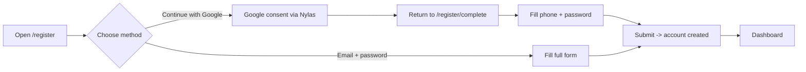
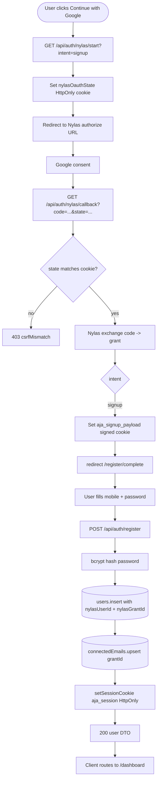

# Feature Development Plan — Signup Flow using Nylas + Google

## Source studied (Rule 12)

- [docs/Next_Phase1.docx](../docs/Next_Phase1.docx) — high-level architecture; Auth + Nylas modules in scope.
- [docs/Next_Phase2.docx](../docs/Next_Phase2.docx) § Task 1 — Signup Flow using Nylas + Google (feature requirements verbatim).
- [AI_Job_Application_Agent_Documentation.docx](../AI_Job_Application_Agent_Documentation.docx) — Authentication Module overview.

---

## Step 1 — What is the feature

**a. High-level description.** Users sign up by clicking "Continue with Google" which routes through Nylas v3 OAuth. After consent, Google returns full name + email and Nylas returns a `grantId` (the long-lived token Nylas uses to act on the user's mailbox). The form pre-fills name and email; the user fills phone, new password, and confirm-password. On submit the account is created and a session cookie is set.

**b. Source citation (docs/Next_Phase2.docx § Task 1):**
> Signup using Google via Nylas · Store Nylas User ID · Store Grant ID · Auto-fill Full Name + Email · User manually fills Phone Number, New Password, Confirm Password · Validate password match · Save user data in database.

**c. Status: Partial.** Email + password signup is built ([src/app/api/auth/register/route.ts](../src/app/api/auth/register/route.ts) + [src/app/(auth)/register/page.tsx](../src/app/(auth)/register/page.tsx)). Nylas Google signup is NOT wired — Nylas OAuth currently runs from Settings to connect an inbox to an already-signed-in user ([src/app/api/nylas/auth/route.ts](../src/app/api/nylas/auth/route.ts)). This plan covers wiring Nylas as a signup entry point.

---

## Step 2 — Pages

| Page                   | Path                                                                                | Status                  | Server/Client | Triad |
|------------------------|-------------------------------------------------------------------------------------|-------------------------|---------------|-------|
| Register               | [src/app/(auth)/register/page.tsx](../src/app/(auth)/register/page.tsx)             | EXISTING (modify)       | Server shell  | ✓     |
| Register completion    | `src/app/(auth)/register/complete/page.tsx`                                          | NEW                     | Server shell  | ✓     |

- **Register (modify)** — add a "Continue with Google" button above the email/password form. Button hits `GET /api/auth/nylas/start?intent=signup` and Nylas redirects to Google.
- **Register completion (new)** — landing page after Nylas callback when `intent=signup`. Pre-fills `fullName` + `email` from query/cookie state, asks user for `mobile` + `password` + `confirmPassword`, then POSTs to `/api/auth/register` and routes to `/dashboard`.

### Page → docs mapping

| Page                | Source doc                  | Section / task        | Verbatim copy to use                                                                                  |
|---------------------|-----------------------------|-----------------------|-------------------------------------------------------------------------------------------------------|
| Register            | docs/Next_Phase2.docx       | Task 1                | "Signup using Google via Nylas", "Full Name", "Email", "Phone Number", "New Password", "Confirm Password" |
| Register completion | docs/Next_Phase2.docx       | Task 1                | "Validate password match"                                                                              |

---

## Step 3 — User Journey



---

## Step 4 — Database schema

> Reminder — Rule 1: every Mongoose path is camelCase.

**a. New models** — none.

**b. Modifications to existing models:**

[src/server/models/User.ts](../src/server/models/User.ts) — add optional fields:

| Field         | Type   | Constraints                       | Purpose                                                            |
|---------------|--------|-----------------------------------|--------------------------------------------------------------------|
| nylasUserId   | string | optional, sparse index            | Nylas-issued user id (Rule 12: required by docs § Task 1).         |
| nylasGrantId  | string | optional                          | Long-lived grant for sending email (one user → one primary grant). |
| signupMethod  | string | enum `["password","nylasGoogle"]` | Audit which path created the account.                              |

[src/server/models/ConnectedEmail.ts](../src/server/models/ConnectedEmail.ts) already stores `grantId` + `provider` per user (unique on `userId`). When the signup grant is also the primary connected inbox, write the same `grantId` here too. No schema change needed.

**c. Refs** — none added.

**d. Indexes** — `users.nylasUserId` sparse unique (so multiple null is allowed).

**e. Other constraints** — `passwordHash` becomes `required: false` ONLY for `signupMethod === "nylasGoogle"`. Use a custom Mongoose validator. If the user never sets a password, the login page must hide the password field for that email and route to "Continue with Google" instead — see [plan/02-login-system.md](02-login-system.md).

**f. Migration plan** — additive; Mongoose backfills `null` for the new fields on existing docs. No script needed.

---

## Step 5 — Auth guard / cross-cutting identification

**a. New guards** — none.

**b. Existing guards:**

- [src/server/auth/session.ts](../src/server/auth/session.ts) `setSessionCookie(payload)` — reused after registration to log the user in.
- [src/server/auth/jwt.ts](../src/server/auth/jwt.ts) `signSession(...)` — reused.

**c. Application order** — the new `/api/auth/nylas/callback` route:
1. Validate `state` query against the cookie-stored `nylasOauthState` (CSRF).
2. Exchange code for grant via Nylas SDK.
3. Decide intent (`signup` vs `connectInbox`).
4. For `signup`: write a short-lived signed cookie `aja_signup_payload` carrying `{ fullName, email, nylasUserId, nylasGrantId }` and redirect to `/register/complete`.

**d. Cross-cutting** — add a single-use, signed `nylasOauthState` cookie (HttpOnly, 10 min TTL) to prevent CSRF on the OAuth round-trip. Implemented inline in the start route handler.

---

## Step 6 — Routes

**a. Frontend routes**

```
/register              — "Create account"                    [public]   EXISTING (modify) [src/app/(auth)/register/page.tsx]
/register/complete     — "Finish signing up"                  [public]   NEW
```

**b. API routes**

```
GET    /api/auth/nylas/start          — Begin Nylas OAuth (intent=signup|connect)  [public]   NEW
GET    /api/auth/nylas/callback       — Handle Nylas OAuth callback                [public]   NEW
POST   /api/auth/register             — Create user + log in                       [public]   EXISTING (modify)
```

All NEW backend route files declare `export const runtime = "nodejs"` (Rule 11).

---

## Step 7 — Components

**a. New components**

| Component                                          | Scope        | Purpose                                                                |
|----------------------------------------------------|--------------|------------------------------------------------------------------------|
| `src/app/(auth)/register/_components/SignupMethodChoice.tsx` | Single-page | Tabs: "Google" / "Email" above the form.                              |
| `src/app/(auth)/register/complete/_components/CompleteForm.tsx` | Single-page | The phone + password completion form.                                  |

**b. Existing components** — reuse [src/components/GoogleAuthButton.tsx](../src/components/GoogleAuthButton.tsx), [src/components/Input.tsx](../src/components/Input.tsx), [src/components/Button.tsx](../src/components/Button.tsx), [src/components/FormMessage.tsx](../src/components/FormMessage.tsx), [src/components/AuthShell.tsx](../src/components/AuthShell.tsx).

---

## Step 8 — Third-party integrations

```
### Nylas v3 (extending existing usage)
- OAuth round-trip for signup (already used for inbox-connect from Settings)
- Env vars: NYLAS_API_KEY, NYLAS_CLIENT_ID, NYLAS_API_URI, APP_URL (already in [src/lib/env.ts](../src/lib/env.ts))
- Quota: free tier is fine for OAuth; throttle if abuse detected
```

No new env vars. No new SDKs.

---

## Step 9 — End-to-end Mermaid flow



---

## Step 10 — Route handlers and per-route logic

### GET /api/auth/nylas/start (`src/app/api/auth/nylas/start/route.ts`, NEW)
1. Parse query `?intent=signup|connect` (default `connect`).
2. `requireNylasConfigured()` from [src/server/services/nylas/nylasClient.ts](../src/server/services/nylas/nylasClient.ts).
3. Generate random `state` (crypto.randomBytes 32 → base64url).
4. Set HttpOnly cookie `nylasOauthState={ state, intent }` (10 min, signed).
5. Build authorize URL via `nylas.auth.urlForOAuth2({ clientId, redirectUri, loginHint? })`.
6. `Response.redirect(authorizeUrl, 302)`.

Error paths: missing Nylas env → `fail("nylasNotConfigured", 503)`.

### GET /api/auth/nylas/callback (`src/app/api/auth/nylas/callback/route.ts`, NEW)
1. Parse `?code` and `?state`.
2. Read `nylasOauthState` cookie; if missing or `state` mismatch → `fail("csrfMismatch", 403)`.
3. `nylas.auth.exchangeCodeForToken({ code, clientId, clientSecret?, redirectUri })`.
4. From the grant: `grantId`, `grant.email`, `grant.provider`, optional Nylas user info.
5. Branch on `intent`:
   - `signup`: set short-lived signed cookie `aja_signup_payload = { fullName, email, nylasUserId, nylasGrantId, provider }` (HttpOnly, 10 min) and redirect to `/register/complete`.
   - `connect`: existing behavior in [src/app/api/nylas/callback/route.ts](../src/app/api/nylas/callback/route.ts) — keep as is, just route share state cookie.
6. Errors: Nylas exchange failure → `fail("nylasExchangeFailed", 502)`.

### POST /api/auth/register (`src/app/api/auth/register/route.ts`, MODIFY)
1. Parse body with zod schema `{ email, password, confirmPassword, fullName?, mobile?, signupPayloadToken? }` (camelCase).
2. If `signupPayloadToken` present: verify the `aja_signup_payload` cookie; pull `fullName`, `email`, `nylasUserId`, `nylasGrantId`.
3. Validate `password === confirmPassword` → `fail("passwordsDoNotMatch", 400)`.
4. `dbConnect()`; check `User.findOne({ email })` → if exists `fail("emailExists", 409)`.
5. `bcrypt.hash(password, 12)`.
6. `User.create({ email, fullName, mobile, passwordHash, nylasUserId, nylasGrantId, signupMethod: payload ? "nylasGoogle" : "password" })`.
7. If `nylasGrantId`: `ConnectedEmail.findOneAndUpdate({ userId }, { grantId, provider, emailAddress: email, syncStatus: "active", connectedAt: new Date() }, { upsert: true })`.
8. `setSessionCookie({ userId, email })` (server-set HttpOnly, Rule 3).
9. Clear `aja_signup_payload` cookie.
10. Return `ok(userDto)` from [src/server/serializers.ts](../src/server/serializers.ts).

Error paths: zod failure → `fail("invalidInput", 400)`; bcrypt/DB exception → `handleError(err)`.

---

## Step 11 — Folder structure

```
src/app/(auth)/register/
├── page.tsx                          # MODIFIED — add <SignupMethodChoice/> above form
├── error.tsx                         # EXISTING — uses <ErrorState/>
├── loading.tsx                       # EXISTING — uses <PageLoading/>
├── _components/
│   ├── RegisterForm.tsx              # EXISTING — add `signupPayload` prop (optional)
│   ├── SignupMethodChoice.tsx        # NEW
│   └── SignupMethodChoice.module.css # NEW
└── complete/
    ├── page.tsx                      # NEW (≤ 30 LOC)
    ├── error.tsx                     # NEW (3-line shell)
    ├── loading.tsx                   # NEW (3-line shell)
    └── _components/
        ├── CompleteForm.tsx          # NEW
        └── CompleteForm.module.css   # NEW

src/app/api/auth/nylas/start/route.ts     # NEW
src/app/api/auth/nylas/callback/route.ts  # NEW
src/app/api/auth/register/route.ts        # MODIFIED

src/server/services/nylas/nylasClient.ts   # EXISTING — reuse
src/server/services/auth/createUser.ts     # NEW service function (split logic out of route)
src/server/models/User.ts                  # MODIFIED — add nylasUserId, nylasGrantId, signupMethod
```

### Delta table

| #  | Path                                                      | NEW / MOD | Purpose                                       | LOC |
|----|-----------------------------------------------------------|-----------|-----------------------------------------------|-----|
| F1 | src/app/(auth)/register/page.tsx                          | MOD       | Add SignupMethodChoice tabs                    | +10 |
| F2 | src/app/(auth)/register/_components/SignupMethodChoice.tsx| NEW       | Google/email tabs                              | 60  |
| F3 | src/app/(auth)/register/complete/page.tsx                 | NEW       | Thin shell                                     | 20  |
| F4 | src/app/(auth)/register/complete/error.tsx                | NEW       | 3-line shell                                   | 3   |
| F5 | src/app/(auth)/register/complete/loading.tsx              | NEW       | 3-line shell                                   | 3   |
| F6 | src/app/(auth)/register/complete/_components/CompleteForm.tsx | NEW   | Phone + password form                          | 140 |
| B1 | src/app/api/auth/nylas/start/route.ts                     | NEW       | OAuth init                                     | 40  |
| B2 | src/app/api/auth/nylas/callback/route.ts                  | NEW       | OAuth callback (refactor existing per-intent)  | 80  |
| B3 | src/app/api/auth/register/route.ts                        | MOD       | Handle signupPayloadToken branch               | +30 |
| B4 | src/server/services/auth/createUser.ts                    | NEW       | Insert user + ConnectedEmail upsert            | 70  |
| B5 | src/server/models/User.ts                                 | MOD       | Add nylasUserId, nylasGrantId, signupMethod    | +12 |

---

## Open questions

1. Do we mark the user as "email verified" automatically when the signup grant comes from Google (since Google verified the address)? Recommended: yes, add `emailVerifiedAt: Date` to `User`.
2. If the user starts Nylas Google signup but already has an account with that email created via password, do we **merge** (attach the grant) or **block** (force them to log in first)? Default proposal: block with `fail("emailExists", 409)` and link to `/login`.
