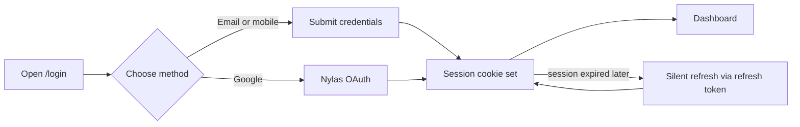
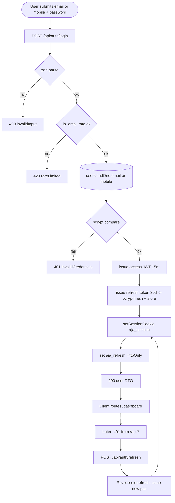

# Feature Development Plan — Login System

## Source studied (Rule 12)

- [docs/Next_Phase1.docx](../docs/Next_Phase1.docx) — auth module + JWT/refresh-token security.
- [docs/Next_Phase2.docx](../docs/Next_Phase2.docx) § Task 2 — Login System.
- [AI_Job_Application_Agent_Documentation.docx](../AI_Job_Application_Agent_Documentation.docx) — Authentication Module.

---

## Step 1 — What is the feature

**a.** Users sign in with email + password OR mobile + password, OR by clicking "Continue with Google" (Nylas). On success a session cookie is set and they land on `/dashboard`.

**b. Source citation (docs/Next_Phase2.docx § Task 2):**
> Email + Password · Mobile Number + Password · Google Login via Nylas · JWT Authentication · Refresh Token System · Session Management · Secure Login Validation.

**c. Status: Partial.** Email + password login is built ([src/app/api/auth/login/route.ts](../src/app/api/auth/login/route.ts)). Mobile+password is supported by the existing route (it tries both fields). Google login via Nylas — depends on [plan/01-signup-nylas-google.md](01-signup-nylas-google.md). **Refresh token rotation is NOT implemented** — the JWT in `aja_session` is the only token and expires after 7 days.

---

## Step 2 — Pages

| Page  | Path                                                          | Status | Triad |
|-------|---------------------------------------------------------------|--------|-------|
| Login | [src/app/(auth)/login/page.tsx](../src/app/(auth)/login/page.tsx) | EXISTING (modify) | ✓ |

### Page → docs mapping

| Page  | Source doc            | Section | Verbatim copy                                                                 |
|-------|-----------------------|---------|-------------------------------------------------------------------------------|
| Login | docs/Next_Phase2.docx | Task 2  | "Email + Password", "Mobile Number + Password", "Google Login via Nylas"      |

---

## Step 3 — User Journey



---

## Step 4 — Database schema

**a. New models:**

`src/server/models/RefreshToken.ts` (NEW)

| Field        | Type     | Constraints           | Purpose                              |
|--------------|----------|-----------------------|--------------------------------------|
| userId       | ObjectId | required, indexed     | Owner                                |
| tokenHash    | string   | required, unique      | bcrypt-hashed random token           |
| expiresAt    | Date     | required, ttl index   | Auto-expiry                          |
| revokedAt    | Date     | optional              | Soft-revoke on logout / rotation     |
| replacedBy   | string   | optional              | Audit chain when rotated             |
| ipAddress    | string   | optional              | Audit                                |
| userAgent    | string   | optional              | Audit                                |
| createdAt/updatedAt | Date | timestamps: true   | Audit                                |

**b. Modifications** — none to existing models.

**c. Refs** — `RefreshToken.userId → User._id`.

**d. Indexes** — `userId`, `tokenHash` (unique), `expiresAt` (TTL with `expireAfterSeconds: 0`).

**e. Other constraints** — `tokenHash` stored bcrypt-hashed (Rule 13 spirit; never store raw refresh tokens).

**f. Migration plan** — new collection; no script needed.

---

## Step 5 — Auth guard / cross-cutting identification

**a. New guards** — none flat-file; behavior added inside existing handlers.

**b. Existing guards:**

- [src/server/auth/jwt.ts](../src/server/auth/jwt.ts) `signSession` / `verifySession` — reused.
- [src/server/auth/session.ts](../src/server/auth/session.ts) `setSessionCookie` / `clearSessionCookie` / `getSession` — reused; **shorten access token TTL to 15 min** when refresh-token rotation is enabled.
- [src/server/auth/requireUser.ts](../src/server/auth/requireUser.ts) — reused.

**c. Application order** — login route: `zod parse → dbConnect → findUser → bcrypt.compare → issueAccessToken (15 min) → issueRefreshToken (30 d) → setSessionCookie aja_session + setRefreshCookie aja_refresh (both HttpOnly, server-set per Rule 3) → ok(userDto)`.

**d. Cross-cutting** — per-IP login rate-limit (5 failed/min). Implemented inline using a Mongo TTL collection `loginAttempts` keyed on `ipAddress + email`.

---

## Step 6 — Routes

**a. Frontend routes**

```
/login              — "Sign in"                              [public]   EXISTING (modify) [src/app/(auth)/login/page.tsx]
```

**b. API routes**

```
POST   /api/auth/login          — Login with email or mobile + password   [public]                EXISTING (modify)
POST   /api/auth/logout         — Revoke session + refresh token          [protected: getSession] EXISTING (modify)
POST   /api/auth/refresh        — Rotate refresh token, issue new access  [public]                NEW
GET    /api/auth/me             — Get current user                        [protected: getSession] EXISTING
```

---

## Step 7 — Components

**a. New components**

| Component                                                   | Scope        | Purpose                                |
|-------------------------------------------------------------|--------------|----------------------------------------|
| `src/app/(auth)/login/_components/LoginMethodChoice.tsx`    | Single-page  | Email vs mobile tab switch (re-use icons). |
| `src/components/SilentRefresh.tsx`                          | Shared       | Background effect that hits `/api/auth/refresh` on 401. |

**b. Existing components** — reuse [src/components/GoogleAuthButton.tsx](../src/components/GoogleAuthButton.tsx), [src/components/Input.tsx](../src/components/Input.tsx), [src/components/Button.tsx](../src/components/Button.tsx), [src/components/AuthShell.tsx](../src/components/AuthShell.tsx).

`SilentRefresh` is global because it's mounted in [src/components/AppShell.tsx](../src/components/AppShell.tsx) (used by every protected page).

---

## Step 8 — Third-party integrations

```
### bcryptjs (existing)
- bcrypt.compare for password check
- bcrypt.hash for refresh-token persistence

### jsonwebtoken (existing)
- HS256 signed access token (15 min) — short-lived

### Nylas v3 (extending — see plan/01)
- "Continue with Google" reuses /api/auth/nylas/start and /api/auth/nylas/callback with intent=login
```

Env vars: no new ones — `JWT_SECRET` already validated in [src/lib/env.ts](../src/lib/env.ts).

---

## Step 9 — End-to-end Mermaid flow



---

## Step 10 — Route handlers and per-route logic

### POST /api/auth/login ([src/app/api/auth/login/route.ts](../src/app/api/auth/login/route.ts), MODIFY)
1. zod parse `{ email?, mobile?, password }` — exactly one of email/mobile required.
2. Check `loginAttempts` Mongo TTL collection by `ipAddress + identifier`; bail if > 5 in last minute.
3. `dbConnect()`. `User.findOne({ $or: [{ email }, { mobile }] })`.
4. `bcrypt.compare(password, user.passwordHash)`.
5. Issue access JWT (15 min); issue refresh token (random 64 bytes → bcrypt hash → save `RefreshToken`).
6. `setSessionCookie({ userId, email })` (15 min); `setRefreshCookie(rawRefresh)` (30 d) — both HttpOnly server-set per Rule 3.
7. Return `ok(userDto)`.

Error paths:
- zod fail → `fail("invalidInput", 400)`
- rate limit → `fail("rateLimited", 429)`
- bad credentials → `fail("invalidCredentials", 401)` (also increment loginAttempts)
- exception → `handleError(err)`

### POST /api/auth/refresh (NEW)
1. Read `aja_refresh` cookie; if missing → `fail("noRefresh", 401)`.
2. `RefreshToken.find({ revokedAt: null, expiresAt: { $gt: now } })` — narrow with bcrypt match (small set per user). If none → `fail("invalidRefresh", 401)`.
3. Rotate: set `revokedAt = now`, `replacedBy = newId`; issue new pair.
4. `setSessionCookie` + `setRefreshCookie` (server-set).
5. `ok({ rotated: true })`.

### POST /api/auth/logout ([src/app/api/auth/logout/route.ts](../src/app/api/auth/logout/route.ts), MODIFY)
1. `clearSessionCookie()` (existing).
2. Also revoke current refresh: `RefreshToken.updateOne({ ... }, { revokedAt: now })`.
3. Clear `aja_refresh` cookie.
4. `ok({ ok: true })`.

---

## Step 11 — Folder structure

```
src/app/(auth)/login/
├── page.tsx                          # MODIFIED — add LoginMethodChoice + Google button
├── error.tsx                         # EXISTING
├── loading.tsx                       # EXISTING
└── _components/
    ├── LoginForm.tsx                 # EXISTING — extend with identifier kind prop
    ├── LoginMethodChoice.tsx         # NEW
    └── LoginMethodChoice.module.css  # NEW

src/components/SilentRefresh.tsx      # NEW — wired into AppShell.tsx

src/app/api/auth/login/route.ts       # MODIFIED
src/app/api/auth/refresh/route.ts     # NEW
src/app/api/auth/logout/route.ts      # MODIFIED

src/server/models/RefreshToken.ts     # NEW
src/server/services/auth/issueTokens.ts          # NEW — encapsulate access+refresh issuance
src/server/services/auth/rotateRefresh.ts        # NEW
src/server/services/auth/recordLoginAttempt.ts   # NEW — rate-limit helper

src/server/auth/session.ts            # MODIFIED — shorten access TTL to 15 min; add setRefreshCookie/clearRefreshCookie
src/server/auth/jwt.ts                # MODIFIED — TTL constants
```

### Delta table

| #  | Path                                                       | NEW / MOD | Purpose                          | LOC |
|----|------------------------------------------------------------|-----------|----------------------------------|-----|
| F1 | src/app/(auth)/login/page.tsx                              | MOD       | Wire method choice               | +6  |
| F2 | src/app/(auth)/login/_components/LoginMethodChoice.tsx     | NEW       | Email/mobile tabs                | 50  |
| F3 | src/components/SilentRefresh.tsx                           | NEW       | 401 → /api/auth/refresh effect   | 40  |
| B1 | src/app/api/auth/login/route.ts                            | MOD       | Issue refresh + rate-limit       | +40 |
| B2 | src/app/api/auth/refresh/route.ts                          | NEW       | Refresh rotation                 | 50  |
| B3 | src/app/api/auth/logout/route.ts                           | MOD       | Revoke refresh                   | +15 |
| B4 | src/server/models/RefreshToken.ts                          | NEW       | Refresh-token storage            | 50  |
| B5 | src/server/services/auth/issueTokens.ts                    | NEW       | Access + refresh issuance        | 60  |
| B6 | src/server/services/auth/rotateRefresh.ts                  | NEW       | Rotation logic                   | 50  |
| B7 | src/server/services/auth/recordLoginAttempt.ts             | NEW       | Per-IP rate-limit                | 30  |
| B8 | src/server/auth/session.ts                                 | MOD       | setRefreshCookie/clearRefreshCookie | +30 |
| B9 | src/server/auth/jwt.ts                                     | MOD       | TTL constants                    | +5  |

---

## Open questions

1. Should refresh-token rotation invalidate ALL of a user's sessions on theft detection (token reuse on a revoked id)? Recommended: yes — revoke chain on reuse.
2. Should we add "Remember me" (skip refresh-token, single 30-day access JWT)? Default proposal: no — refresh rotation is strictly better.
