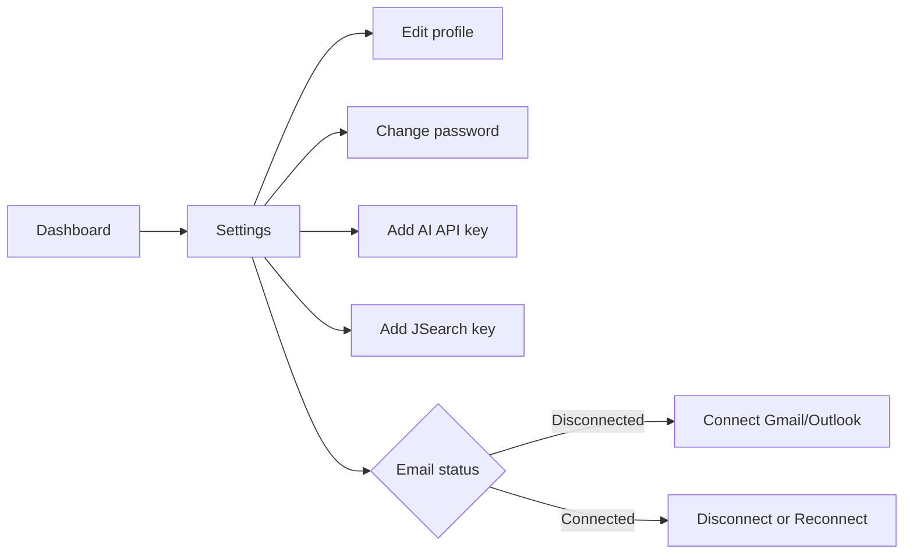
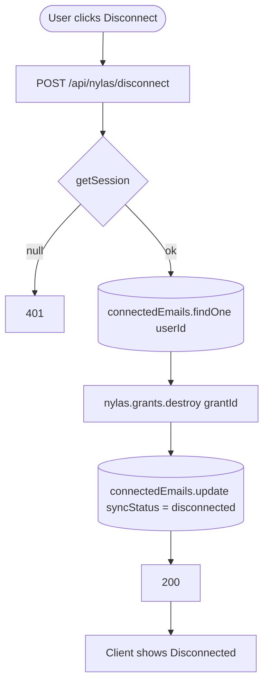

# Feature Development Plan — Settings Page

## Source studied (Rule 12)

- [docs/Next_Phase1.docx](../docs/Next_Phase1.docx) — User Profile Module + Notification module.
- [docs/Next_Phase2.docx](../docs/Next_Phase2.docx) § Task 3 — Settings Page.

---

## Step 1 — What is the feature

**a.** The Settings page lets the user manage profile (name, email, mobile), change password, manage AI provider API keys, manage the JSearch API key, and connect/disconnect their inbox (Gmail / Outlook via Nylas).

**b. Source citation (docs/Next_Phase2.docx § Task 3):**
> Profile Settings — Update Name, Email, Mobile, Change Password · Nylas Email Connection — Show Connected/Disconnected Status, Connect Gmail, Connect Outlook, Reconnect Account, Disconnect Email · Store Grant ID, Provider, Sync Status, Connected Time.

**c. Status: Built (with small gaps).** [src/app/settings/page.tsx](../src/app/settings/page.tsx) + [_components/](../src/app/settings/_components/) ship the page (ProfileSection, PasswordForm, AiProvidersSection, JsearchSection, ConnectedEmailSection). Gaps: (1) explicit "Connect Outlook" CTA — current connect button uses the generic Nylas authorize URL and Microsoft must be configured upstream; (2) "Reconnect Account" UX after `syncStatus="expired"` is implicit; (3) `connectedAt` is stored but not surfaced.

---

## Step 2 — Pages

| Page     | Path                                                            | Status | Triad |
|----------|-----------------------------------------------------------------|--------|-------|
| Settings | [src/app/settings/page.tsx](../src/app/settings/page.tsx)        | EXISTING (modify) | ✓ |

### Page → docs mapping

| Page     | Source doc            | Section | Verbatim copy                                                                                |
|----------|-----------------------|---------|----------------------------------------------------------------------------------------------|
| Settings | docs/Next_Phase2.docx | Task 3  | "Update Name", "Update Email", "Update Mobile Number", "Change Password", "Connect Gmail", "Connect Outlook", "Reconnect Account", "Disconnect Email" |

---

## Step 3 — User Journey



---

## Step 4 — Database schema

**a. New models** — none.

**b. Modifications** — [src/server/models/ConnectedEmail.ts](../src/server/models/ConnectedEmail.ts):

| Field         | Type   | Constraints                                | Purpose                            |
|---------------|--------|--------------------------------------------|------------------------------------|
| reconnectHint | string | optional, enum `["grantExpired","scopeRevoked",null]` | Drives reconnect UI message. |

`connectedAt` and `lastSyncAt` already exist — just surface them in the UI.

**c. Refs** — unchanged.

**d. Indexes** — unchanged.

**e. Other constraints** — unchanged.

**f. Migration plan** — additive.

---

## Step 5 — Auth guard / cross-cutting identification

**a. New guards** — none.

**b. Existing guards** — `await requireUser()` in [src/app/settings/page.tsx](../src/app/settings/page.tsx); `getSession()` in every API route.

**c. Application order** — page-level: `requireUser()` → load DTOs server-side → render.

**d. Cross-cutting** — when the user clicks Disconnect, the route handler also calls `nylas.grants.destroy({ grantId })` (best-effort). Failure is logged and ignored.

---

## Step 6 — Routes

**a. Frontend routes**

```
/settings                         — "Settings"   [protected: requireUser]   EXISTING
```

**b. API routes**

```
GET    /api/user                            — Get my profile          [protected]  EXISTING
PUT    /api/user                            — Update name/email/mobile [protected]  EXISTING
POST   /api/user/password                   — Change password         [protected]  EXISTING
GET    /api/ai-providers                    — List provider keys      [protected]  EXISTING
POST   /api/ai-providers/[provider]         — Add key                 [protected]  EXISTING
DELETE /api/ai-providers/[provider]         — Remove key              [protected]  EXISTING
POST   /api/ai-providers/[provider]/activate— Activate provider       [protected]  EXISTING
GET    /api/jsearch                         — Get JSearch status      [protected]  EXISTING (verify shape)
POST   /api/jsearch                         — Set JSearch key         [protected]  EXISTING
DELETE /api/jsearch                         — Remove JSearch key      [protected]  NEW
GET    /api/nylas                           — Get connection status   [protected]  EXISTING
GET    /api/nylas/auth                      — Initiate Nylas OAuth    [protected]  EXISTING (reused; add ?provider=outlook hint)
POST   /api/nylas/disconnect                — Disconnect inbox        [protected]  NEW
```

---

## Step 7 — Components

**a. New components**

| Component                                                  | Scope        | Purpose                                                    |
|------------------------------------------------------------|--------------|------------------------------------------------------------|
| `src/app/settings/_components/ReconnectBanner.tsx`         | Single-page  | Shows when `syncStatus === "expired"`; one-click reconnect. |

**b. Existing components — audit**

| Component                                                                                                       | Action          |
|------------------------------------------------------------------------------------------------------------------|-----------------|
| [ProfileSection.tsx](../src/app/settings/_components/ProfileSection.tsx)                                         | Modify — show `connectedAt` & last-edited timestamp |
| [PasswordForm.tsx](../src/app/settings/_components/PasswordForm.tsx)                                             | Reuse as-is    |
| [AiProvidersSection.tsx](../src/app/settings/_components/AiProvidersSection.tsx) + ApiKeySetForm / ApiKeyRow      | Reuse as-is    |
| [JsearchSection.tsx](../src/app/settings/_components/JsearchSection.tsx)                                         | Modify — add "Remove key" button → DELETE /api/jsearch |
| [ConnectedEmailSection.tsx](../src/app/settings/_components/ConnectedEmailSection.tsx)                           | Modify — split "Connect" into Gmail/Outlook; surface `connectedAt`; pipe `reconnectHint` into `<ReconnectBanner/>` |

---

## Step 8 — Third-party integrations

```
### Nylas v3 (existing)
- Reused for connect/disconnect/reconnect
- ?provider=outlook hint added to /api/nylas/auth (passes loginHint=outlook to Nylas authorize URL)
```

No new env vars.

---

## Step 9 — End-to-end Mermaid flow



---

## Step 10 — Route handlers and per-route logic

### PUT /api/user ([src/app/api/user/route.ts](../src/app/api/user/route.ts), EXISTING)
1. `getSession()` → 401 if null.
2. zod parse `{ fullName?, email?, mobile? }`.
3. If `email` change: ensure unique → `fail("emailExists", 409)`.
4. `User.findByIdAndUpdate(userId, $set)`.
5. `ok(userDto)`.

### POST /api/user/password ([src/app/api/user/password/route.ts](../src/app/api/user/password/route.ts), EXISTING)
1. zod parse `{ currentPassword, newPassword, confirmNewPassword }`.
2. Compare current vs stored hash → 401 if wrong.
3. `newPassword === confirmNewPassword`.
4. Hash + save. `ok({ updated: true })`.

### POST /api/nylas/disconnect (NEW)
1. `getSession()` → 401.
2. `dbConnect()`. Load `ConnectedEmail` for user.
3. Try `nylas.grants.destroy({ grantId })` — log + swallow errors.
4. `ConnectedEmail.updateOne({ userId }, { syncStatus: "disconnected" })`.
5. `ok({ disconnected: true })`.

### DELETE /api/jsearch (NEW)
1. `getSession()` → 401.
2. `JsearchKey.deleteOne({ userId })`.
3. `ok({ removed: true })`.

All others (AI providers etc.) keep existing shape.

---

## Step 11 — Folder structure

```
src/app/settings/
├── page.tsx                                # EXISTING (no change)
├── error.tsx                               # EXISTING
├── loading.tsx                             # EXISTING
└── _components/
    ├── SettingsView.tsx                    # MODIFIED — wire <ReconnectBanner/>
    ├── ProfileSection.tsx                  # MODIFIED — show timestamps
    ├── PasswordForm.tsx                    # EXISTING
    ├── AiProvidersSection.tsx              # EXISTING
    ├── ApiKeySetForm.tsx                   # EXISTING
    ├── ApiKeyRow.tsx                       # EXISTING
    ├── JsearchSection.tsx                  # MODIFIED — add Remove button
    ├── ConnectedEmailSection.tsx           # MODIFIED — Gmail/Outlook + reconnect
    ├── ReconnectBanner.tsx                 # NEW
    ├── ReconnectBanner.module.css          # NEW
    └── UsageCard.tsx                       # EXISTING

src/app/api/nylas/disconnect/route.ts       # NEW
src/app/api/jsearch/route.ts                # MODIFIED — add DELETE

src/server/services/nylas/disconnectGrant.ts # NEW
src/server/models/ConnectedEmail.ts          # MODIFIED — reconnectHint field
```

### Delta table

| #  | Path                                                  | NEW / MOD | Purpose                       | LOC |
|----|-------------------------------------------------------|-----------|-------------------------------|-----|
| F1 | _components/ReconnectBanner.tsx                       | NEW       | Reconnect alert               | 50  |
| F2 | _components/ConnectedEmailSection.tsx                 | MOD       | Gmail/Outlook split + reconnect | +40 |
| F3 | _components/JsearchSection.tsx                        | MOD       | Remove key                    | +20 |
| F4 | _components/ProfileSection.tsx                        | MOD       | Show timestamps               | +15 |
| B1 | src/app/api/nylas/disconnect/route.ts                 | NEW       | Disconnect handler            | 40  |
| B2 | src/app/api/jsearch/route.ts                          | MOD       | DELETE handler                | +25 |
| B3 | src/server/services/nylas/disconnectGrant.ts          | NEW       | Calls Nylas grants.destroy    | 40  |
| B4 | src/server/models/ConnectedEmail.ts                   | MOD       | reconnectHint enum field      | +5  |

---

## Open questions

1. Should email change require re-verification (send code to new address)? Recommended: yes, but defer to Phase 4.
2. Mobile uniqueness — current schema has `unique sparse` on mobile. If a user clears their mobile, the index allows null. Confirm desired behavior.
