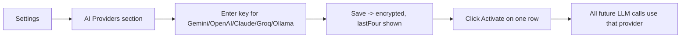
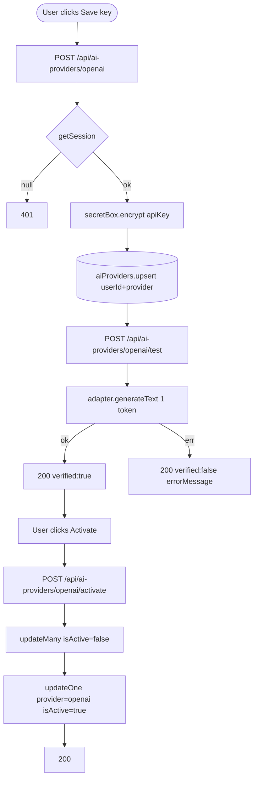

# Feature Development Plan — AI Agent API Key Management

## Source studied (Rule 12)

- [docs/Next_Phase1.docx](../docs/Next_Phase1.docx) — AI Matching Engine; multi-provider.
- [docs/Next_Phase2.docx](../docs/Next_Phase2.docx) § Task 4 — AI Agent API Key Management.

---

## Step 1 — What is the feature

**a.** Users add their own LLM provider API key (Gemini, OpenAI, Claude, Groq, Ollama). Keys are AES-256-GCM encrypted at rest. The user picks one **active** provider; every LLM call in the app routes through it.

**b. Source citation (docs/Next_Phase2.docx § Task 4):**
> Add AI API Key · Edit AI API Key · Delete AI API Key · Activate/Deactivate AI Provider · Gemini · OpenAI · Claude · Groq · Ollama (Optional) · Encrypt API Keys · Backend-only Access · User-wise AI Configuration.

**c. Status: Built (Ollama is the gap).** All five providers exist in the schema enum; adapters for Gemini, OpenAI, Claude, Groq are wired in [src/server/services/llm/adapters/](../src/server/services/llm/adapters/). [src/server/services/llm/resolver.ts](../src/server/services/llm/resolver.ts) picks the active one (fallback Gemini). The Settings UI ([AiProvidersSection.tsx](../src/app/settings/_components/AiProvidersSection.tsx)) covers add/delete/activate. Edit-in-place reuses the same Add endpoint with an upsert.

---

## Step 2 — Pages

No new pages. UI lives inside Settings — see [plan/03-settings-page.md](03-settings-page.md).

### Page → docs mapping

N/A — covered under Settings (Task 3).

---

## Step 3 — User Journey



---

## Step 4 — Database schema

**a. New models** — none.

**b. Modifications** — [src/server/models/AiProvider.ts](../src/server/models/AiProvider.ts) is already correct:

| Field      | Type            | Constraints                                    | Purpose |
|------------|-----------------|------------------------------------------------|---------|
| userId     | ObjectId        | required, indexed                              | Owner   |
| provider   | string          | enum gemini\|openai\|claude\|groq\|ollama      |         |
| encrypted  | Sealed          | { iv, ciphertext, tag } sub-doc                | AES-GCM |
| lastFour   | string          | 4 chars (UI display)                           |         |
| isActive   | boolean         | default false                                  |         |
| createdAt / updatedAt | Date | timestamps                                     |         |

For **Ollama** specifically: the "key" can be the base URL (e.g. `http://localhost:11434`) since Ollama doesn't require auth — still store via `secretBox.encrypt` so the storage shape is uniform.

**c. Refs** — unchanged.

**d. Indexes** — unique compound `(userId, provider)` already declared.

**e. Other constraints** — exactly one `isActive = true` per user. Enforce in service layer (`activateProvider` runs `updateMany({ userId }, { isActive: false })` then sets the target).

**f. Migration plan** — N/A.

---

## Step 5 — Auth guard / cross-cutting identification

**a. New guards** — none.

**b. Existing guards** — `getSession()` in every route.

**c. Application order** — `getSession → dbConnect → service call → ok/fail`.

**d. Cross-cutting** — never log a key in plaintext; never return `encrypted` or the raw key in any response — only `provider`, `lastFour`, `isActive`, `createdAt` (Rule 13 spirit).

---

## Step 6 — Routes

**a. Frontend routes** — none new (Settings page only).

**b. API routes**

```
GET    /api/ai-providers                       — List my providers          [protected]  EXISTING
POST   /api/ai-providers/[provider]            — Add or update (upsert)     [protected]  EXISTING
DELETE /api/ai-providers/[provider]            — Remove                     [protected]  EXISTING
POST   /api/ai-providers/[provider]/activate   — Set active                 [protected]  EXISTING
POST   /api/ai-providers/[provider]/test       — Probe the key              [protected]  NEW
```

The `/test` route is new — it exercises the adapter with a 1-token prompt to verify the key works. Recommended for UX: after Add, auto-run `/test`.

---

## Step 7 — Components

**a. New components** — none required.

**b. Existing components** — reuse / minor modify:

| Component                                                                          | Action |
|------------------------------------------------------------------------------------|--------|
| [AiProvidersSection.tsx](../src/app/settings/_components/AiProvidersSection.tsx) | Modify — call `/test` after add; show "Verified" badge |
| [ApiKeySetForm.tsx](../src/app/settings/_components/ApiKeySetForm.tsx)           | Reuse |
| [ApiKeyRow.tsx](../src/app/settings/_components/ApiKeyRow.tsx)                   | Modify — show "Verified" / "Untested" pill |

---

## Step 8 — Third-party integrations

```
### @google/genai (existing)
- Gemini adapter

### openai (existing)
- OpenAI and Groq (Groq is OpenAI-compatible API)

### @anthropic-ai/sdk (existing)
- Claude adapter (Anthropic API)

### Ollama (NEW — adapter)
- HTTP fetch against base URL (no SDK)
- Env: none required — user supplies base URL
- Quota: local; no rate limit
```

---

## Step 9 — End-to-end Mermaid flow



---

## Step 10 — Route handlers and per-route logic

### POST /api/ai-providers/[provider] (EXISTING — verify)
1. `getSession()` → 401.
2. zod parse `{ apiKey }`; `provider` from path.
3. Validate `provider` in `AI_PROVIDER_NAMES` enum.
4. `sealed = secretBox.encrypt(apiKey)`; `lastFour = lastFour(apiKey)`.
5. `AiProvider.findOneAndUpdate({ userId, provider }, { encrypted: sealed, lastFour }, { upsert: true })`.
6. `ok({ provider, lastFour, isActive })`.

### POST /api/ai-providers/[provider]/activate (EXISTING)
1. `getSession()`.
2. `AiProvider.updateMany({ userId }, { isActive: false })`.
3. `AiProvider.updateOne({ userId, provider }, { isActive: true })`.
4. `ok({ provider, isActive: true })`.

### POST /api/ai-providers/[provider]/test (NEW)
1. `getSession()`.
2. Load `AiProvider`; decrypt key via `secretBox.decrypt(...)`.
3. `adapter = buildAdapter(provider, apiKey)`.
4. `await adapter.generateText({ system: "ping", prompt: "Respond with the single token: ok" })` (limit max-tokens to 5).
5. Catch errors → `ok({ verified: false, errorMessage: err.message })`.
6. Success → `ok({ verified: true })`.

Error paths in every route: zod fail → 400; missing key on activate → `fail("noKey", 404)`; exception → `handleError(err)`.

---

## Step 11 — Folder structure

```
src/app/settings/_components/
├── AiProvidersSection.tsx                  # MODIFIED
├── ApiKeySetForm.tsx                       # EXISTING
└── ApiKeyRow.tsx                           # MODIFIED

src/app/api/ai-providers/route.ts                          # EXISTING
src/app/api/ai-providers/[provider]/route.ts               # EXISTING
src/app/api/ai-providers/[provider]/activate/route.ts      # EXISTING
src/app/api/ai-providers/[provider]/test/route.ts          # NEW

src/server/services/llm/
├── resolver.ts                              # EXISTING
└── adapters/
    ├── geminiAdapter.ts                     # EXISTING
    ├── openaiAdapter.ts                     # EXISTING
    ├── claudeAdapter.ts                     # EXISTING
    └── ollamaAdapter.ts                     # NEW

src/server/models/AiProvider.ts              # EXISTING
src/server/crypto/secretBox.ts               # EXISTING
```

### Delta table

| #  | Path                                                        | NEW / MOD | Purpose                       | LOC |
|----|-------------------------------------------------------------|-----------|-------------------------------|-----|
| F1 | _components/AiProvidersSection.tsx                          | MOD       | Auto-test after add           | +25 |
| F2 | _components/ApiKeyRow.tsx                                   | MOD       | Verified badge                | +15 |
| B1 | src/app/api/ai-providers/[provider]/test/route.ts           | NEW       | Probe key                     | 35  |
| B2 | src/server/services/llm/adapters/ollamaAdapter.ts           | NEW       | HTTP-based Ollama adapter     | 80  |
| B3 | src/server/services/llm/resolver.ts                         | MOD       | Branch ollama → adapter       | +6  |

---

## Open questions

1. Ollama: should the "key" UI prompt be a URL field instead of a password field? Recommended: yes, dedicated `<Input type="url"/>` variant for Ollama.
2. Should we let the user set per-feature provider (e.g. Claude for cover letters, Gemini for matching)? Defer until Phase 4.
