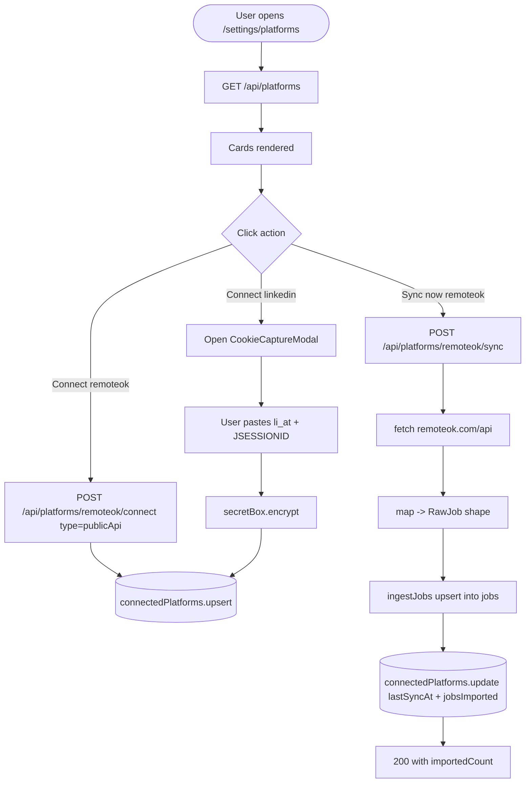

# Feature Development Plan — Connected Job Platforms

## Source studied (Rule 12)

- [docs/Next_Phase1.docx](../docs/Next_Phase1.docx) — Job Scraper Service / Engine.
- [docs/Next_Phase2.docx](../docs/Next_Phase2.docx) § Task 5 — Connected Job Platforms.

---

## Step 1 — What is the feature

**a.** Let the user connect external job platforms (LinkedIn, Naukri, We Work Remotely, Remote OK, Indeed, Workable) so the app can sync jobs from each into a unified inbox. For platforms with public job APIs (Remote OK, We Work Remotely, RemoteOK RSS) we sync directly. For session-based platforms (LinkedIn, Naukri, Indeed, Workable) we capture the user's session cookies via the browser extension and store them encrypted; backend uses them for HTTP scraping.

**b. Source citation (docs/Next_Phase2.docx § Task 5):**
> Platforms — LinkedIn · Naukri · We Work Remotely · Remote OK · Indeed · Workable · Connect Accounts · Store Session/Auth Tokens · Sync Jobs Automatically · Fetch Job Details (Job Title, Company, Salary, Skills, Location, Remote/Hybrid/Onsite, Apply Link).

**c. Status: New.** Only two providers exist in [src/server/services/jobs/providers/](../src/server/services/jobs/providers/): `seedJobProvider` (hardcoded 6 jobs) and `createJsearchProvider` (RapidAPI). No platform-credential storage, no scraping pipeline, no per-platform connect UI.

---

## Step 2 — Pages

| Page                  | Path                                                    | Status | Triad |
|-----------------------|---------------------------------------------------------|--------|-------|
| Connected Platforms   | `src/app/settings/platforms/page.tsx`                    | NEW    | ✓     |

### Page → docs mapping

| Page                | Source doc            | Section | Verbatim copy                                          |
|---------------------|-----------------------|---------|--------------------------------------------------------|
| Connected Platforms | docs/Next_Phase2.docx | Task 5  | "Connect Accounts", "Store Session/Auth Tokens", "Sync Jobs Automatically" |

---

## Step 3 — User Journey

```mermaid
flowchart LR
    A[Settings] --> B[Connected Platforms]
    B --> C{Choose platform}
    C -- Public API --> D[Click Sync now]
    C -- Session-based --> E[Open extension - capture cookies]
    E --> F[Cookies stored encrypted]
    D --> G[Jobs upserted into DB]
    F --> H[Backend uses cookies to scrape]
    H --> G
    G --> I[/jobs page shows new postings]
```

---

## Step 4 — Database schema

**a. New models:**

`src/server/models/ConnectedPlatform.ts` (NEW)

| Field           | Type     | Constraints                              | Purpose                              |
|-----------------|----------|------------------------------------------|--------------------------------------|
| userId          | ObjectId | required, indexed                        | Owner                                |
| platform        | string   | enum (see below), required               | Platform name (camelCase slug)       |
| connectionType  | string   | enum `["publicApi","sessionCookies","oauthToken"]` | How we authenticate           |
| encryptedSecrets | Sealed  | optional sub-doc                         | Cookies / OAuth tokens (when needed) |
| syncStatus      | string   | enum `["active","disconnected","expired","error"]` | Last-known health         |
| lastSyncAt      | Date     | optional                                 | Last successful sync                 |
| lastError       | string   | optional                                 | Latest sync error message            |
| jobsImported    | number   | default 0                                | Lifetime imports                     |
| createdAt / updatedAt | Date | timestamps                             |                                      |

Platform enum slug values (Rule 1 camelCase): `linkedin`, `naukri`, `weworkremotely`, `remoteok`, `indeed`, `workable`.

**b. Modifications** — [src/server/models/Job.ts](../src/server/models/Job.ts):

| Field    | Type   | Constraints | Purpose                                                 |
|----------|--------|-------------|---------------------------------------------------------|
| source   | string | enum extended with the 6 platform slugs (existing default `seed`) | Already a string field; just widen valid values in service-layer enum. |

**c. Refs** — `ConnectedPlatform.userId → User._id`.

**d. Indexes** — compound unique `(userId, platform)`.

**e. Other constraints** — `encryptedSecrets` required when `connectionType !== "publicApi"`.

**f. Migration plan** — new collection. Old `Job` docs keep `source: "seed"`.

---

## Step 5 — Auth guard / cross-cutting identification

**a. New guards** — none.

**b. Existing guards** — `getSession()` / `requireUser()`.

**c. Application order** — page: `requireUser → load ConnectedPlatform list → render`.

**d. Cross-cutting** — sync runs are user-triggered (manual) for Phase 1; background scheduling is deferred to Phase 3/4 (BullMQ — see [plan/19-future-enhancements.md](19-future-enhancements.md)). Each sync writes a `SyncRun` audit row.

---

## Step 6 — Routes

**a. Frontend routes**

```
/settings/platforms                       — "Connected Platforms"   [protected]   NEW
```

**b. API routes**

```
GET    /api/platforms                                — List my platform connections     [protected]  NEW
POST   /api/platforms/[platform]/connect             — Save session cookies / OAuth     [protected]  NEW
DELETE /api/platforms/[platform]                     — Disconnect                       [protected]  NEW
POST   /api/platforms/[platform]/sync                — Trigger one-off sync             [protected]  NEW
GET    /api/platforms/[platform]/jobs                — Sync results (latest run)        [protected]  NEW
```

All NEW routes use `runtime = "nodejs"`.

---

## Step 7 — Components

**a. New components**

| Component                                                       | Scope         | Purpose                                                  |
|-----------------------------------------------------------------|---------------|----------------------------------------------------------|
| `src/app/settings/platforms/_components/PlatformList.tsx`        | Single-page  | Render six platform cards.                                |
| `src/app/settings/platforms/_components/PlatformCard.tsx`        | Single-page  | Single card with status + connect/sync/disconnect actions. |
| `src/app/settings/platforms/_components/CookieCaptureModal.tsx`  | Single-page  | Instructions + paste-box for the user (Phase 1). Phase 2 replaces with extension push. |
| `src/components/StatusBadge.tsx`                                 | Shared       | Color-coded status pill (active/expired/error). Will also be used in admin (Task 14). |

**b. Existing components** — reuse [src/components/Card.tsx](../src/components/Card.tsx), [src/components/Button.tsx](../src/components/Button.tsx).

---

## Step 8 — Third-party integrations

```
### Remote OK (NEW)
- Public REST: https://remoteok.com/api
- No auth required
- Polling rate: <= once per 10 min per user (avoid IP blocks)

### We Work Remotely (NEW)
- RSS feed: https://weworkremotely.com/categories/.../feed
- No auth
- Parse XML server-side

### LinkedIn / Naukri / Indeed / Workable (NEW, deferred to Phase 2)
- Session-cookie scraping with fetch + cheerio (HTML parsing)
- Cookies captured via browser extension (existing [browser-extension/](../browser-extension/)) — extension extended with a "Capture" button that POSTs cookies to /api/platforms/<slug>/connect
- Heavy throttling: 1 req/3 sec per user per platform; respect robots.txt; backoff on 429
- Risk: ToS conflict — semi-automatic only (user-initiated sync, not background)

### cheerio (NEW dependency)
- HTML parsing for scraped pages
- npm install cheerio @types/cheerio
```

Env vars: none required — credentials are per-user, encrypted.

---

## Step 9 — End-to-end Mermaid flow



---

## Step 10 — Route handlers and per-route logic

### POST /api/platforms/[platform]/connect (NEW)
1. `getSession()` → 401.
2. zod parse based on platform — publicApi platforms accept `{}`; session platforms accept `{ cookies: Record<string,string> }`.
3. Validate `platform` slug.
4. If session-based: `sealed = secretBox.encrypt(JSON.stringify(cookies))`.
5. `ConnectedPlatform.findOneAndUpdate({ userId, platform }, { connectionType, encryptedSecrets, syncStatus: "active" }, { upsert: true })`.
6. `ok({ platform, syncStatus: "active" })`.

### POST /api/platforms/[platform]/sync (NEW)
1. `getSession()` → 401.
2. Load `ConnectedPlatform`; if missing → `fail("notConnected", 404)`.
3. Build provider:
   - `remoteok` → `createRemoteOkProvider()` (no creds)
   - `weworkremotely` → `createWwrProvider()`
   - `linkedin/naukri/indeed/workable` → `createSessionProvider(platform, cookies)` after decrypt
4. `await ingestJobs(provider)` (existing [src/server/services/jobs/ingestJobs.ts](../src/server/services/jobs/ingestJobs.ts)) — extend to tag jobs with `source = platform`.
5. Update `lastSyncAt`, `jobsImported += importedCount`.
6. On error: set `syncStatus = "error"`, `lastError = err.message`; `handleError(err)`.

### GET /api/platforms (NEW)
1. `getSession()` → 401.
2. `ConnectedPlatform.find({ userId })`; map to DTO (no `encryptedSecrets`).
3. `ok(rows)`.

### DELETE /api/platforms/[platform] (NEW)
1. `getSession()` → 401.
2. `ConnectedPlatform.deleteOne({ userId, platform })`.
3. `ok({ disconnected: true })`.

---

## Step 11 — Folder structure

```
src/app/settings/platforms/
├── page.tsx                                  # NEW (≤ 30 LOC)
├── error.tsx                                 # NEW (3-line)
├── loading.tsx                               # NEW (3-line)
└── _components/
    ├── PlatformsView.tsx                     # NEW
    ├── PlatformList.tsx                      # NEW
    ├── PlatformCard.tsx                      # NEW
    └── CookieCaptureModal.tsx                # NEW

src/components/StatusBadge.tsx                # NEW (used by platforms + admin)

src/app/api/platforms/route.ts                # NEW (GET)
src/app/api/platforms/[platform]/route.ts     # NEW (DELETE)
src/app/api/platforms/[platform]/connect/route.ts  # NEW
src/app/api/platforms/[platform]/sync/route.ts     # NEW

src/server/models/ConnectedPlatform.ts        # NEW

src/server/services/jobs/providers/remoteOkProvider.ts        # NEW
src/server/services/jobs/providers/wwrProvider.ts             # NEW
src/server/services/jobs/providers/linkedinProvider.ts        # NEW (Phase 2)
src/server/services/jobs/providers/naukriProvider.ts          # NEW (Phase 2)
src/server/services/jobs/providers/indeedProvider.ts          # NEW (Phase 2)
src/server/services/jobs/providers/workableProvider.ts        # NEW (Phase 2)
src/server/services/jobs/providers/buildSessionProvider.ts    # NEW — shared cheerio scaffold

src/server/services/jobs/ingestJobs.ts        # MODIFIED — accept platform source tag
src/server/services/jobs/jobProvider.ts       # MODIFIED — widen RawJob `source` union

browser-extension/popup/                      # MODIFIED — add "Capture cookies for LinkedIn" button (Phase 2)
```

### Delta table

| #   | Path                                                       | NEW / MOD | Purpose                          | LOC |
|-----|------------------------------------------------------------|-----------|----------------------------------|-----|
| F1  | src/app/settings/platforms/page.tsx                        | NEW       | Shell                            | 20  |
| F2  | src/app/settings/platforms/error.tsx                       | NEW       | Shell                            | 3   |
| F3  | src/app/settings/platforms/loading.tsx                     | NEW       | Shell                            | 3   |
| F4  | _components/PlatformsView.tsx                              | NEW       | Client entry                     | 100 |
| F5  | _components/PlatformList.tsx                               | NEW       | Card list                        | 60  |
| F6  | _components/PlatformCard.tsx                               | NEW       | Per-platform card                | 120 |
| F7  | _components/CookieCaptureModal.tsx                         | NEW       | Manual cookie paste              | 90  |
| F8  | src/components/StatusBadge.tsx                             | NEW       | Shared status pill               | 50  |
| B1  | src/app/api/platforms/route.ts                             | NEW       | List                             | 25  |
| B2  | src/app/api/platforms/[platform]/route.ts                  | NEW       | Disconnect                       | 25  |
| B3  | src/app/api/platforms/[platform]/connect/route.ts          | NEW       | Save creds                       | 50  |
| B4  | src/app/api/platforms/[platform]/sync/route.ts             | NEW       | Trigger sync                     | 60  |
| B5  | src/server/models/ConnectedPlatform.ts                     | NEW       | Schema                           | 70  |
| B6  | src/server/services/jobs/providers/remoteOkProvider.ts     | NEW       | Phase 1                          | 80  |
| B7  | src/server/services/jobs/providers/wwrProvider.ts          | NEW       | Phase 1 (RSS)                    | 90  |
| B8  | src/server/services/jobs/providers/buildSessionProvider.ts | NEW       | Cheerio scaffold (Phase 2)       | 150 |
| B9  | src/server/services/jobs/providers/linkedinProvider.ts     | NEW       | Phase 2                          | 200 |
| B10 | src/server/services/jobs/providers/naukriProvider.ts       | NEW       | Phase 2                          | 200 |
| B11 | src/server/services/jobs/providers/indeedProvider.ts       | NEW       | Phase 2                          | 200 |
| B12 | src/server/services/jobs/providers/workableProvider.ts     | NEW       | Phase 2                          | 200 |
| B13 | src/server/services/jobs/ingestJobs.ts                     | MOD       | source tag pass-through          | +20 |

---

## Open questions

1. **Legal:** scraping LinkedIn / Indeed / Naukri violates their ToS. Recommended: defer those to Phase 2, gate behind a UI warning, and never auto-poll. Remote OK + WWR + Workable have official public feeds — start there.
2. Where do we surface scraped-job freshness on `/jobs`? Recommended: add `lastSyncedAt` to JobDto, sort `latest` by it.
3. Should we extend the existing JSearch provider into this UI (showing JSearch alongside the 6 platforms)? Recommended: yes — JSearch becomes the 7th card and replaces the standalone JsearchSection in Settings.
