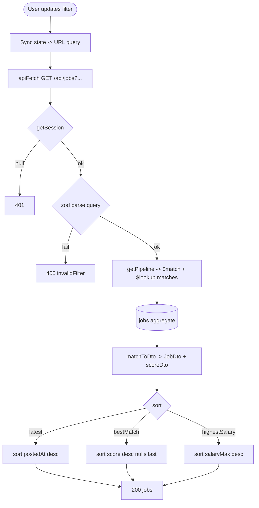

# Feature Development Plan — Job Filters System

## Source studied (Rule 12)

- [docs/Next_Phase1.docx](../docs/Next_Phase1.docx) — Job Scraper Engine + Filter requirements.
- [docs/Next_Phase2.docx](../docs/Next_Phase2.docx) § Task 6 — Job Filters System.

---

## Step 1 — What is the feature

**a.** Lets users filter the ingested job list by basic (title, company, location, remote/hybrid/onsite) and advanced (salary range, experience level, skills, employment type, date posted, easy-apply) criteria, and sort by Latest / Best Match / Highest Salary.

**b. Source citation (docs/Next_Phase2.docx § Task 6):**
> Basic Filters — Job Title, Company, Location, Remote, Hybrid, Onsite · Advanced Filters — Salary Range, Experience Level, Skills, Employment Type, Date Posted, Easy Apply · Sorting — Latest Jobs, Best Match, Highest Salary.

**c. Status: Built (gaps).** [src/server/services/jobs/queryJobs.ts](../src/server/services/jobs/queryJobs.ts) supports a `JobsFilter` shape (title, company, location, jobMode, salaryMin/Max, experienceLevels, employmentType, datePosted, skills) and three sorts (`latest|bestMatch|highestSalary`). [src/app/jobs/_components/JobsFilter.tsx](../src/app/jobs/_components/JobsFilter.tsx) surfaces filters. Gaps: (1) **Easy Apply** flag — not in `Job` schema; (2) skills-multi-select UX uses comma input only; (3) `datePosted = 24h|7d|30d|all` is wired but no relative-time UI; (4) "Best Match" requires a current resume — handle empty-state explicitly.

---

## Step 2 — Pages

| Page | Path                                  | Status | Triad |
|------|---------------------------------------|--------|-------|
| Jobs | [src/app/jobs/page.tsx](../src/app/jobs/page.tsx) | EXISTING (modify) | ✓ |

### Page → docs mapping

| Page | Source doc            | Section | Verbatim copy                                                                 |
|------|-----------------------|---------|-------------------------------------------------------------------------------|
| Jobs | docs/Next_Phase2.docx | Task 6  | "Latest Jobs", "Best Match", "Highest Salary", "Easy Apply", "Date Posted"    |

---

## Step 3 — User Journey

```mermaid
flowchart LR
    A[/jobs/] --> B[Open Filters panel]
    B --> C[Pick filters]
    C --> D[Apply]
    D --> E[List re-fetches GET /api/jobs?...]
    E --> F[Click job -> /jobs/[id]]
```

---

## Step 4 — Database schema

**a. New models** — none.

**b. Modifications** — [src/server/models/Job.ts](../src/server/models/Job.ts):

| Field         | Type     | Constraints   | Purpose                                             |
|---------------|----------|---------------|-----------------------------------------------------|
| easyApply     | boolean  | default false | "Easy Apply" badge (LinkedIn / Indeed style).       |
| jobMode       | string   | enum `["remote","hybrid","onsite"]`, optional | Normalized from `isRemote` + scraped text. Backfill via script. |
| skills        | string[] | optional, indexed (multikey) | Indexed for `$in` filter performance.        |

`isRemote` (boolean) is already present; keep it but treat `jobMode` as the canonical field going forward and write both during ingest.

**c. Refs** — unchanged.

**d. Indexes:**

- multikey on `skills` — backs `$in` advanced filter.
- compound `(jobMode, postedAt -1)` — backs "remote + latest" pattern.
- text index on `(title, company, description)` — for full-text search.

**e. Other constraints** — unchanged.

**f. Migration plan** — additive. One-off script to backfill `jobMode` from `isRemote` and infer from `location` text.

---

## Step 5 — Auth guard / cross-cutting identification

**a. New guards** — none.

**b. Existing guards** — `getSession()` in [src/app/api/jobs/route.ts](../src/app/api/jobs/route.ts).

**c. Application order** — `getSession → zod parse query → queryJobs(userId, filters, sort, limit) → ok(rows)`.

**d. Cross-cutting** — encode the filter state in the URL query string so refreshes and back-button preserve view (a Next.js best practice; no cookie needed).

---

## Step 6 — Routes

**a. Frontend routes**

```
/jobs                                — "Job search"   [protected]   EXISTING (modify)
```

URL search-param shape (camelCase):

```
?title=&company=&location=&jobMode=remote&salaryMin=80000&salaryMax=150000
 &experienceLevel=mid,senior&employmentType=fullTime&datePosted=7d
 &easyApply=true&skills=react,nextjs&sort=bestMatch&limit=25
```

**b. API routes**

```
GET    /api/jobs                     — Query filtered jobs       [protected]  EXISTING (modify)
```

The shape extension is backward-compatible — old query keys still work; new ones are optional.

---

## Step 7 — Components

**a. New components**

| Component                                              | Scope        | Purpose                                                |
|--------------------------------------------------------|--------------|--------------------------------------------------------|
| `src/app/jobs/_components/AdvancedFilters.tsx`         | Single-page  | Collapsible panel: salary range slider, exp-level chips, employment-type checkboxes, date-posted radios, easy-apply toggle. |
| `src/app/jobs/_components/SkillsSelect.tsx`            | Single-page  | Multi-tag chip input bound to `?skills=`.              |
| `src/components/Slider.tsx`                            | Shared       | Range slider primitive (will also be reused on resume ATS minimum-score filter). |

**b. Existing components — audit**

| Component                                                                                | Action |
|------------------------------------------------------------------------------------------|--------|
| [JobsFilter.tsx](../src/app/jobs/_components/JobsFilter.tsx)                             | Modify — keep basic; mount `<AdvancedFilters/>` below; preserve state in URL |
| [JobsList.tsx](../src/app/jobs/_components/JobsList.tsx)                                 | Reuse  |
| [JobCard.tsx](../src/app/jobs/_components/JobCard.tsx)                                   | Modify — show "Easy Apply" badge when `easyApply === true` |
| [JobsHeader.tsx](../src/app/jobs/_components/JobsHeader.tsx)                             | Modify — surface result count + active filter chips |
| [JobSearchForm.tsx](../src/app/jobs/_components/JobSearchForm.tsx)                       | Reuse  |

---

## Step 8 — Third-party integrations

None new. Filters are pure Mongo aggregation.

---

## Step 9 — End-to-end Mermaid flow



---

## Step 10 — Route handlers and per-route logic

### GET /api/jobs ([src/app/api/jobs/route.ts](../src/app/api/jobs/route.ts), MODIFY)
1. `getSession()` → 401.
2. zod parse query: `{ title?, company?, location?, jobMode? (csv of remote|hybrid|onsite), salaryMin?, salaryMax?, experienceLevel? (csv), employmentType? (csv), datePosted? (24h|7d|30d|all), easyApply?, skills? (csv), sort?, limit? }`.
3. Normalize csv → string[].
4. `dbConnect()`.
5. `await queryJobs(userId, filters, sort, limit)` — modify [queryJobs.ts](../src/server/services/jobs/queryJobs.ts) to accept new fields.
6. `ok({ jobs })`.

Inside `queryJobs`:
- `jobMode`: `{ jobMode: { $in: filters.jobMode } }`.
- `salaryMin`: `{ salaryMax: { $gte: filters.salaryMin } }` (any overlapping range qualifies).
- `salaryMax`: `{ salaryMin: { $lte: filters.salaryMax } }`.
- `easyApply`: `{ easyApply: true }`.
- `skills`: `{ skills: { $in: filters.skills } }`.
- `datePosted`: compute cutoff `now - {24h|7d|30d}`, add `{ postedAt: { $gte: cutoff } }`.
- Existing handling for experienceLevel, employmentType, title, company, location.

Error paths: zod fail → 400; aggregation exception → `handleError`.

---

## Step 11 — Folder structure

```
src/app/jobs/
├── page.tsx                                  # EXISTING
├── error.tsx                                 # EXISTING
├── loading.tsx                               # EXISTING
└── _components/
    ├── JobsView.tsx                          # MODIFIED — keep URL <-> state in sync
    ├── JobsFilter.tsx                        # MODIFIED — mount AdvancedFilters
    ├── AdvancedFilters.tsx                   # NEW
    ├── AdvancedFilters.module.css            # NEW
    ├── SkillsSelect.tsx                      # NEW
    ├── SkillsSelect.module.css               # NEW
    ├── JobsHeader.tsx                        # MODIFIED — show active filter chips
    ├── JobsList.tsx                          # EXISTING
    ├── JobCard.tsx                           # MODIFIED — Easy Apply badge
    ├── JobSearchForm.tsx                     # EXISTING
    └── SeedJobsButton.tsx                    # EXISTING

src/components/Slider.tsx                     # NEW (shared)
src/components/Slider.module.css              # NEW

src/app/api/jobs/route.ts                     # MODIFIED — new query fields
src/server/services/jobs/queryJobs.ts         # MODIFIED — extended filter shape
src/server/services/jobs/getPipeline.ts       # MODIFIED — emit new $match stages
src/server/models/Job.ts                      # MODIFIED — easyApply, jobMode, skills index

scripts/backfillJobMode.ts                    # NEW — one-off backfill
```

### Delta table

| #   | Path                                  | NEW / MOD | Purpose                              | LOC |
|-----|---------------------------------------|-----------|--------------------------------------|-----|
| F1  | _components/JobsFilter.tsx            | MOD       | Mount AdvancedFilters                | +25 |
| F2  | _components/AdvancedFilters.tsx       | NEW       | New panel                            | 220 |
| F3  | _components/SkillsSelect.tsx          | NEW       | Chip multi-select                    | 110 |
| F4  | _components/JobCard.tsx               | MOD       | Easy Apply badge                     | +12 |
| F5  | _components/JobsHeader.tsx            | MOD       | Active-filter chips + count          | +40 |
| F6  | src/components/Slider.tsx             | NEW       | Range slider primitive               | 130 |
| B1  | src/app/api/jobs/route.ts             | MOD       | Extended query parse                 | +25 |
| B2  | src/server/services/jobs/queryJobs.ts | MOD       | Extended filter shape                | +50 |
| B3  | src/server/services/jobs/getPipeline.ts | MOD     | New $match stages                    | +40 |
| B4  | src/server/models/Job.ts              | MOD       | easyApply / jobMode / skills index   | +15 |
| B5  | scripts/backfillJobMode.ts            | NEW       | One-off Node script                  | 50  |

---

## Open questions

1. "Easy Apply" detection — what signals does each platform expose? LinkedIn returns `applyMethod === "EasyApply"` in its API; Indeed/Naukri don't reliably mark this. Recommended: only set `easyApply = true` when the source provider explicitly says so.
2. Skill matching — full-string equality vs fuzzy (e.g. "React" vs "ReactJS")? Phase 1: exact-match on lowercase token. Phase 2: synonym map in `src/server/services/jobs/skillSynonyms.ts`.
3. Default sort — `latest` or `bestMatch`? Recommended: `latest` for first visit; persist last-used sort in `localStorage` (non-HttpOnly cookie OK).
