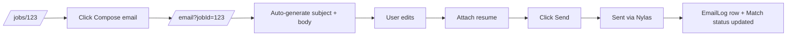
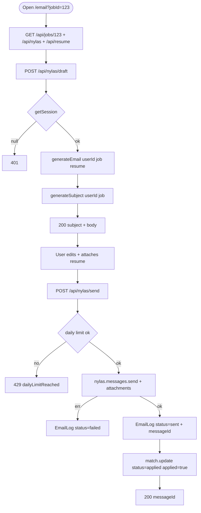

# Feature Development Plan — AI Email Generator using Nylas

## Source studied (Rule 12)

- [docs/Next_Phase1.docx](../docs/Next_Phase1.docx) — Resume Customization Engine + Notification System.
- [docs/Next_Phase2.docx](../docs/Next_Phase2.docx) § Task 7 — AI Email Generator using Nylas.

---

## Step 1 — What is the feature

**a.** Pick a job → the app fetches the job description → AI generates a subject line, cover-letter paragraph, and email body addressed to the recruiter → user can edit recipient, CC, BCC, attach a resume, and send via Nylas using their connected inbox.

**b. Source citation (docs/Next_Phase2.docx § Task 7):**
> Select Job · Fetch Job Description · Generate AI Email · Generate Subject Line · Generate Cover Letter Paragraph · Edit Generated Email · Recipient Email Input · CC/BCC · Attach Resume · Send Email using Nylas.

**c. Status: Built (gaps).** [src/app/email/page.tsx](../src/app/email/page.tsx) + [_components/EmailComposerView.tsx](../src/app/email/_components/EmailComposerView.tsx) ship the composer. API: [POST /api/nylas/draft](../src/app/api/nylas/draft/route.ts) generates the body; [POST /api/nylas/send](../src/app/api/nylas/send/route.ts) sends. Existing LLM function [generateEmail.ts](../src/server/services/llm/generateEmail.ts) + paired prompt. **Gaps:** (1) subject line is not separately AI-generated — currently the user types it; (2) resume attachment isn't auto-attached; (3) the composer doesn't deep-link from `/jobs/[id]` ("Compose email for this job" CTA).

---

## Step 2 — Pages

| Page  | Path                                       | Status            | Triad |
|-------|--------------------------------------------|-------------------|-------|
| Email | [src/app/email/page.tsx](../src/app/email/page.tsx) | EXISTING (modify) | ✓ |

### Page → docs mapping

| Page  | Source doc            | Section | Verbatim copy                                                      |
|-------|-----------------------|---------|--------------------------------------------------------------------|
| Email | docs/Next_Phase2.docx | Task 7  | "Recipient Email", "CC", "BCC", "Attach Resume", "Send Email"      |

---

## Step 3 — User Journey



---

## Step 4 — Database schema

**a. New models** — none.

**b. Modifications:**

[src/server/models/EmailLog.ts](../src/server/models/EmailLog.ts) already covers: `userId`, `jobId`, `grantId`, `provider`, `to/cc/bcc`, `subject`, `bodyPreview`, `status`, `errorMessage`, `messageId`, `sentAt`, `mode`. Add:

| Field         | Type    | Constraints | Purpose                                              |
|---------------|---------|-------------|------------------------------------------------------|
| attachmentIds | string[] | optional   | Nylas attachment ids (so we can audit what was sent). |
| aiGenerated   | boolean | default false | Flags emails composed via AI vs hand-written.       |

**c. Refs** — unchanged.

**d. Indexes** — `(userId, sentAt -1)` already implicit via timestamps; add explicit index for fast "this month" admin queries.

**e. Other constraints** — `bodyPreview` capped 280 chars (existing).

**f. Migration plan** — additive.

---

## Step 5 — Auth guard / cross-cutting identification

**a. New guards** — none.

**b. Existing guards** — `getSession()` in every Nylas route.

**c. Application order** — `getSession → load ConnectedEmail → load Job → call services/llm/generateEmail + generateSubject → ok(draft)`.

**d. Cross-cutting** — daily send-limit guard: refuse if user has sent > 100 emails today (Nylas free tier protection). New service `services/nylas/checkDailyLimit.ts`.

---

## Step 6 — Routes

**a. Frontend routes**

```
/email                          — "Email composer"           [protected: requireUser]   EXISTING (modify)
/email?jobId=<id>               — Auto-loads job + draft     (query param)              EXISTING
```

**b. API routes**

```
POST   /api/nylas/draft         — Generate body + subject     [protected]   EXISTING (modify)
POST   /api/nylas/send          — Send via Nylas              [protected]   EXISTING (modify — accept attachments)
POST   /api/nylas/draft/subject — Generate subject only       [protected]   NEW (used for "Regenerate subject")
GET    /api/email-logs          — List my sent emails         [protected]   NEW (powers Email Testing page — Task 8)
```

---

## Step 7 — Components

**a. New components**

| Component                                              | Scope        | Purpose                                                      |
|--------------------------------------------------------|--------------|--------------------------------------------------------------|
| `src/app/email/_components/RecipientFields.tsx`        | Single-page  | To / CC / BCC chip inputs with email validation.              |
| `src/app/email/_components/AttachResumeButton.tsx`     | Single-page  | One-click attach the user's stored resume.                    |
| `src/app/email/_components/SubjectField.tsx`           | Single-page  | Editable input + "Regenerate" via /api/nylas/draft/subject.   |

**b. Existing components**

| Component                                                              | Action |
|------------------------------------------------------------------------|--------|
| [EmailComposerView.tsx](../src/app/email/_components/EmailComposerView.tsx) | Modify — wire new sub-components; accept `?jobId=` |

---

## Step 8 — Third-party integrations

```
### Nylas v3 (existing)
- /api/nylas/send uses nylas.messages.send(...) with attachments[]
- Attachments encoded as { filename, contentType, content (base64), size }
- Daily limit: provider-dependent; enforce app-level 100/day per user
```

```
### Gemini / OpenAI / Claude / Groq (existing — extended)
- New LLM function: services/llm/generateSubject.ts (NEW)
- Paired prompt: services/llm/prompt/generateSubject.ts (NEW)
- Output: { subject: string } via zod-validated JSON
```

No new env vars.

---

## Step 9 — End-to-end Mermaid flow



---

## Step 10 — Route handlers and per-route logic

### POST /api/nylas/draft ([src/app/api/nylas/draft/route.ts](../src/app/api/nylas/draft/route.ts), MODIFY)
1. `getSession()` → 401.
2. zod parse `{ jobId, includeSubject? = true }`.
3. `dbConnect()`; load Job + Resume + User.
4. `body = await generateEmail(userId, { job, resume })` — existing.
5. If `includeSubject`: `subject = await generateSubject(userId, { jobTitle, company })` (NEW).
6. `ok({ subject, body, fromAddress: connectedEmail.emailAddress })`.

### POST /api/nylas/draft/subject (NEW)
1. `getSession()` → 401.
2. zod parse `{ jobId }`.
3. Load Job; call `generateSubject`.
4. `ok({ subject })`.

### POST /api/nylas/send ([src/app/api/nylas/send/route.ts](../src/app/api/nylas/send/route.ts), MODIFY)
1. `getSession()` → 401.
2. zod parse `{ jobId, to, cc?, bcc?, subject, body, attachResume? }`.
3. Daily limit check via `checkDailyLimit(userId)` → 429 if exceeded.
4. If `attachResume`: load Resume file from storage (note: current Resume model stores `rawText` only — see Open question 1).
5. `nylas.messages.send({ identifier: grantId, requestBody: { to: [...], cc, bcc, subject, body, attachments } })`.
6. `EmailLog.create({ ..., status: "sent", messageId, attachmentIds, aiGenerated: true })`.
7. If `jobId`: update `Match` status to `"applied"` and push history.
8. `ok({ sent: true, messageId })`.

Error paths: zod fail → 400; Nylas failure → `EmailLog.create({ status: "failed", errorMessage })` + `fail("sendFailed", 502)`.

### GET /api/email-logs (NEW)
1. `getSession()` → 401.
2. zod parse query `{ mode?, status?, limit? = 50 }`.
3. `EmailLog.find({ userId, ...filters }).sort({ sentAt: -1 }).limit`.
4. `ok({ logs })`.

---

## Step 11 — Folder structure

```
src/app/email/
├── page.tsx                                  # EXISTING
├── error.tsx                                 # EXISTING
├── loading.tsx                               # EXISTING
└── _components/
    ├── EmailComposerView.tsx                 # MODIFIED
    ├── RecipientFields.tsx                   # NEW
    ├── AttachResumeButton.tsx                # NEW
    ├── SubjectField.tsx                      # NEW
    └── EmailComposerView.module.css          # MODIFIED

src/app/jobs/[id]/_components/JobDetailView.tsx  # MODIFIED — add "Compose email" CTA -> /email?jobId={id}

src/app/api/nylas/draft/route.ts              # MODIFIED — include subject
src/app/api/nylas/draft/subject/route.ts      # NEW
src/app/api/nylas/send/route.ts               # MODIFIED — accept attachments + limit check
src/app/api/email-logs/route.ts               # NEW

src/server/services/llm/generateSubject.ts    # NEW
src/server/services/llm/prompt/generateSubject.ts # NEW
src/server/services/nylas/checkDailyLimit.ts  # NEW
src/server/models/EmailLog.ts                 # MODIFIED — attachmentIds, aiGenerated
src/server/services/llm/generateEmail.ts      # EXISTING (reused)
```

### Delta table

| #   | Path                                              | NEW / MOD | Purpose                                | LOC |
|-----|---------------------------------------------------|-----------|----------------------------------------|-----|
| F1  | _components/EmailComposerView.tsx                 | MOD       | Wire subject + recipient fields        | +60 |
| F2  | _components/RecipientFields.tsx                   | NEW       | Chip-style email input                 | 110 |
| F3  | _components/AttachResumeButton.tsx                | NEW       | Toggle attach                          | 50  |
| F4  | _components/SubjectField.tsx                      | NEW       | Subject + regenerate                   | 60  |
| F5  | src/app/jobs/[id]/_components/JobDetailView.tsx   | MOD       | Compose-email CTA                      | +10 |
| B1  | src/app/api/nylas/draft/route.ts                  | MOD       | Include subject                        | +20 |
| B2  | src/app/api/nylas/draft/subject/route.ts          | NEW       | Subject-only                           | 25  |
| B3  | src/app/api/nylas/send/route.ts                   | MOD       | Attachments + limit                    | +40 |
| B4  | src/app/api/email-logs/route.ts                   | NEW       | List logs                              | 30  |
| B5  | src/server/services/llm/generateSubject.ts        | NEW       | Subject orchestration                  | 40  |
| B6  | src/server/services/llm/prompt/generateSubject.ts | NEW       | Prompt builder                         | 30  |
| B7  | src/server/services/nylas/checkDailyLimit.ts      | NEW       | Per-user 100/day                       | 30  |
| B8  | src/server/models/EmailLog.ts                     | MOD       | attachmentIds, aiGenerated             | +10 |

---

## Open questions

1. **Resume file storage** — the current Resume model stores only `rawText`, no `Buffer` / file. To attach the original PDF/DOCX, we need to persist the upload (GridFS or S3). Recommended: Phase 1, regenerate a PDF from the tailored Markdown on the fly (no storage needed); Phase 2, add object storage.
2. Should sending an email automatically mark the Match as `applied`? Recommended: yes, and add a "Don't mark as applied" toggle on the composer for cases where the email is just inquiry.
3. CC/BCC defaults — should we default to BCC'ing the user themselves so they have a copy? Recommended: yes (toggle in Settings).
