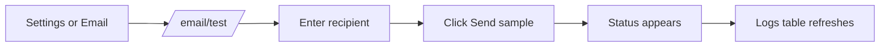
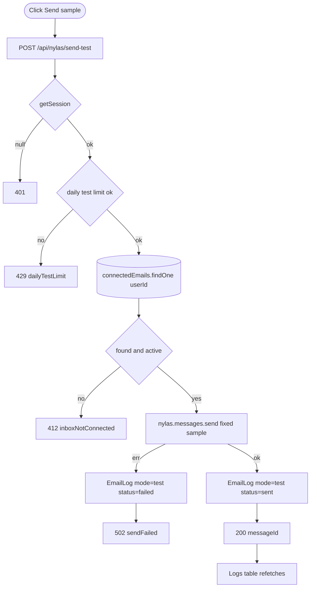

# Feature Development Plan — Email Testing Page

## Source studied (Rule 12)

- [docs/Next_Phase2.docx](../docs/Next_Phase2.docx) § Task 8 — Email Testing Page.

---

## Step 1 — What is the feature

**a.** A simple page where the user types a test email recipient and clicks Send — useful to verify their Nylas inbox is healthy before relying on it for cold outreach. Shows delivery status (sent / failed) and a tail of recent test/compose logs.

**b. Source citation (docs/Next_Phase2.docx § Task 8):**
> Enter Test Email · Send Sample Email · Check Delivery Status · Success/Failure Logs.

**c. Status: Partial.** The data layer is ready: [EmailLog.ts](../src/server/models/EmailLog.ts) has a `mode: "compose" | "test"` enum. No dedicated `/email/test` page exists; logs are not surfaced anywhere.

---

## Step 2 — Pages

| Page          | Path                              | Status | Triad |
|---------------|-----------------------------------|--------|-------|
| Email Testing | `src/app/email/test/page.tsx`     | NEW    | ✓     |

### Page → docs mapping

| Page          | Source doc            | Section | Verbatim copy                                                |
|---------------|-----------------------|---------|--------------------------------------------------------------|
| Email Testing | docs/Next_Phase2.docx | Task 8  | "Enter Test Email", "Send Sample Email", "Check Delivery Status", "Success/Failure Logs" |

---

## Step 3 — User Journey



---

## Step 4 — Database schema

**a. New models** — none.

**b. Modifications** — none. [EmailLog](../src/server/models/EmailLog.ts) already covers `mode: "test"` + `status: "sent"|"failed"` + `errorMessage` + `messageId` + `sentAt`.

**c. Refs / indexes / constraints** — unchanged.

**f. Migration plan** — N/A.

---

## Step 5 — Auth guard / cross-cutting identification

**a. New guards** — none.

**b. Existing guards** — `getSession()` in the API; `requireUser()` in the page.

**c. Application order** — page: `requireUser → load latest 20 test logs → render`.

**d. Cross-cutting** — daily test-limit (10/day per user) to avoid abuse. Shares the limiter from [plan/07-ai-email-generator.md](07-ai-email-generator.md).

---

## Step 6 — Routes

**a. Frontend routes**

```
/email/test               — "Email testing"   [protected: requireUser]   NEW
```

**b. API routes**

```
POST   /api/nylas/send-test        — Send sample email           [protected]   NEW
GET    /api/email-logs?mode=test   — List test logs              [protected]   EXISTING (reuses Task 7's new endpoint)
```

---

## Step 7 — Components

**a. New components**

| Component                                              | Scope        | Purpose                                       |
|--------------------------------------------------------|--------------|-----------------------------------------------|
| `src/app/email/test/_components/TestForm.tsx`          | Single-page  | Recipient input + Send button + status.       |
| `src/app/email/test/_components/LogsTable.tsx`         | Single-page  | Compact table of recent test logs.            |

**b. Existing components** — reuse [src/components/Input.tsx](../src/components/Input.tsx), [src/components/Button.tsx](../src/components/Button.tsx), [src/components/StatusBadge.tsx](../src/components/StatusBadge.tsx) (new in [plan/05](05-connected-job-platforms.md)).

---

## Step 8 — Third-party integrations

```
### Nylas v3 (existing)
- nylas.messages.send with a fixed sample body
- Sample subject: "AI Job Applier — Email connectivity test"
- Sample body: "If you received this, your AI Job Applier inbox connection is healthy. Sent at <UTC timestamp>."
```

No new env vars.

---

## Step 9 — End-to-end Mermaid flow



---

## Step 10 — Route handlers and per-route logic

### POST /api/nylas/send-test (NEW)
1. `getSession()` → 401.
2. zod parse `{ to: z.string().email() }`.
3. Daily test-limit check (`checkDailyLimit(userId, { mode: "test" })`).
4. `dbConnect()`; load `ConnectedEmail`. If missing/expired → `fail("inboxNotConnected", 412)`.
5. Fixed `subject = "AI Job Applier — Email connectivity test"`, `body = "If you received this, your AI Job Applier inbox connection is healthy. Sent at " + new Date().toISOString()`.
6. `nylas.messages.send({ identifier: grantId, requestBody: { to: [{ email: to }], subject, body } })`.
7. `EmailLog.create({ userId, grantId, provider, to: [to], subject, bodyPreview, status: "sent", messageId, mode: "test", sentAt: new Date() })`.
8. `ok({ sent: true, messageId })`.

Error paths: zod fail → 400; Nylas exception → log failed row + `fail("sendFailed", 502)`.

---

## Step 11 — Folder structure

```
src/app/email/test/
├── page.tsx                                  # NEW (≤ 30 LOC; requireUser + <TestView/>)
├── error.tsx                                 # NEW (3-line shell)
├── loading.tsx                               # NEW (3-line shell)
└── _components/
    ├── TestView.tsx                          # NEW (client entry)
    ├── TestForm.tsx                          # NEW
    ├── LogsTable.tsx                         # NEW
    └── TestView.module.css                   # NEW

src/app/api/nylas/send-test/route.ts          # NEW
src/app/api/email-logs/route.ts               # EXISTING (from Task 7)
```

### Delta table

| #  | Path                                          | NEW / MOD | Purpose                       | LOC |
|----|-----------------------------------------------|-----------|-------------------------------|-----|
| F1 | src/app/email/test/page.tsx                   | NEW       | Shell                         | 20  |
| F2 | src/app/email/test/error.tsx                  | NEW       | Shell                         | 3   |
| F3 | src/app/email/test/loading.tsx                | NEW       | Shell                         | 3   |
| F4 | _components/TestView.tsx                      | NEW       | Client entry                  | 80  |
| F5 | _components/TestForm.tsx                      | NEW       | Form                          | 90  |
| F6 | _components/LogsTable.tsx                     | NEW       | Logs                          | 80  |
| B1 | src/app/api/nylas/send-test/route.ts          | NEW       | Send sample                   | 60  |

---

## Open questions

1. Should we add a "Send to me" shortcut button that prefills `to` with the user's connected email address? Recommended: yes — primary UX.
2. Persist sample template per-user (so power users can customize)? Defer to Phase 4.
