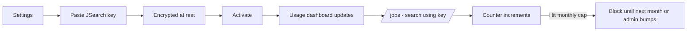
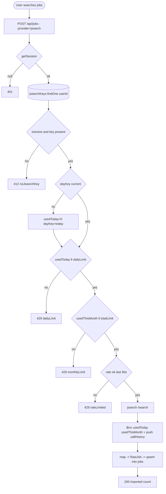

# Feature Development Plan — JSearch API Integration

## Source studied (Rule 12)

- [docs/Next_Phase1.docx](../docs/Next_Phase1.docx) — Job Scraper Engine + Security.
- [docs/Next_Phase2.docx](../docs/Next_Phase2.docx) § Task 9 — JSearch API Integration.

---

## Step 1 — What is the feature

**a.** Every user brings their own RapidAPI JSearch key. The app uses that key to fetch jobs on the user's behalf and tracks usage (used / remaining / monthly cap, daily/monthly history, last call). Keys are encrypted at rest; backend proxies all requests; abuse protection (rate limit) prevents hammering RapidAPI.

**b. Source citation (docs/Next_Phase2.docx § Task 9):**
> Every User Adds Own JSearch API Key · User-wise API Usage · Increase Total Limits Per User · Request Tracking System · Add/Edit/Delete/Activate · Usage Dashboard — Total/Used/Remaining/Daily/Monthly/Last Call · Encrypt Keys · Backend Proxy · Rate Limiting · Abuse Protection.

**c. Status: Built (small gaps).** Schema [src/server/models/JsearchKey.ts](../src/server/models/JsearchKey.ts) covers encrypted key + monthly counter + `callHistory[]`. [src/server/services/jobs/providers/jsearchProvider.ts](../src/server/services/jobs/providers/jsearchProvider.ts) is wired. Settings UI lives in [JsearchSection.tsx](../src/app/settings/_components/JsearchSection.tsx). **Gaps:** (1) Activate/Deactivate flag — `isActive` exists but UI doesn't expose toggle; (2) daily-usage rollup — currently only monthly counter; (3) Rate-limit guard not enforced server-side beyond Mongo write contention; (4) Admin-side per-user `totalLimit` bump UI doesn't exist.

---

## Step 2 — Pages

| Page          | Path                                  | Status            | Triad |
|---------------|---------------------------------------|-------------------|-------|
| Settings      | [src/app/settings/page.tsx](../src/app/settings/page.tsx) | EXISTING (modify) | ✓ |
| Admin         | [src/app/admin/page.tsx](../src/app/admin/page.tsx)       | EXISTING (modify) | ✓ |

### Page → docs mapping

| Page     | Source doc            | Section | Verbatim copy                                          |
|----------|-----------------------|---------|--------------------------------------------------------|
| Settings | docs/Next_Phase2.docx | Task 9  | "Total Requests", "Used Requests", "Remaining Requests", "Daily Usage", "Monthly Usage", "Last API Call Time" |
| Admin    | docs/Next_Phase2.docx | Task 9 + 14 | "Increase Total Limits Per User"                  |

---

## Step 3 — User Journey



---

## Step 4 — Database schema

**a. New models** — none.

**b. Modifications** — [src/server/models/JsearchKey.ts](../src/server/models/JsearchKey.ts):

| Field          | Type    | Constraints                                            | Purpose                                       |
|----------------|---------|--------------------------------------------------------|-----------------------------------------------|
| usedToday      | number  | default 0                                              | Daily counter (resets via cron / lazy check). |
| dayKey         | string  | YYYY-MM-DD                                             | Last day this counter was for.                |
| dailyLimit     | number  | default 20, optional                                   | Per-user daily cap (UX guard).                |

`callHistory[]` exists; trim to last 200 entries inside the service to keep the doc small.

**c. Refs** — unchanged.

**d. Indexes** — unchanged (`userId` is unique).

**e. Other constraints** — `dailyLimit <= totalLimit`.

**f. Migration plan** — additive; lazy reset of `usedToday` when `dayKey !== currentDayKey()`.

---

## Step 5 — Auth guard / cross-cutting identification

**a. New guards** — none.

**b. Existing guards** — `getSession()` for user; `isCurrentAdmin()` for admin-side bump.

**c. Application order** — every JSearch call: `getSession → load JsearchKey → check active + within daily/monthly cap → decrypt → call JSearch → increment counters → ok(rows)`.

**d. Cross-cutting** — abuse protection: hard cap 5 calls/minute per user (counted in `callHistory[]` window). Service refuses with `fail("rateLimited", 429)`.

---

## Step 6 — Routes

**a. Frontend routes**

```
/settings                     — JSearch card lives inside Settings   EXISTING (modify)
/admin                        — Per-user JSearch quota bump table     EXISTING (modify)
```

**b. API routes**

```
GET    /api/jsearch                          — Get my JSearch status + usage    [protected]  EXISTING
POST   /api/jsearch                          — Set/update key                   [protected]  EXISTING
DELETE /api/jsearch                          — Remove key                       [protected]  NEW (from plan/03)
POST   /api/jsearch/activate                 — Activate/deactivate              [protected]  NEW
POST   /api/jsearch/test                     — Probe quota with 1 call          [protected]  NEW
GET    /api/admin/jsearch                    — List all users' JSearch usage    [admin]      NEW
PATCH  /api/admin/jsearch/[userId]           — Bump totalLimit                  [admin]      NEW
```

---

## Step 7 — Components

**a. New components**

| Component                                                       | Scope        | Purpose                                                     |
|-----------------------------------------------------------------|--------------|-------------------------------------------------------------|
| `src/app/settings/_components/JsearchUsageBars.tsx`             | Single-page  | Stacked bars: daily / monthly usage.                         |
| `src/app/admin/_components/JsearchQuotaTable.tsx`               | Single-page  | Admin per-user table with "Bump limit" button.               |

**b. Existing components** — modify [JsearchSection.tsx](../src/app/settings/_components/JsearchSection.tsx) to add Activate toggle + embed `<JsearchUsageBars/>`. Modify [AdminView](../src/app/admin/_components/AdminView.tsx) to mount the new table.

---

## Step 8 — Third-party integrations

```
### JSearch via RapidAPI (existing)
- Host: jsearch.p.rapidapi.com
- Per-user X-RapidAPI-Key (decrypted from JsearchKey.encrypted)
- Endpoints: /search (Phase 1), /job-details (Phase 2)
- Quota: RapidAPI tier dependent; we track app-side counters to avoid surprise overage
```

No new env vars.

---

## Step 9 — End-to-end Mermaid flow



---

## Step 10 — Route handlers and per-route logic

### POST /api/jsearch/activate (NEW)
1. `getSession()` → 401.
2. zod parse `{ isActive }`.
3. `JsearchKey.updateOne({ userId }, { isActive })`.
4. `ok({ isActive })`.

### POST /api/jsearch/test (NEW)
1. `getSession()` → 401.
2. Load + decrypt key.
3. Make a single `/search` call with `query=test`, `num_pages=1`.
4. On 200: `ok({ verified: true })`; on non-2xx: `ok({ verified: false, errorMessage })`.

### GET /api/admin/jsearch (NEW)
1. `isCurrentAdmin()` → 401/403.
2. `JsearchKey.find({})` joined with user email.
3. Project: `{ userId, email, isActive, totalLimit, usedThisMonth, usedToday, lastCallAt }`.
4. `ok({ rows })`.

### PATCH /api/admin/jsearch/[userId] (NEW)
1. `isCurrentAdmin()`.
2. zod parse `{ totalLimit? , dailyLimit? }`.
3. `JsearchKey.updateOne({ userId }, $set)`.
4. `ok({ updated: true })`.

### POST /api/jobs (EXISTING, MODIFY) — provider="jsearch" branch
1. Load JSearch key; enforce caps (see flow). On allow, call provider.
2. Service `incrementJsearchCounters(userId, { calls: 1 })` updates `usedToday`, `usedThisMonth`, `lastCallAt`, pushes `callHistory[ { at } ]` (trim to last 200).

---

## Step 11 — Folder structure

```
src/app/settings/_components/
├── JsearchSection.tsx                       # MODIFIED — activate toggle + usage bars
├── JsearchUsageBars.tsx                     # NEW
└── JsearchUsageBars.module.css              # NEW

src/app/admin/_components/
├── AdminView.tsx                            # MODIFIED — mount quota table
├── JsearchQuotaTable.tsx                    # NEW
└── JsearchQuotaTable.module.css             # NEW

src/app/api/jsearch/route.ts                 # EXISTING (modify — DELETE handler added in plan/03)
src/app/api/jsearch/activate/route.ts        # NEW
src/app/api/jsearch/test/route.ts            # NEW
src/app/api/admin/jsearch/route.ts           # NEW
src/app/api/admin/jsearch/[userId]/route.ts  # NEW

src/server/services/jsearch/incrementCounters.ts   # NEW
src/server/services/jsearch/checkCaps.ts            # NEW
src/server/services/jobs/providers/jsearchProvider.ts  # MODIFIED — call checkCaps + increment

src/server/models/JsearchKey.ts              # MODIFIED — usedToday + dayKey + dailyLimit
```

### Delta table

| #  | Path                                                | NEW / MOD | Purpose                            | LOC |
|----|-----------------------------------------------------|-----------|------------------------------------|-----|
| F1 | _components/JsearchSection.tsx                      | MOD       | Activate toggle + bars             | +30 |
| F2 | _components/JsearchUsageBars.tsx                    | NEW       | Daily + monthly bars               | 90  |
| F3 | _components/AdminView.tsx                           | MOD       | Mount JsearchQuotaTable            | +12 |
| F4 | _components/JsearchQuotaTable.tsx                   | NEW       | Admin table                        | 140 |
| B1 | src/app/api/jsearch/activate/route.ts               | NEW       | Activate toggle                    | 25  |
| B2 | src/app/api/jsearch/test/route.ts                   | NEW       | Probe key                          | 35  |
| B3 | src/app/api/admin/jsearch/route.ts                  | NEW       | List all                           | 40  |
| B4 | src/app/api/admin/jsearch/[userId]/route.ts         | NEW       | Bump limit                         | 35  |
| B5 | src/server/services/jsearch/incrementCounters.ts    | NEW       | Update + trim history              | 50  |
| B6 | src/server/services/jsearch/checkCaps.ts            | NEW       | Daily/monthly/rate enforcement     | 80  |
| B7 | src/server/services/jobs/providers/jsearchProvider.ts | MOD     | Wire cap check + counter           | +25 |
| B8 | src/server/models/JsearchKey.ts                     | MOD       | usedToday + dayKey + dailyLimit    | +10 |

---

## Open questions

1. Should we display the user's RapidAPI plan name (e.g. "Free", "Basic")? RapidAPI returns this in a header; recommended yes for clarity.
2. What's the right default `totalLimit`? Free RapidAPI JSearch is ~100/month; default `totalLimit: 100` is correct. Admin can bump.
3. When a user's key fails (401 from RapidAPI), should we auto-deactivate? Recommended: yes, set `isActive = false` and surface a reconnect banner.
