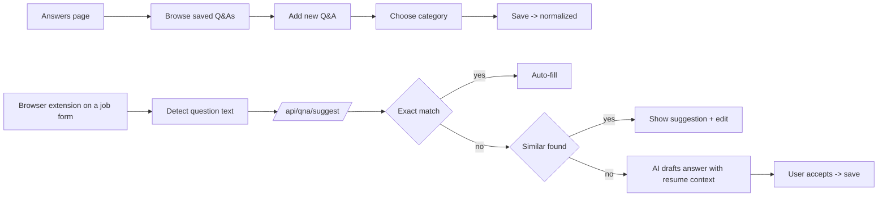
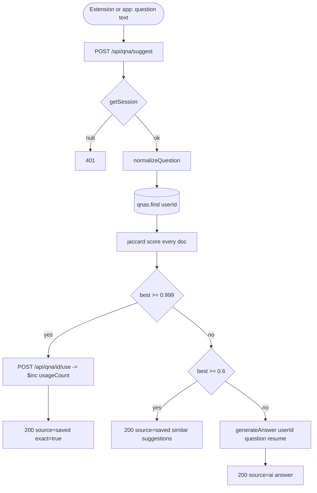

# Feature Development Plan — Smart Questions & Auto Answer System

## Source studied (Rule 12)

- [docs/Next_Phase1.docx](../docs/Next_Phase1.docx) — Resume Customization + Application Automation.
- [docs/Next_Phase2.docx](../docs/Next_Phase2.docx) § Task 10 — Smart Questions & Auto Answer System; § Task 11 — AI Resume-Based Answers (paired; see [plan/11](11-ai-resume-answers.md)).

---

## Step 1 — What is the feature

**a.** When the user encounters a job-application question (in the app, in the browser extension, or via the auto-apply pipeline), the system either: (a) finds a similar previously-saved Q&A and auto-fills the answer; or (b) drafts a new one with the LLM using the resume + job context. Saved Q&As are normalized so "Tell me about yourself" and "Tell me a bit about yourself" match.

**b. Source citation (docs/Next_Phase2.docx § Task 10):**
> Detect repeated job questions · Auto-fill saved answers · Save Questions · Save Answers · AI Generated Answers · Reuse Previous Answers · Normalize Similar Questions · Auto-fill Repeated Questions.

**c. Status: Built.** Model [QnA.ts](../src/server/models/QnA.ts) is in place with `normalizedQuestion` + uniqueness. Services: [normalize.ts](../src/server/services/qna/normalize.ts) (jaccard token sim), [findSimilar.ts](../src/server/services/qna/findSimilar.ts), [generateAnswer.ts](../src/server/services/llm/generateAnswer.ts). API: [/api/qna](../src/app/api/qna/route.ts), [/api/qna/[id]](../src/app/api/qna/[id]/route.ts), [/api/qna/suggest](../src/app/api/qna/suggest/route.ts). Page: [/answers](../src/app/answers/page.tsx). Browser extension calls `/api/qna/suggest`. **Gaps:** (1) Category UX is "general" only; the docs call out specific categories (salary, notice, sponsorship etc.); (2) `usageCount` increments only on `/suggest` exact-match; not surfaced in UI; (3) no bulk-import of common answers.

---

## Step 2 — Pages

| Page    | Path                                                | Status            | Triad |
|---------|-----------------------------------------------------|-------------------|-------|
| Answers | [src/app/answers/page.tsx](../src/app/answers/page.tsx) | EXISTING (modify) | ✓     |

### Page → docs mapping

| Page    | Source doc            | Section  | Verbatim copy                                                                 |
|---------|-----------------------|----------|-------------------------------------------------------------------------------|
| Answers | docs/Next_Phase2.docx | Task 10  | "Save Questions", "Save Answers", "Tell me about yourself", "Why should we hire you?", "Expected salary", "Notice period", "Relocation", "Sponsorship" |

---

## Step 3 — User Journey



---

## Step 4 — Database schema

**a. New models** — none.

**b. Modifications** — [src/server/models/QnA.ts](../src/server/models/QnA.ts):

| Field    | Type   | Constraints                                  | Purpose                          |
|----------|--------|----------------------------------------------|----------------------------------|
| category | string | enum extended with docs categories below     | Drives grouping in UI.            |
| tags     | string[] | optional                                   | Free-form keywords (e.g. "remote", "fintech"). |

Category enum values (camelCase per Rule 1): `general`, `aboutMe`, `motivation`, `salary`, `noticePeriod`, `relocation`, `sponsorship`, `experience`, `skills`, `behavioral`.

**c. Refs** — unchanged.

**d. Indexes** — add `(userId, category, usageCount -1)` to support category-grouped most-used queries.

**e. Other constraints** — unchanged.

**f. Migration plan** — additive; existing docs keep `category: "general"`.

---

## Step 5 — Auth guard / cross-cutting identification

**a. New guards** — none.

**b. Existing guards** — `getSession()` in QnA routes; **special: the browser extension calls `/api/qna/suggest` with the same `aja_session` cookie — confirm CORS allows the extension origin (`chrome-extension://...`).**

**c. Application order** — `getSession → load similar matches → optional LLM draft → ok`.

**d. Cross-cutting** — debouncing on extension side (already in [browser-extension/content.js](../browser-extension/content.js)).

---

## Step 6 — Routes

**a. Frontend routes**

```
/answers                     — "Saved Q&A library"   [protected: requireUser]   EXISTING (modify)
```

**b. API routes**

```
GET    /api/qna                            — List my Q&As (filter by category) [protected]  EXISTING (modify — accept ?category=)
POST   /api/qna                            — Save Q&A                          [protected]  EXISTING
DELETE /api/qna/[id]                       — Delete                            [protected]  EXISTING
POST   /api/qna/suggest                    — Find similar + optional AI draft  [protected]  EXISTING (modify — return category)
POST   /api/qna/seed                       — Bulk-import common answers        [protected]  NEW
POST   /api/qna/[id]/use                   — Increment usageCount + lastUsedAt [protected]  NEW (explicit, used by extension)
```

---

## Step 7 — Components

**a. New components**

| Component                                                | Scope        | Purpose                                          |
|----------------------------------------------------------|--------------|--------------------------------------------------|
| `src/app/answers/_components/CategoryTabs.tsx`           | Single-page  | Tab strip across the 10 categories + "All".      |
| `src/app/answers/_components/SeedAnswersButton.tsx`      | Single-page  | One-click bulk-import 10 starter Q&As.            |
| `src/app/answers/_components/UsageBadge.tsx`             | Single-page  | "Used 12 times" pill on each card.                |

**b. Existing components**

| Component                                                              | Action |
|------------------------------------------------------------------------|--------|
| [AnswersView.tsx](../src/app/answers/_components/AnswersView.tsx)      | Modify — wire CategoryTabs |
| [QnaList.tsx](../src/app/answers/_components/QnaList.tsx)              | Modify — group by category |
| [QnaItem.tsx](../src/app/answers/_components/QnaItem.tsx)              | Modify — show UsageBadge + category chip |
| [QnaForm.tsx](../src/app/answers/_components/QnaForm.tsx)              | Modify — category dropdown + tags |
| [SuggestPanel.tsx](../src/app/answers/_components/SuggestPanel.tsx)    | Modify — surface category hint |

---

## Step 8 — Third-party integrations

```
### Active LLM (existing)
- /api/qna/suggest calls services/llm/generateAnswer.ts when no exact match
- Uses resolver.getActiveAdapter(userId)
```

```
### Browser extension (existing)
- Reads question text from DOM
- Calls /api/qna/suggest via fetch with credentials: "include" (cookies)
- Manifest v3 requires explicit host_permissions on the app's domain (already set)
```

No new env vars.

---

## Step 9 — End-to-end Mermaid flow



---

## Step 10 — Route handlers and per-route logic

### POST /api/qna ([src/app/api/qna/route.ts](../src/app/api/qna/route.ts), EXISTING — modify)
1. `getSession()` → 401.
2. zod parse `{ question, answer, category?, tags? }`.
3. `normalized = normalizeQuestion(question)`.
4. `QnA.findOneAndUpdate({ userId, normalizedQuestion }, { question, answer, category, tags }, { upsert: true })` (Rule 6: 1:1 keys).
5. `ok(qnaDto)`.

### POST /api/qna/suggest ([src/app/api/qna/suggest/route.ts](../src/app/api/qna/suggest/route.ts), EXISTING — modify)
1. `getSession()` → 401.
2. zod parse `{ question, jobId?, draftIfMissing? = true }`.
3. `matches = await findSimilarAnswers(userId, question)`.
4. If `isExactMatch(matches[0])` → record usage via the `/use` route helper; return `{ source: "saved", exact: true, qna: matches[0] }`.
5. If `matches[0].score >= 0.6` → return `{ source: "saved", exact: false, suggestions: matches.slice(0, 3) }`.
6. Else if `draftIfMissing`: load Resume + Job (if jobId); `answer = await generateAnswer(userId, question, { resume, job })`; return `{ source: "ai", answer }`.

### POST /api/qna/[id]/use (NEW)
1. `getSession()`.
2. `QnA.updateOne({ _id, userId }, { $inc: { usageCount: 1 }, $set: { lastUsedAt: new Date() } })`.
3. `ok({ ok: true })`.

### POST /api/qna/seed (NEW)
1. `getSession()`.
2. zod parse `{ overwrite? = false }`.
3. Iterate 10 canonical templates (from `src/server/services/qna/seedTemplates.ts`); for each call the upsert from the POST /api/qna service.
4. `ok({ seeded: 10 })`.

---

## Step 11 — Folder structure

```
src/app/answers/
├── page.tsx                                  # EXISTING
├── error.tsx                                 # EXISTING
├── loading.tsx                               # EXISTING
└── _components/
    ├── AnswersView.tsx                       # MODIFIED
    ├── CategoryTabs.tsx                      # NEW
    ├── SeedAnswersButton.tsx                 # NEW
    ├── UsageBadge.tsx                        # NEW
    ├── QnaList.tsx                           # MODIFIED — group
    ├── QnaItem.tsx                           # MODIFIED — badges
    ├── QnaForm.tsx                           # MODIFIED — category dropdown + tags
    └── SuggestPanel.tsx                      # MODIFIED

src/app/api/qna/route.ts                      # MODIFIED — category filter
src/app/api/qna/[id]/route.ts                 # EXISTING
src/app/api/qna/[id]/use/route.ts             # NEW
src/app/api/qna/seed/route.ts                 # NEW
src/app/api/qna/suggest/route.ts              # MODIFIED — return category

src/server/services/qna/seedTemplates.ts      # NEW — 10 canonical Q&A templates
src/server/services/qna/normalize.ts          # EXISTING
src/server/services/qna/findSimilar.ts        # EXISTING
src/server/models/QnA.ts                      # MODIFIED — category enum + tags

src/server/services/llm/generateAnswer.ts     # EXISTING
src/server/services/llm/prompt/generateAnswer.ts # EXISTING

src/types/index.ts                            # MODIFIED — QNA_CATEGORIES constant + QnaCategory type
```

### Delta table

| #  | Path                                          | NEW / MOD | Purpose                            | LOC |
|----|-----------------------------------------------|-----------|------------------------------------|-----|
| F1 | _components/AnswersView.tsx                   | MOD       | Wire tabs                          | +20 |
| F2 | _components/CategoryTabs.tsx                  | NEW       | Tab strip                          | 80  |
| F3 | _components/SeedAnswersButton.tsx             | NEW       | Bulk import                        | 40  |
| F4 | _components/UsageBadge.tsx                    | NEW       | "Used 12x" pill                    | 30  |
| F5 | _components/QnaList.tsx                       | MOD       | Group by category                  | +30 |
| F6 | _components/QnaItem.tsx                       | MOD       | Badges                             | +20 |
| F7 | _components/QnaForm.tsx                       | MOD       | Category dropdown + tags           | +35 |
| F8 | _components/SuggestPanel.tsx                  | MOD       | Category hint                      | +12 |
| B1 | src/app/api/qna/route.ts                      | MOD       | Category filter                    | +20 |
| B2 | src/app/api/qna/[id]/use/route.ts             | NEW       | Usage increment                    | 25  |
| B3 | src/app/api/qna/seed/route.ts                 | NEW       | Bulk seed                          | 35  |
| B4 | src/app/api/qna/suggest/route.ts              | MOD       | Return category                    | +15 |
| B5 | src/server/services/qna/seedTemplates.ts      | NEW       | 10 templates                       | 80  |
| B6 | src/server/models/QnA.ts                      | MOD       | category enum + tags               | +12 |
| B7 | src/types/index.ts                            | MOD       | QNA_CATEGORIES                     | +15 |

---

## Open questions

1. Should normalization include stemming (e.g. "interviewing" → "interview")? Phase 1 uses token jaccard only — works for our short questions. Defer stemming.
2. Should the extension auto-submit when confidence ≥ 95% per Task 13? See [plan/13-smart-learning.md](13-smart-learning.md) — yes, but gated behind user opt-in.
3. Same question asked in different language — out of scope for Phase 1.
