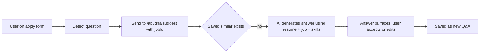
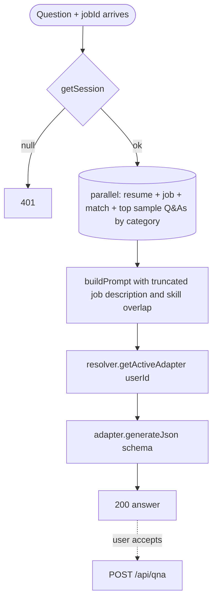

# Feature Development Plan — AI Resume-Based Answers

## Source studied (Rule 12)

- [docs/Next_Phase1.docx](../docs/Next_Phase1.docx) — Resume Customization Engine.
- [docs/Next_Phase2.docx](../docs/Next_Phase2.docx) § Task 11 — AI Resume-Based Answers.

---

## Step 1 — What is the feature

**a.** When generating an answer to a job-application question, the AI grounds its response in (i) the user's parsed resume (skills, summary, experience years), (ii) the job description it's applied to, and (iii) the user's previously-saved Q&As (for tone/voice consistency). Result: personalized, defensible answers — e.g., "Why are you fit for this role?" pulls relevant resume bullets.

**b. Source citation (docs/Next_Phase2.docx § Task 11):**
> Resume Parsing · Job Description Analysis · Skill Matching · Personalized Answer Generation.

**c. Status: Built (gap).** [services/llm/generateAnswer.ts](../src/server/services/llm/generateAnswer.ts) accepts a `context?` and the prompt at [prompt/generateAnswer.ts](../src/server/services/llm/prompt/generateAnswer.ts) can be enriched. Today the suggest route passes resume context only. **Gaps:** (1) Job description not currently injected; (2) Skill-overlap signals (matched / missing skills from `Match`) not fed to the prompt; (3) Sample answers (tone seeds) not pulled.

---

## Step 2 — Pages

No new pages. Used by:
- [/answers](../src/app/answers/page.tsx) (suggest panel)
- [/email composer](../src/app/email/page.tsx)
- Browser extension auto-fill
- Auto-apply pipeline ([plan/12](12-auto-apply-system.md))

### Page → docs mapping

N/A — backend feature.

---

## Step 3 — User Journey



---

## Step 4 — Database schema

**a. New models** — none.

**b. Modifications** — none.

(All required state already exists: [Resume.ts](../src/server/models/Resume.ts), [Job.ts](../src/server/models/Job.ts), [Match.ts](../src/server/models/Match.ts) with `matchedSkills` / `missingSkills`.)

**c–f.** — N/A.

---

## Step 5 — Auth guard / cross-cutting identification

**a. New guards** — none.

**b. Existing guards** — `getSession()`.

**c. Application order** — `getSession → load resume + job + match → build context → adapter.generateJson({ answer }) → save Q&A → ok`.

**d. Cross-cutting** — token budget guard: cap the resume + job context at ~3000 input tokens (truncate description and rawText). Implemented inline in `generateAnswer.ts`.

---

## Step 6 — Routes

**a. Frontend routes** — N/A.

**b. API routes**

```
POST   /api/qna/suggest          — Modified to pass jobId context   [protected]   EXISTING (modify; same change as plan/10)
POST   /api/qna/answer           — Direct AI answer (no save)        [protected]   NEW (used by extension when user wants regenerate without saving)
```

---

## Step 7 — Components

**a. New components** — none on the page side; consumers already exist.

**b. Existing components** — [SuggestPanel.tsx](../src/app/answers/_components/SuggestPanel.tsx) gains a "Regenerate with job context" button that hits `/api/qna/answer`.

---

## Step 8 — Third-party integrations

```
### Active LLM (existing — extending)
- Prompt builder receives:
  - candidateSummary (Resume.summary)
  - candidateSkills (Resume.skills)
  - experienceYears (Resume.experienceYears)
  - jobTitle (Job.title)
  - jobDescription (Job.description, truncated to ~2000 chars)
  - matchedSkills + missingSkills from Match (when available)
  - sampleAnswers: top 3 Q&As from same category for tone
- Output: { answer: string } via zod-validated JSON
```

No new env vars.

---

## Step 9 — End-to-end Mermaid flow



---

## Step 10 — Route handlers and per-route logic

### POST /api/qna/answer (NEW)
1. `getSession()` → 401.
2. zod parse `{ question, jobId?, category? }`.
3. `dbConnect()`.
4. Parallel load: `Resume.findOne({ userId })`, `Job.findById(jobId)` (if jobId), `Match.findOne({ userId, jobId })` (for skill overlap), `QnA.find({ userId, category }).sort({ usageCount: -1 }).limit(3)`.
5. Build context object (camelCase per Rule 1):
   ```ts
   {
     candidateSummary, candidateSkills, experienceYears,
     jobTitle, jobDescription: trim(job.description, 2000),
     matchedSkills, missingSkills,
     sampleAnswers: top3.map(q => ({ question: q.question, answer: q.answer })),
   }
   ```
6. `answer = await generateAnswer(userId, question, context)`.
7. `ok({ source: "ai", answer })`.

### POST /api/qna/suggest (MODIFY)
Reuses the same context-building helper for the AI fallback branch.

---

## Step 11 — Folder structure

```
src/app/api/qna/answer/route.ts                       # NEW
src/app/api/qna/suggest/route.ts                      # MODIFIED — share context builder
src/server/services/llm/generateAnswer.ts             # MODIFIED — accept richer context
src/server/services/llm/prompt/generateAnswer.ts      # MODIFIED — include skill overlap + sample answers
src/server/services/qna/buildAnswerContext.ts         # NEW — shared context loader
src/server/services/qna/findSimilar.ts                # EXISTING

src/app/answers/_components/SuggestPanel.tsx          # MODIFIED — Regenerate button
```

### Delta table

| #  | Path                                              | NEW / MOD | Purpose                          | LOC |
|----|---------------------------------------------------|-----------|----------------------------------|-----|
| F1 | _components/SuggestPanel.tsx                      | MOD       | Regenerate button                | +25 |
| B1 | src/app/api/qna/answer/route.ts                   | NEW       | Direct AI answer                 | 40  |
| B2 | src/app/api/qna/suggest/route.ts                  | MOD       | Use buildAnswerContext           | +15 |
| B3 | src/server/services/qna/buildAnswerContext.ts     | NEW       | Shared loader                    | 90  |
| B4 | src/server/services/llm/generateAnswer.ts         | MOD       | Accept richer context            | +30 |
| B5 | src/server/services/llm/prompt/generateAnswer.ts  | MOD       | Inject overlap + samples         | +40 |

---

## Open questions

1. Should the AI cite which resume bullet it used (provenance)? Useful for the user to defend the answer in an interview. Recommended: add `provenance: { source: "resume"|"sample"|"general", evidence: string }[]` to the response schema.
2. Maximum answer length — recruiters expect 100–300 words. Default cap = 250 tokens output; expose user override in Settings.
3. Should we fall back to Gemini if the user's active provider fails? Currently `resolver` already falls back to Gemini when no active provider; for hard failure we surface `errorMessage` and let the UI offer retry.
