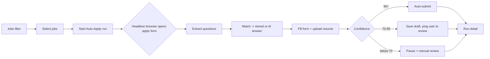
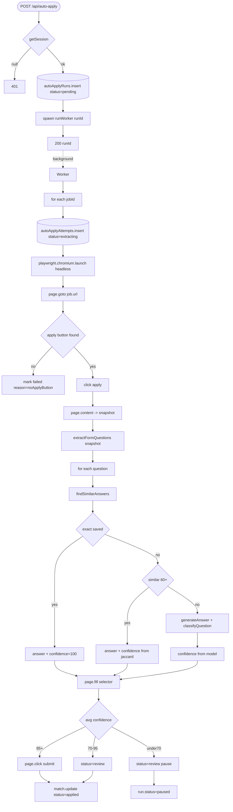

# Feature Development Plan — Auto Apply System

## Source studied (Rule 12)

- [docs/Next_Phase1.docx](../docs/Next_Phase1.docx) — Application Automation Engine + Automation Workflow (Phase 3).
- [docs/Next_Phase2.docx](../docs/Next_Phase2.docx) § Task 12 — Auto Apply System; § Task 13 — Smart Learning (paired with [plan/13](13-smart-learning.md)).

---

## Step 1 — What is the feature

**a.** The user picks a job (or a saved filter), the system opens the apply form in a headless browser (Playwright), extracts every question, matches each to a saved Q&A or AI-generates one, fills the form, uploads the resume, and either auto-submits (high confidence) or saves a draft for manual review. Every run is logged for audit + smart-learning.

**b. Source citation (docs/Next_Phase2.docx § Task 12):**
> Workflow: 1. Fetch Jobs · 2. Open Apply Form · 3. Extract Questions · 4. Match Stored Answers · 5. Generate Missing Answers · 6. Auto-fill Forms · 7. Upload Resume · 8. Submit Applications · 9. Save Logs.

**c. Status: New.** Manual apply is wired ([/api/jobs/[id]/apply](../src/app/api/jobs/[id]/apply/route.ts)) but it only flips Match.status to `applied`; no browser automation, no form filling. This is the biggest single piece of net-new work in the backlog.

---

## Step 2 — Pages

| Page                 | Path                                                       | Status | Triad |
|----------------------|------------------------------------------------------------|--------|-------|
| Auto Apply dashboard | `src/app/auto-apply/page.tsx`                              | NEW    | ✓     |
| Auto Apply run detail | `src/app/auto-apply/[runId]/page.tsx`                     | NEW    | ✓     |
| Job detail (modify)  | `src/app/jobs/[id]/page.tsx`                               | EXISTING (modify) | ✓ |

### Page → docs mapping

| Page                 | Source doc            | Section  | Verbatim copy                                                          |
|----------------------|-----------------------|----------|------------------------------------------------------------------------|
| Auto Apply dashboard | docs/Next_Phase2.docx | Task 12  | "Fetch Jobs", "Open Apply Form", "Extract Questions", "Match Stored Answers", "Auto-fill Forms", "Submit Applications", "Save Logs" |
| Run detail           | docs/Next_Phase2.docx | Task 12  | "Save Logs"                                                            |

---

## Step 3 — User Journey



---

## Step 4 — Database schema

**a. New models:**

`src/server/models/AutoApplyRun.ts` (NEW)

| Field                | Type     | Constraints                                           | Purpose |
|----------------------|----------|-------------------------------------------------------|---------|
| userId               | ObjectId | required, indexed                                     | Owner |
| jobIds               | ObjectId[] | required                                            | Targeted jobs |
| status               | string   | enum `pending|running|paused|completed|failed`       | Pipeline state |
| confidenceThresholds | object   | `{ autoSubmit: 95, review: 70 }` (camelCase)         | Per-run override |
| startedAt / finishedAt | Date   | optional                                              | Audit |
| createdAt/updatedAt  | Date     | timestamps                                            | Audit |

`src/server/models/AutoApplyAttempt.ts` (NEW)

| Field                | Type     | Constraints                                           | Purpose |
|----------------------|----------|-------------------------------------------------------|---------|
| runId                | ObjectId | required, ref AutoApplyRun, indexed                   | Parent |
| userId               | ObjectId | required, indexed                                     | Denorm for queries |
| jobId                | ObjectId | required, ref Job, indexed                            | Target |
| status               | string   | enum `extracting|filling|review|submitted|failed`    | Stage |
| questions            | nested[] | `{ raw, normalized, answer, source: "saved"\|"ai"\|"user", confidence, qnaId? }` | Per Q audit |
| screenshots          | string[] | optional (path to saved screenshots)                  | Visual audit |
| errorMessage         | string   | optional                                              | If failed |
| submittedAt          | Date     | optional                                              | When submitted |
| startedAt / finishedAt | Date   | optional                                              | Audit |

**b. Modifications:**

[src/server/models/Match.ts](../src/server/models/Match.ts) — add:

| Field         | Type     | Constraints | Purpose                                       |
|---------------|----------|-------------|-----------------------------------------------|
| autoApplyRunId | ObjectId | optional, indexed | Link to the run that applied this match |

**c. Refs**

```
AutoApplyRun.userId    → User._id
AutoApplyAttempt.runId → AutoApplyRun._id   // cascade-delete via service
AutoApplyAttempt.jobId → Job._id
```

**d. Indexes**

- `(userId, createdAt -1)` on AutoApplyRun.
- `(userId, runId, jobId)` on AutoApplyAttempt.
- `(runId, status)` on AutoApplyAttempt.

**e. Other constraints** — `confidenceThresholds.autoSubmit ∈ [50, 100]`, `confidenceThresholds.review ∈ [0, autoSubmit)`.

**f. Migration plan** — additive; new collections.

---

## Step 5 — Auth guard / cross-cutting identification

**a. New guards:**

`src/server/auth/requireFeatureFlag.ts` (NEW)
- Default export `requireFeatureFlag(name: string)` page guard that reads a per-user feature-flag set and redirects to `/dashboard?blocked=<name>` if disabled.
- Phase 1 of Auto Apply is opt-in; user enables it from Settings.

**b. Existing guards** — `requireUser`, `getSession`.

**c. Application order** — page: `requireUser → requireFeatureFlag("autoApply") → render`.

**d. Cross-cutting** — background runs are long; use a job queue. Phase 1: process the run synchronously inside a Node child process via a thin in-memory queue (no Redis). Phase 2: BullMQ ([plan/19](19-future-enhancements.md)).

Also: **opt-in legal warning** — before any platform that forbids scraping (LinkedIn, Indeed) the user must accept a per-platform disclaimer (stored on User as `autoApplyOptIn: { linkedin: true, ... }`).

---

## Step 6 — Routes

**a. Frontend routes**

```
/auto-apply                    — "Auto-apply dashboard"   [protected: requireUser + requireFeatureFlag(autoApply)]   NEW
/auto-apply/[runId]            — "Run detail"             [protected]                                                NEW
/jobs/[id]                     — Add "Add to auto-apply queue" CTA                                                    EXISTING (modify)
/settings                      — Add Auto-Apply opt-in section                                                        EXISTING (modify)
```

**b. API routes**

```
GET    /api/auto-apply                            — List my runs                       [protected]   NEW
POST   /api/auto-apply                            — Start a run                        [protected]   NEW
GET    /api/auto-apply/[runId]                    — Run detail + attempts              [protected]   NEW
POST   /api/auto-apply/[runId]/pause              — Pause running run                  [protected]   NEW
POST   /api/auto-apply/[runId]/resume             — Resume paused run                  [protected]   NEW
POST   /api/auto-apply/attempts/[attemptId]/approve — Approve a review-required attempt + auto-submit  [protected]   NEW
POST   /api/auto-apply/attempts/[attemptId]/edit    — Edit answers before submit       [protected]   NEW
POST   /api/auto-apply/attempts/[attemptId]/skip    — Skip                              [protected]   NEW
```

All NEW backend routes declare `runtime = "nodejs"`.

---

## Step 7 — Components

**a. New components**

| Component                                                              | Scope        | Purpose                                                |
|------------------------------------------------------------------------|--------------|--------------------------------------------------------|
| `src/app/auto-apply/_components/RunsTable.tsx`                         | Single-page  | List of all runs.                                       |
| `src/app/auto-apply/_components/StartRunDrawer.tsx`                    | Single-page  | Wizard: pick jobs + thresholds + start.                 |
| `src/app/auto-apply/[runId]/_components/AttemptTimeline.tsx`           | Single-page  | Per-job timeline with status icons.                     |
| `src/app/auto-apply/[runId]/_components/AttemptCard.tsx`               | Single-page  | Per-job card with Q&A table + Approve/Edit/Skip actions. |
| `src/app/auto-apply/[runId]/_components/QuestionRow.tsx`               | Single-page  | One row per extracted question with confidence pill.    |
| `src/app/settings/_components/AutoApplyOptInSection.tsx`               | Single-page  | Toggle per-platform opt-ins + thresholds.               |
| `src/components/ConfidencePill.tsx`                                    | Shared       | 0–100 color-coded pill (shared with smart-learning).    |

**b. Existing components** — reuse [src/components/StatusBadge.tsx](../src/components/StatusBadge.tsx), [src/components/Card.tsx](../src/components/Card.tsx), [src/components/Button.tsx](../src/components/Button.tsx).

---

## Step 8 — Third-party integrations

```
### playwright (NEW)
- Headless Chromium for form interaction
- npm install playwright + npx playwright install --with-deps chromium
- Env: PLAYWRIGHT_BROWSERS_PATH=0 to keep binaries inside node_modules
- Resource: ~300MB binary; runs on Node 18+

### Active LLM (existing — extending)
- New LLM function: services/llm/classifyQuestion.ts (NEW)
  - input: { questionText, fieldType (textarea|select|radio|checkbox|file|number) }
  - output: { category: QnaCategory, isSensitive: boolean, suggestedAnswerKind: "text"|"select"|"yesNo" }
- Existing generateAnswer is reused for textareas
- New LLM function: services/llm/extractFormQuestions.ts (NEW)
  - input: serialized DOM snapshot (HTML of <form> with labels/aria)
  - output: array of { rawQuestion, normalized, fieldSelector, fieldType, required }

### Browser extension (existing — extending)
- A "Hand-off to auto-apply" button on the extension that opens the headless run in the app
- Posts the current page URL + html snapshot to /api/auto-apply with mode=manualHandoff
```

```
### Env vars (NEW)
- AUTO_APPLY_ENABLED=true|false  (master kill switch)
- PLAYWRIGHT_HEADLESS=true|false (debug toggle; default true)
- AUTO_APPLY_SCREENSHOT_DIR=./screenshots
```

Add to [src/lib/env.ts](../src/lib/env.ts) and [.env.example](../.env.example).

---

## Step 9 — End-to-end Mermaid flow



---

## Step 10 — Route handlers and per-route logic

### POST /api/auto-apply (NEW)
1. `getSession()` → 401.
2. zod parse `{ jobIds, confidenceThresholds? }`.
3. Check `User.autoApplyOptIn[<platform>]` for each job's source — refuse with `fail("optInRequired", 412)` if missing.
4. `dbConnect()`. Create `AutoApplyRun` doc (status `pending`).
5. Spawn `runWorker(runId)` (Phase 1: child_process / setImmediate; Phase 2: BullMQ enqueue).
6. `ok({ runId })`.

### `runWorker(runId)` (in `src/server/services/autoApply/runWorker.ts`)
1. `AutoApplyRun.update(status=running, startedAt=now)`.
2. For each `jobId`:
   a. Create `AutoApplyAttempt(status=extracting)`.
   b. `browser = await playwright.chromium.launch({ headless: PLAYWRIGHT_HEADLESS })`.
   c. `page = await browser.newPage()`, `goto(job.url)`.
   d. Find apply button (try selectors per platform; fall back to text match "Apply").
   e. Snapshot `page.content()` and call `extractFormQuestions(html)`.
   f. For each question: call `findSimilarAnswers` then fall back to `generateAnswer` if no match.
   g. Compute per-attempt average confidence; pick branch (auto-submit / review / manual).
   h. On submit: `page.click(submitSelector)` and wait for navigation; mark attempt `submitted` + screenshot.
   i. Update `Match` (status=`applied`, push `statusHistory`).
3. `AutoApplyRun.update(status=completed, finishedAt=now)`.
4. Errors per attempt: catch + set `status=failed`, `errorMessage`. Continue with next job.

### POST /api/auto-apply/attempts/[attemptId]/approve (NEW)
1. `getSession()` → 401.
2. Load attempt (must be `userId` + `status="review"`).
3. Re-open browser + fill from stored answers + submit.
4. Update attempt + Match.
5. `ok({ submitted: true })`.

(Other routes — pause/resume/edit/skip — mirror this shape.)

---

## Step 11 — Folder structure

```
src/app/auto-apply/
├── page.tsx                                  # NEW (≤ 30 LOC; requireUser + requireFeatureFlag + <DashboardView/>)
├── error.tsx                                 # NEW (3-line)
├── loading.tsx                               # NEW (3-line)
├── _components/
│   ├── DashboardView.tsx                     # NEW
│   ├── RunsTable.tsx                         # NEW
│   ├── StartRunDrawer.tsx                    # NEW
│   └── DashboardView.module.css              # NEW
└── [runId]/
    ├── page.tsx                              # NEW
    ├── error.tsx                             # NEW
    ├── loading.tsx                           # NEW
    └── _components/
        ├── RunDetailView.tsx                 # NEW
        ├── AttemptTimeline.tsx               # NEW
        ├── AttemptCard.tsx                   # NEW
        └── QuestionRow.tsx                   # NEW

src/components/ConfidencePill.tsx             # NEW (shared)

src/app/jobs/[id]/_components/JobDetailView.tsx       # MODIFIED — Add to queue CTA
src/app/settings/_components/AutoApplyOptInSection.tsx # NEW

src/app/api/auto-apply/route.ts                            # NEW
src/app/api/auto-apply/[runId]/route.ts                    # NEW
src/app/api/auto-apply/[runId]/pause/route.ts              # NEW
src/app/api/auto-apply/[runId]/resume/route.ts             # NEW
src/app/api/auto-apply/attempts/[attemptId]/approve/route.ts # NEW
src/app/api/auto-apply/attempts/[attemptId]/edit/route.ts    # NEW
src/app/api/auto-apply/attempts/[attemptId]/skip/route.ts    # NEW

src/server/models/AutoApplyRun.ts             # NEW
src/server/models/AutoApplyAttempt.ts         # NEW
src/server/models/Match.ts                    # MODIFIED — autoApplyRunId

src/server/services/autoApply/runWorker.ts                 # NEW
src/server/services/autoApply/extractAndAnswer.ts          # NEW
src/server/services/autoApply/fillForm.ts                  # NEW
src/server/services/autoApply/submitForm.ts                # NEW
src/server/services/autoApply/screenshot.ts                # NEW
src/server/services/autoApply/per-platform/linkedin.ts     # NEW (selectors + apply-button heuristics)
src/server/services/autoApply/per-platform/indeed.ts       # NEW
src/server/services/autoApply/per-platform/workable.ts     # NEW
src/server/services/autoApply/per-platform/generic.ts      # NEW

src/server/services/llm/extractFormQuestions.ts            # NEW
src/server/services/llm/prompt/extractFormQuestions.ts     # NEW
src/server/services/llm/classifyQuestion.ts                # NEW
src/server/services/llm/prompt/classifyQuestion.ts         # NEW

src/server/auth/requireFeatureFlag.ts                       # NEW

src/lib/env.ts                                # MODIFIED — AUTO_APPLY_ENABLED + PLAYWRIGHT_HEADLESS + AUTO_APPLY_SCREENSHOT_DIR
.env.example                                  # MODIFIED
```

### Delta table

| #   | Path                                                                | NEW / MOD | Purpose                          | LOC |
|-----|---------------------------------------------------------------------|-----------|----------------------------------|-----|
| F1  | src/app/auto-apply/page.tsx                                          | NEW       | Shell                            | 25  |
| F2  | src/app/auto-apply/[runId]/page.tsx                                  | NEW       | Shell                            | 25  |
| F3  | _components/DashboardView.tsx                                        | NEW       | Client entry                     | 120 |
| F4  | _components/RunsTable.tsx                                            | NEW       | Runs list                        | 140 |
| F5  | _components/StartRunDrawer.tsx                                       | NEW       | Wizard                           | 200 |
| F6  | [runId]/_components/RunDetailView.tsx                                | NEW       | Run detail entry                 | 100 |
| F7  | [runId]/_components/AttemptTimeline.tsx                              | NEW       | Per-job timeline                 | 150 |
| F8  | [runId]/_components/AttemptCard.tsx                                  | NEW       | Card with actions                | 220 |
| F9  | [runId]/_components/QuestionRow.tsx                                  | NEW       | Question row                     | 100 |
| F10 | src/components/ConfidencePill.tsx                                    | NEW       | Shared pill                      | 50  |
| F11 | src/app/jobs/[id]/_components/JobDetailView.tsx                      | MOD       | Add-to-queue CTA                 | +15 |
| F12 | src/app/settings/_components/AutoApplyOptInSection.tsx               | NEW       | Opt-in section                   | 180 |
| B1  | src/app/api/auto-apply/route.ts                                      | NEW       | List + start                     | 70  |
| B2  | src/app/api/auto-apply/[runId]/route.ts                              | NEW       | Detail                           | 40  |
| B3  | src/app/api/auto-apply/[runId]/pause/route.ts                        | NEW       | Pause                            | 25  |
| B4  | src/app/api/auto-apply/[runId]/resume/route.ts                       | NEW       | Resume                           | 25  |
| B5  | src/app/api/auto-apply/attempts/[attemptId]/approve/route.ts         | NEW       | Approve + submit                 | 50  |
| B6  | src/app/api/auto-apply/attempts/[attemptId]/edit/route.ts            | NEW       | Edit answers                     | 40  |
| B7  | src/app/api/auto-apply/attempts/[attemptId]/skip/route.ts            | NEW       | Skip                             | 25  |
| B8  | src/server/models/AutoApplyRun.ts                                    | NEW       | Schema                           | 70  |
| B9  | src/server/models/AutoApplyAttempt.ts                                | NEW       | Schema                           | 100 |
| B10 | src/server/models/Match.ts                                           | MOD       | autoApplyRunId                   | +5  |
| B11 | src/server/services/autoApply/runWorker.ts                           | NEW       | Orchestrator                     | 220 |
| B12 | src/server/services/autoApply/extractAndAnswer.ts                    | NEW       | Q&A pipeline                     | 150 |
| B13 | src/server/services/autoApply/fillForm.ts                            | NEW       | Field filling                    | 130 |
| B14 | src/server/services/autoApply/submitForm.ts                          | NEW       | Submit + wait                    | 80  |
| B15 | src/server/services/autoApply/screenshot.ts                          | NEW       | Save snaps                       | 40  |
| B16 | src/server/services/autoApply/per-platform/linkedin.ts               | NEW       | LinkedIn selectors               | 150 |
| B17 | src/server/services/autoApply/per-platform/indeed.ts                 | NEW       | Indeed selectors                 | 130 |
| B18 | src/server/services/autoApply/per-platform/workable.ts               | NEW       | Workable selectors               | 120 |
| B19 | src/server/services/autoApply/per-platform/generic.ts                | NEW       | Fallback heuristics              | 150 |
| B20 | src/server/services/llm/extractFormQuestions.ts                      | NEW       | LLM extraction                   | 60  |
| B21 | src/server/services/llm/prompt/extractFormQuestions.ts               | NEW       | Prompt                           | 50  |
| B22 | src/server/services/llm/classifyQuestion.ts                          | NEW       | LLM classify                     | 50  |
| B23 | src/server/services/llm/prompt/classifyQuestion.ts                   | NEW       | Prompt                           | 40  |
| B24 | src/server/auth/requireFeatureFlag.ts                                | NEW       | Per-user flag guard              | 35  |
| B25 | src/lib/env.ts                                                       | MOD       | New env keys                     | +10 |
| B26 | .env.example                                                         | MOD       | New env keys                     | +3  |

---

## Open questions

1. **Hosting** — Playwright needs Chromium binaries (~300MB). Recommended: dedicated worker process; not Vercel (Vercel functions can't run headless Chromium). Phase 1 may require a self-hosted Node worker.
2. **Captcha** — many platforms throw reCAPTCHA. Recommended: pause attempt + ping user via email when captcha detected; never solve.
3. **Resume file** — auto-apply needs the actual file to upload. Resolves Open Question 1 from [plan/07](07-ai-email-generator.md) — must add object storage in this phase.
4. **Run concurrency** — should we cap to one active run per user? Recommended yes.
5. **Per-platform ToS** — see [plan/05 Open Q1](05-connected-job-platforms.md#open-questions). LinkedIn/Indeed auto-submit is risky; default to "review only" mode for those platforms even at high confidence.
