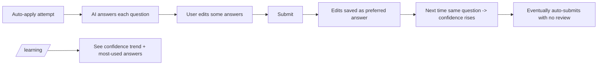

# Feature Development Plan — Smart Learning System

## Source studied (Rule 12)

- [docs/Next_Phase1.docx](../docs/Next_Phase1.docx) — AI Matching Engine + Analytics.
- [docs/Next_Phase2.docx](../docs/Next_Phase2.docx) § Task 13 — Smart Learning System.

---

## Step 1 — What is the feature

**a.** The app learns from every auto-apply attempt. When a user edits an AI-drafted answer or submits a new Q&A from the apply form, the corrected answer is saved and re-used next time. Confidence scoring drives the auto-apply behavior: ≥95% auto-submits, 70–95% asks for review, <70% requires manual review. Over time the system learns the user's voice.

**b. Source citation (docs/Next_Phase2.docx § Task 13):**
> Learn from previous applications · Save new questions · Save successful answers · Improve future automation · Confidence Levels: 95+ → Auto Submit · 70-95 → Review Suggested · Below 70 → Manual Review.

**c. Status: New.** No telemetry collection, no confidence calibration loop, no "successful answer" record.

---

## Step 2 — Pages

| Page                  | Path                                  | Status | Triad |
|-----------------------|---------------------------------------|--------|-------|
| Learning insights     | `src/app/learning/page.tsx`           | NEW    | ✓     |

(Lightweight page; many features surface in existing Auto-Apply and Answers pages.)

### Page → docs mapping

| Page              | Source doc            | Section  | Verbatim copy                                                          |
|-------------------|-----------------------|----------|------------------------------------------------------------------------|
| Learning insights | docs/Next_Phase2.docx | Task 13  | "Learn from previous applications", "Save new questions", "Save successful answers" |

---

## Step 3 — User Journey



---

## Step 4 — Database schema

**a. New models:**

`src/server/models/AnswerFeedback.ts` (NEW) — tracks every (auto-suggested → user-edited) pair so we can train confidence.

| Field              | Type     | Constraints                       | Purpose |
|--------------------|----------|-----------------------------------|---------|
| userId             | ObjectId | required, indexed                 | Owner |
| attemptId          | ObjectId | required, indexed                 | Source attempt |
| qnaId              | ObjectId | optional                          | If saved/used a QnA |
| questionNormalized | string   | required                          | Match key |
| suggestedAnswer    | string   | required                          | What AI / saved Q&A produced |
| finalAnswer        | string   | required                          | What user accepted |
| editDistance       | number   | computed (Levenshtein normalized) | 0=accepted; 1=fully rewritten |
| accepted           | boolean  | required                          | true if `editDistance < 0.1` |
| confidenceBefore   | number   | 0–100                             | Confidence shown to user |
| confidenceAdjusted | number   | 0–100                             | After-the-fact ground-truth confidence (1 - editDistance) * 100 |
| createdAt          | Date     | timestamps                        | Audit |

**b. Modifications:**

[src/server/models/QnA.ts](../src/server/models/QnA.ts) — add:

| Field              | Type   | Constraints                | Purpose                                          |
|--------------------|--------|----------------------------|--------------------------------------------------|
| confidenceScore    | number | default 70, 0–100          | Rolling confidence from AnswerFeedback.        |
| acceptanceCount    | number | default 0                  | How many times accepted as-is.                   |
| editCount          | number | default 0                  | How many times edited.                            |
| lastFeedbackAt     | Date   | optional                   | Last time this Q&A was scored.                   |

`User.autoApplyOptIn` (introduced in [plan/12](12-auto-apply-system.md)) extends to include `autoSubmitThreshold` (default 95) and `reviewThreshold` (default 70).

**c. Refs**

```
AnswerFeedback.userId    → User._id
AnswerFeedback.attemptId → AutoApplyAttempt._id
AnswerFeedback.qnaId     → QnA._id (nullable when AI-only)
```

**d. Indexes** — `(userId, questionNormalized)`, `(userId, createdAt -1)`, `(qnaId)`.

**e. Other constraints** — `editDistance ∈ [0,1]`.

**f. Migration plan** — additive.

---

## Step 5 — Auth guard / cross-cutting identification

**a. New guards** — none.

**b. Existing guards** — `getSession`.

**c. Application order** — feedback writes happen inside the auto-apply submit and edit handlers; no extra public API needed beyond a read endpoint for the insights page.

**d. Cross-cutting** — confidence recompute is **eventually consistent**: after every `AnswerFeedback` insert, the matching `QnA.confidenceScore` is recomputed as a Bayesian rolling mean (`(prior * 0.8 + sample * 0.2)`) inside the service `updateQnaConfidence.ts`.

---

## Step 6 — Routes

**a. Frontend routes**

```
/learning                       — "Learning insights"   [protected: requireUser]   NEW
```

**b. API routes**

```
GET    /api/learning                          — Stats + confidence trend             [protected]   NEW
GET    /api/learning/questions                — Top edited / accepted questions      [protected]   NEW
POST   /api/auto-apply/attempts/[attemptId]/edit  — extended to also record AnswerFeedback for every changed answer (see plan/12)   MODIFIED
```

---

## Step 7 — Components

**a. New components**

| Component                                              | Scope        | Purpose                                       |
|--------------------------------------------------------|--------------|-----------------------------------------------|
| `src/app/learning/_components/ConfidenceTrend.tsx`     | Single-page  | Line chart: confidence average over time.     |
| `src/app/learning/_components/AcceptanceRateCard.tsx`  | Single-page  | "92% of suggestions accepted last week".      |
| `src/app/learning/_components/MostEditedTable.tsx`     | Single-page  | Top 10 questions where AI most often gets it wrong. |
| `src/app/learning/_components/TopAnswersTable.tsx`     | Single-page  | Top accepted Q&As — recommended canonical set. |
| `src/components/ConfidencePill.tsx`                    | Shared       | Already created in [plan/12](12-auto-apply-system.md) — reused. |
| `src/components/MiniChart.tsx`                         | Shared       | SVG line/bar primitive for sparkline-style charts. Will also be used in Admin (plan/14). |

**b. Existing components** — modify [QnaItem.tsx](../src/app/answers/_components/QnaItem.tsx) to show `confidenceScore` pill + edit/acceptance counts.

---

## Step 8 — Third-party integrations

```
### fast-levenshtein (NEW)
- Edit-distance for editDistance computation
- npm install fast-levenshtein @types/fast-levenshtein
```

No new env vars.

---

## Step 9 — End-to-end Mermaid flow

```mermaid
flowchart TD
    Submit([User clicks Submit in AttemptCard]) --> Edit[POST /api/auto-apply/attempts/id/edit]
    Edit --> Diff[For each question: compute editDistance suggested vs final]
    Diff --> Save[(answerFeedback.insert per question)]
    Save --> UpdateQnA{qnaId present}
    UpdateQnA -- yes --> Recalc[updateQnaConfidence qnaId new sample]
    UpdateQnA -- no --> Upsert[(qnas.upsert userId normalized) with confidenceScore=adjusted]
    Recalc --> Done
    Upsert --> Done[Attempt marked submitted]
    Done --> Calibrate[Background: every Sunday recompute User-wide acceptance rate]
```

---

## Step 10 — Route handlers and per-route logic

### GET /api/learning (NEW)
1. `getSession()` → 401.
2. Aggregations against `AnswerFeedback`:
   - `acceptanceRate = sum(accepted) / count() * 100` (last 30 days).
   - `confidenceTrend`: bucket by week, average `confidenceAdjusted`.
   - `totalCorrections = count(accepted=false)`.
3. `ok({ acceptanceRate, confidenceTrend, totalCorrections })`.

### GET /api/learning/questions (NEW)
1. `getSession()` → 401.
2. `AnswerFeedback.aggregate([{ $match: { userId } }, { $group: { _id: "$questionNormalized", edits: { $sum: { $cond: [{ $eq: ["$accepted", false] }, 1, 0] } }, total: { $sum: 1 }, avgAdjusted: { $avg: "$confidenceAdjusted" } } }, { $sort: { edits: -1 } }, { $limit: 10 }])`.
3. Top-accepted similarly: sort by `acceptanceRate desc`.
4. `ok({ mostEdited, topAccepted })`.

### POST /api/auto-apply/attempts/[attemptId]/edit (MODIFY)
1. Load attempt; auth.
2. zod parse `{ answers: { questionIndex, finalAnswer }[] }`.
3. For each: pull `suggestedAnswer` from stored attempt; compute `editDistance` via `fast-levenshtein`; `accepted = editDistance < 0.1`.
4. `AnswerFeedback.create({...})`.
5. If `qnaId`: `await updateQnaConfidence(qnaId, confidenceAdjusted)`. Else: upsert a new QnA with `source: "ai"` and `confidenceScore = confidenceAdjusted`.
6. Update attempt with `questions[*].finalAnswer`.
7. `ok({ saved: answers.length })`.

### `updateQnaConfidence(qnaId, sample)` (service)
```ts
const prior = qna.confidenceScore ?? 70;
const next = prior * 0.8 + sample * 0.2;
QnA.updateOne({ _id: qnaId }, {
  confidenceScore: next,
  $inc: { acceptanceCount: sample >= 90 ? 1 : 0, editCount: sample < 90 ? 1 : 0 },
  lastFeedbackAt: new Date(),
});
```

---

## Step 11 — Folder structure

```
src/app/learning/
├── page.tsx                                  # NEW (≤ 30 LOC)
├── error.tsx                                 # NEW
├── loading.tsx                               # NEW
└── _components/
    ├── LearningView.tsx                      # NEW
    ├── ConfidenceTrend.tsx                   # NEW
    ├── AcceptanceRateCard.tsx                # NEW
    ├── MostEditedTable.tsx                   # NEW
    ├── TopAnswersTable.tsx                   # NEW
    └── LearningView.module.css               # NEW

src/components/MiniChart.tsx                  # NEW (shared)

src/app/api/learning/route.ts                 # NEW
src/app/api/learning/questions/route.ts       # NEW
src/app/api/auto-apply/attempts/[attemptId]/edit/route.ts # MODIFIED (from plan/12)

src/server/models/AnswerFeedback.ts           # NEW
src/server/models/QnA.ts                      # MODIFIED — confidenceScore + counts

src/server/services/learning/updateQnaConfidence.ts       # NEW
src/server/services/learning/recordAnswerFeedback.ts      # NEW
src/server/services/learning/getLearningStats.ts          # NEW
src/server/services/learning/getTopQuestions.ts           # NEW
```

### Delta table

| #   | Path                                                              | NEW / MOD | Purpose                       | LOC |
|-----|-------------------------------------------------------------------|-----------|-------------------------------|-----|
| F1  | src/app/learning/page.tsx                                          | NEW       | Shell                         | 20  |
| F2  | _components/LearningView.tsx                                       | NEW       | Client entry                  | 100 |
| F3  | _components/ConfidenceTrend.tsx                                    | NEW       | Sparkline chart               | 120 |
| F4  | _components/AcceptanceRateCard.tsx                                 | NEW       | Big number card               | 60  |
| F5  | _components/MostEditedTable.tsx                                    | NEW       | Top-10 table                  | 100 |
| F6  | _components/TopAnswersTable.tsx                                    | NEW       | Top-accepted                  | 100 |
| F7  | src/components/MiniChart.tsx                                       | NEW       | Tiny SVG chart                | 120 |
| B1  | src/app/api/learning/route.ts                                      | NEW       | Stats                         | 60  |
| B2  | src/app/api/learning/questions/route.ts                            | NEW       | Top questions                 | 60  |
| B3  | src/server/models/AnswerFeedback.ts                                | NEW       | Feedback schema               | 80  |
| B4  | src/server/models/QnA.ts                                           | MOD       | confidenceScore + counts      | +12 |
| B5  | src/server/services/learning/updateQnaConfidence.ts                | NEW       | Rolling mean update           | 50  |
| B6  | src/server/services/learning/recordAnswerFeedback.ts               | NEW       | Insert + recompute            | 80  |
| B7  | src/server/services/learning/getLearningStats.ts                   | NEW       | Aggregate stats               | 80  |
| B8  | src/server/services/learning/getTopQuestions.ts                    | NEW       | Most-edited / top-accepted    | 60  |

---

## Open questions

1. Are corrections in the QnA library (when user edits an answer in `/answers`) also feedback events? Recommended yes — same insert, `attemptId = null`.
2. Should we ever lower a `confidenceScore` below the floor (say 30)? Yes — but block from auto-submit at any level below `User.autoSubmitThreshold`.
3. Should we expose the trained confidence to the user in the QnA card? Recommended yes (transparency — users can see why something is auto vs review).
