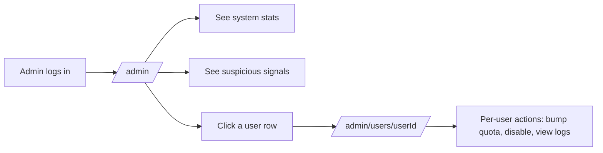
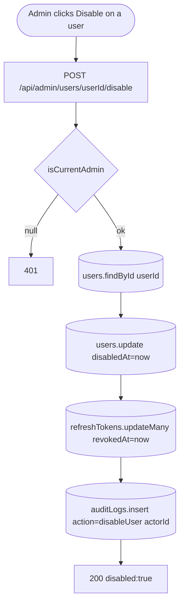

# Feature Development Plan — Admin Dashboard

## Source studied (Rule 12)

- [docs/Next_Phase1.docx](../docs/Next_Phase1.docx) — Analytics Dashboard + Security.
- [docs/Next_Phase2.docx](../docs/Next_Phase2.docx) § Task 14 — Admin Dashboard.

---

## Step 1 — What is the feature

**a.** Admin-only dashboard showing system-wide health: total users, active API keys, API usage, failed requests, suspicious activity, connected-platform analytics. Admins can act on individual users (bump JSearch quota, disable, view audit log).

**b. Source citation (docs/Next_Phase2.docx § Task 14):**
> Total Users · Active API Keys · API Usage Monitoring · Failed Requests · Suspicious Activity Detection · Connected Platforms Analytics.

**c. Status: Partial.** [/admin](../src/app/admin/page.tsx) page exists; [getAdminStats](../src/server/services/stats/getAdminStats.ts) returns aggregate counts; [getSuspiciousSignals](../src/server/services/stats/getAdminStats.ts) detects three anomalies. Page renders via [AdminView.tsx](../src/app/admin/_components/AdminView.tsx). **Gaps:** (1) no per-user drill-down; (2) no time-series charts; (3) no Connected Platforms analytics (depends on [plan/05](05-connected-job-platforms.md)); (4) JSearch quota bump (covered in [plan/09](09-jsearch-integration.md)); (5) no audit log viewer.

---

## Step 2 — Pages

| Page             | Path                                          | Status            | Triad |
|------------------|-----------------------------------------------|-------------------|-------|
| Admin            | [src/app/admin/page.tsx](../src/app/admin/page.tsx) | EXISTING (modify) | ✓ |
| Admin user detail | `src/app/admin/users/[userId]/page.tsx`       | NEW               | ✓ |

### Page → docs mapping

| Page | Source doc            | Section  | Verbatim copy                                          |
|------|-----------------------|----------|--------------------------------------------------------|
| Admin | docs/Next_Phase2.docx | Task 14 | "Total Users", "Active API Keys", "API Usage Monitoring", "Failed Requests", "Suspicious Activity Detection", "Connected Platforms Analytics" |

---

## Step 3 — User Journey



---

## Step 4 — Database schema

**a. New models:**

`src/server/models/AuditLog.ts` (NEW)

| Field    | Type     | Constraints                              | Purpose |
|----------|----------|------------------------------------------|---------|
| userId   | ObjectId | required, indexed                        | Target user |
| actorId  | ObjectId | optional                                  | Admin who acted (null = system) |
| action   | string   | enum `["login","logoutAll","bumpJsearch","disableUser","enableUser","resetPassword","deleteRefreshTokens","adminViewedUser"]` | What happened |
| metadata | object   | optional (JSON)                          | Extra context |
| createdAt | Date    | timestamps                                | When |

**b. Modifications** — [src/server/models/User.ts](../src/server/models/User.ts) — add:

| Field      | Type    | Constraints     | Purpose                                |
|------------|---------|-----------------|----------------------------------------|
| disabledAt | Date    | optional        | Soft-disable flag — blocks login.       |

**c. Refs**

```
AuditLog.userId  → User._id
AuditLog.actorId → User._id (nullable)
```

**d. Indexes** — `(userId, createdAt -1)` and `(action, createdAt -1)` on AuditLog.

**e. Other constraints** — disabled users can't log in: extend `/api/auth/login` to `fail("accountDisabled", 403)` when `disabledAt != null`.

**f. Migration plan** — additive.

---

## Step 5 — Auth guard / cross-cutting identification

**a. New guards** — none (use existing).

**b. Existing guards** — [requireAdmin](../src/server/auth/requireAdmin.ts) for pages; [isCurrentAdmin](../src/server/auth/requireAdmin.ts) for APIs.

**c. Application order** — every admin API: `isCurrentAdmin → if null fail(401) → dbConnect → service → writeAuditLog → ok`.

**d. Cross-cutting** — every state-changing admin action writes an `AuditLog` row before returning.

---

## Step 6 — Routes

**a. Frontend routes**

```
/admin                                — "Admin"                 [protected: requireAdmin]   EXISTING (modify)
/admin/users/[userId]                 — "User detail"           [protected: requireAdmin]   NEW
```

**b. API routes**

```
GET    /api/admin/stats                       — System-wide counters + signals     [admin]   EXISTING (modify — extend payload)
GET    /api/admin/usage                       — Time-series of API usage           [admin]   NEW
GET    /api/admin/users                       — Paginated user list                [admin]   NEW
GET    /api/admin/users/[userId]              — One user with stats                [admin]   NEW
POST   /api/admin/users/[userId]/disable      — Soft disable                       [admin]   NEW
POST   /api/admin/users/[userId]/enable       — Re-enable                          [admin]   NEW
POST   /api/admin/users/[userId]/revoke-sessions — Revoke all refresh tokens       [admin]   NEW
GET    /api/admin/audit                       — Audit log (paginated, filterable)  [admin]   NEW
```

JSearch routes live in [plan/09](09-jsearch-integration.md). Connected Platforms analytics live in [plan/05](05-connected-job-platforms.md).

---

## Step 7 — Components

**a. New components**

| Component                                                      | Scope        | Purpose                                  |
|----------------------------------------------------------------|--------------|------------------------------------------|
| `src/app/admin/_components/UsageTimeSeries.tsx`                | Single-page  | Line chart per day (uses `<MiniChart/>` from [plan/13](13-smart-learning.md)). |
| `src/app/admin/_components/UsersTable.tsx`                     | Single-page  | Paginated user list with filter input.    |
| `src/app/admin/_components/SuspiciousSignals.tsx`              | Single-page  | Existing logic, extracted to its own card. |
| `src/app/admin/users/[userId]/_components/UserHeader.tsx`      | Single-page  | Email + disable/enable buttons.            |
| `src/app/admin/users/[userId]/_components/UserStatsGrid.tsx`   | Single-page  | Per-user counters.                         |
| `src/app/admin/users/[userId]/_components/AuditLogTable.tsx`   | Single-page  | Paginated audit rows.                      |
| `src/components/Table.tsx`                                     | Shared       | Generic sortable table primitive — also used elsewhere. |

**b. Existing components**

| Component                                                        | Action |
|------------------------------------------------------------------|--------|
| [AdminView.tsx](../src/app/admin/_components/AdminView.tsx)      | Modify — split current monolith into cards |
| [src/components/StatusBadge.tsx](../src/components/StatusBadge.tsx) (from plan/05) | Reuse |

---

## Step 8 — Third-party integrations

```
### winston (optional, NEW)
- Backend audit logger
- Daily-rotated file logs for forensic review (maxFiles: '14d' — admin needs longer than user-side)
- npm install winston winston-daily-rotate-file
```

Optional in Phase 1 (in-DB audit is enough); add if compliance requires off-DB logs.

No new env vars.

---

## Step 9 — End-to-end Mermaid flow



---

## Step 10 — Route handlers and per-route logic

### GET /api/admin/stats ([src/app/api/admin/stats/route.ts](../src/app/api/admin/stats/route.ts), EXISTING — extend if exists, else NEW)
1. `isCurrentAdmin()` → 401.
2. `[stats, signals, platformAnalytics, autoApplyStats] = await Promise.all([getAdminStats(), getSuspiciousSignals(), getPlatformAnalytics(), getAutoApplyStats()])`.
3. `ok({ stats, signals, platformAnalytics, autoApplyStats })`.

`getPlatformAnalytics()` (NEW) aggregates over `ConnectedPlatform` + `Job` (from [plan/05](05-connected-job-platforms.md)).
`getAutoApplyStats()` (NEW) aggregates over `AutoApplyRun` + `AutoApplyAttempt` (from [plan/12](12-auto-apply-system.md)).

### GET /api/admin/usage (NEW)
1. `isCurrentAdmin()` → 401.
2. Bucket `EmailLog`, `Match`, `AutoApplyAttempt`, `JsearchKey.callHistory` by day for last 30 days.
3. `ok({ buckets })`.

### GET /api/admin/users (NEW)
1. `isCurrentAdmin()`.
2. zod parse query `{ q?, disabled?, limit?, cursor? }`.
3. `User.find(filters).sort({ createdAt: -1 }).limit(limit + 1)` (cursor pagination).
4. For each: enrich with `hasActiveProvider`, `hasConnectedEmail`, `jobsApplied`.
5. `ok({ users, nextCursor })`.

### POST /api/admin/users/[userId]/disable (NEW)
1. `isCurrentAdmin()`.
2. `User.updateOne({ _id }, { disabledAt: new Date() })`.
3. Revoke all refresh tokens (when plan/02 lands).
4. `AuditLog.create({ userId, actorId, action: "disableUser" })`.
5. `ok({ disabled: true })`.

Errors: target user not found → 404; self-disable → `fail("cannotDisableSelf", 400)`.

---

## Step 11 — Folder structure

```
src/app/admin/
├── page.tsx                                  # EXISTING
├── error.tsx                                 # EXISTING
├── loading.tsx                               # EXISTING
├── _components/
│   ├── AdminView.tsx                         # MODIFIED — split into cards
│   ├── UsageTimeSeries.tsx                   # NEW
│   ├── UsersTable.tsx                        # NEW
│   ├── SuspiciousSignals.tsx                 # NEW
│   ├── JsearchQuotaTable.tsx                 # NEW (from plan/09)
│   └── *.module.css
└── users/
    └── [userId]/
        ├── page.tsx                          # NEW (≤ 30 LOC)
        ├── error.tsx                         # NEW
        ├── loading.tsx                       # NEW
        └── _components/
            ├── UserDetailView.tsx            # NEW
            ├── UserHeader.tsx                # NEW
            ├── UserStatsGrid.tsx             # NEW
            ├── AuditLogTable.tsx             # NEW
            └── UserDetailView.module.css     # NEW

src/components/Table.tsx                      # NEW (shared)

src/app/api/admin/stats/route.ts              # EXISTING (verify present) / MODIFIED
src/app/api/admin/usage/route.ts              # NEW
src/app/api/admin/users/route.ts              # NEW
src/app/api/admin/users/[userId]/route.ts     # NEW
src/app/api/admin/users/[userId]/disable/route.ts          # NEW
src/app/api/admin/users/[userId]/enable/route.ts           # NEW
src/app/api/admin/users/[userId]/revoke-sessions/route.ts  # NEW
src/app/api/admin/audit/route.ts              # NEW

src/server/models/AuditLog.ts                 # NEW
src/server/models/User.ts                     # MODIFIED — disabledAt

src/server/services/stats/getAdminStats.ts    # EXISTING — extend
src/server/services/stats/getPlatformAnalytics.ts  # NEW
src/server/services/stats/getAutoApplyStats.ts     # NEW
src/server/services/stats/getUsageTimeSeries.ts    # NEW
src/server/services/audit/writeAuditLog.ts         # NEW
src/server/services/admin/disableUser.ts           # NEW
src/server/services/admin/enableUser.ts            # NEW
src/server/services/admin/revokeSessions.ts        # NEW
```

### Delta table

| #  | Path                                                       | NEW / MOD | Purpose                            | LOC |
|----|------------------------------------------------------------|-----------|------------------------------------|-----|
| F1 | _components/AdminView.tsx                                  | MOD       | Split into cards                   | +60 |
| F2 | _components/UsageTimeSeries.tsx                            | NEW       | Time-series                        | 120 |
| F3 | _components/UsersTable.tsx                                 | NEW       | Paginated table                    | 180 |
| F4 | _components/SuspiciousSignals.tsx                          | NEW       | Signal card                        | 80  |
| F5 | users/[userId]/page.tsx                                    | NEW       | Shell                              | 25  |
| F6 | users/[userId]/_components/UserDetailView.tsx              | NEW       | Client entry                       | 100 |
| F7 | users/[userId]/_components/UserHeader.tsx                  | NEW       | Header                             | 80  |
| F8 | users/[userId]/_components/UserStatsGrid.tsx               | NEW       | Stats grid                         | 100 |
| F9 | users/[userId]/_components/AuditLogTable.tsx               | NEW       | Audit table                        | 140 |
| F10 | src/components/Table.tsx                                  | NEW       | Generic sortable table             | 220 |
| B1 | src/app/api/admin/stats/route.ts                           | NEW/MOD   | Extended payload                   | +30 |
| B2 | src/app/api/admin/usage/route.ts                           | NEW       | Time-series                        | 35  |
| B3 | src/app/api/admin/users/route.ts                           | NEW       | List                               | 60  |
| B4 | src/app/api/admin/users/[userId]/route.ts                  | NEW       | One user                           | 50  |
| B5 | src/app/api/admin/users/[userId]/disable/route.ts          | NEW       | Disable                            | 40  |
| B6 | src/app/api/admin/users/[userId]/enable/route.ts           | NEW       | Enable                             | 35  |
| B7 | src/app/api/admin/users/[userId]/revoke-sessions/route.ts  | NEW       | Revoke                             | 35  |
| B8 | src/app/api/admin/audit/route.ts                           | NEW       | Audit log                          | 50  |
| B9 | src/server/models/AuditLog.ts                              | NEW       | Schema                             | 60  |
| B10 | src/server/models/User.ts                                 | MOD       | disabledAt                         | +4  |
| B11 | src/server/services/stats/getPlatformAnalytics.ts         | NEW       | Platform aggregates                | 90  |
| B12 | src/server/services/stats/getAutoApplyStats.ts            | NEW       | Auto-apply aggregates              | 90  |
| B13 | src/server/services/stats/getUsageTimeSeries.ts           | NEW       | Day-bucketed counts                | 120 |
| B14 | src/server/services/audit/writeAuditLog.ts                | NEW       | Audit helper                       | 30  |
| B15 | src/server/services/admin/disableUser.ts                  | NEW       | + revoke + audit                   | 50  |
| B16 | src/server/services/admin/enableUser.ts                   | NEW       | + audit                            | 30  |
| B17 | src/server/services/admin/revokeSessions.ts               | NEW       | + audit                            | 35  |

---

## Open questions

1. Should we add per-user impersonation ("Sign in as user")? Risk vs reward — recommended **no** in Phase 1; very high abuse surface.
2. What signal counts as "suspicious"? Existing service flags three; recommend adding: many failed logins in 1 hr; LLM key probed but never used; auto-apply runs failed > 50%. List configurable in [src/server/services/stats/getAdminStats.ts](../src/server/services/stats/getAdminStats.ts).
3. Retention — audit logs grow unbounded. Recommended: TTL `expireAfterSeconds: 60*60*24*180` (180 days).
