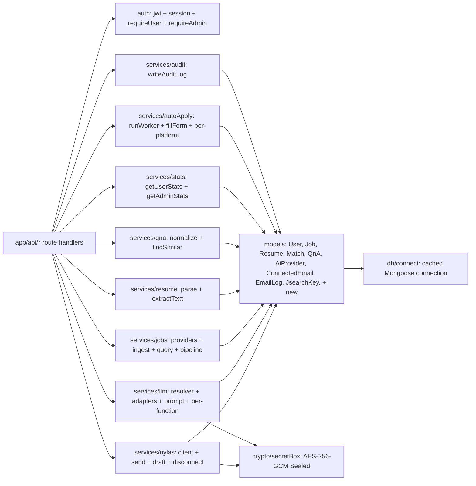

# Feature Development Plan — Backend Architecture

## Source studied (Rule 12)

- [docs/Next_Phase1.docx](../docs/Next_Phase1.docx) — Core Modules, High-Level Architecture.
- [docs/Next_Phase2.docx](../docs/Next_Phase2.docx) § Task 15 — Backend Architecture.

---

## Step 1 — What is the feature

**a.** Defines the canonical module split on the server side so every new feature plugs in the same way: Auth, Nylas, AI/LLM, Jobs, Automation, Settings.

**b. Source citation (docs/Next_Phase2.docx § Task 15):**
> Auth Module — Signup, Login, JWT, Password Reset · Nylas Module — OAuth, Email Sync, Email Send, Grant Management · AI Module — AI Providers, Prompt Engine, Email Generator, Answer Generator · Jobs Module — Job Fetching, Filters, Job Storage · Automation Module — Auto-fill, Auto Apply, Form Detection · Settings Module — User Settings, API Keys, Connected Accounts.

**c. Status: Built (architecture meta-doc).** The current code already follows this split. This plan is the canonical reference engineers should consult when adding any backend code.

---

## Step 2 — Pages

N/A — backend-only.

---

## Step 3 — User Journey

N/A.

---

## Step 4 — Database schema

N/A — each feature plan defines its own models. This plan only defines layout.

---

## Step 5 — Auth guard / cross-cutting identification

Already documented under Rule 2. Authoritative file: [src/server/auth/](../src/server/auth/).

---

## Step 6 — Routes

N/A — see per-feature plans.

---

## Step 7 — Components

N/A.

---

## Step 8 — Third-party integrations

N/A.

---

## Step 9 — Module map



---

## Step 10 — Routing rules

All backend code follows these rules (re-stated from [.claude/commands/feature-plan.md](../.claude/commands/feature-plan.md)):

1. **Route handler is a thin wrapper.** Imports a service function, parses input with zod, returns via [src/lib/http.ts](../src/lib/http.ts).
2. **`export const runtime = "nodejs"`** on every route handler that uses Mongoose, pdf-parse, mammoth, Playwright, or any LLM SDK.
3. **Auth guard** — `getSession()` for API; `requireUser()` / `requireAdmin()` for pages.
4. **Service functions are pure** — one exported function per file. They import Mongoose + LLM SDKs; route handlers do not.
5. **LLM split** — `services/llm/<fn>.ts` orchestration + `services/llm/prompt/<fn>.ts` prompt; route hits `resolver.getActiveAdapter(userId)`.
6. **camelCase end-to-end** — zod key === Mongoose path === DTO field === client `body.<key>`.
7. **Secrets sealed** — every user-provided API key goes through [secretBox.encrypt](../src/server/crypto/secretBox.ts) before persisting.
8. **Cookies HttpOnly + server-set** — `setSessionCookie` / `setRefreshCookie` only.
9. **Every error path** — `fail(code, status)` from [src/lib/http.ts](../src/lib/http.ts), `handleError(err)` for unexpected.

---

## Step 11 — Output backend folder structure (canonical, repository-wide)

```
src/
├── app/api/                                  # Route handlers — thin
│   ├── auth/{login,register,logout,me,refresh,nylas/{start,callback}}/route.ts
│   ├── ai-providers/{,[provider]/{,activate,test}}/route.ts
│   ├── jsearch/{,activate,test}/route.ts
│   ├── jobs/{,[id]/{,match,tailor,cover-letter,interview-prep,apply,status}}/route.ts
│   ├── resume/{,ats}/route.ts
│   ├── qna/{,[id]/{,use},suggest,seed,answer}/route.ts
│   ├── nylas/{,auth,callback,draft/{,subject},send,send-test,disconnect}/route.ts
│   ├── platforms/{,[platform]/{,connect,sync}}/route.ts                  # plan/05
│   ├── auto-apply/{,[runId]/{,pause,resume},attempts/[attemptId]/{approve,edit,skip}}/route.ts  # plan/12
│   ├── learning/{,questions}/route.ts                                    # plan/13
│   ├── email-logs/route.ts                                               # plan/07
│   ├── admin/{stats,usage,users/{,[userId]/{,disable,enable,revoke-sessions}},audit,jsearch/{,[userId]}}/route.ts  # plan/14
│   └── user/{,password}/route.ts
│
├── server/
│   ├── db/connect.ts                         # cached mongoose connection
│   ├── auth/                                 # FLAT (Rule 2)
│   │   ├── jwt.ts
│   │   ├── session.ts                        # setSessionCookie + setRefreshCookie (plan/02)
│   │   ├── requireUser.ts
│   │   ├── requireAdmin.ts
│   │   └── requireFeatureFlag.ts             # plan/12
│   ├── crypto/secretBox.ts                   # AES-256-GCM
│   ├── models/                               # one Mongoose model per file
│   │   ├── User.ts                           # adds disabledAt, nylasUserId, nylasGrantId, signupMethod
│   │   ├── Job.ts                            # adds easyApply, jobMode
│   │   ├── Resume.ts
│   │   ├── Match.ts                          # adds autoApplyRunId
│   │   ├── QnA.ts                            # adds confidenceScore, acceptanceCount, editCount
│   │   ├── AiProvider.ts
│   │   ├── ConnectedEmail.ts                 # adds reconnectHint
│   │   ├── EmailLog.ts                       # adds attachmentIds, aiGenerated
│   │   ├── JsearchKey.ts                     # adds usedToday, dayKey, dailyLimit
│   │   ├── ConnectedPlatform.ts              # plan/05
│   │   ├── AutoApplyRun.ts                   # plan/12
│   │   ├── AutoApplyAttempt.ts               # plan/12
│   │   ├── AnswerFeedback.ts                 # plan/13
│   │   ├── RefreshToken.ts                   # plan/02
│   │   └── AuditLog.ts                       # plan/14
│   ├── services/
│   │   ├── auth/                             # plan/02 — issueTokens, rotateRefresh, recordLoginAttempt, createUser
│   │   ├── nylas/                            # nylasClient, disconnectGrant, checkDailyLimit
│   │   ├── llm/                              # resolver + adapters/{gemini,openai,claude,ollama} + per-function
│   │   │   ├── adapters/
│   │   │   ├── prompt/
│   │   │   ├── resolver.ts
│   │   │   ├── extractSkills.ts
│   │   │   ├── scoreMatch.ts
│   │   │   ├── tailorResume.ts
│   │   │   ├── generateCoverLetter.ts
│   │   │   ├── generateEmail.ts
│   │   │   ├── generateSubject.ts            # plan/07
│   │   │   ├── generateAnswer.ts
│   │   │   ├── generateInterviewQuestions.ts
│   │   │   ├── atsScoreResume.ts
│   │   │   ├── classifyQuestion.ts           # plan/12
│   │   │   └── extractFormQuestions.ts       # plan/12
│   │   ├── jobs/
│   │   │   ├── ingestJobs.ts
│   │   │   ├── queryJobs.ts
│   │   │   ├── getPipeline.ts
│   │   │   ├── jobProvider.ts
│   │   │   └── providers/{seed, jsearch, remoteOk, wwr, linkedin, naukri, indeed, workable, buildSession}.ts
│   │   ├── jsearch/                          # checkCaps, incrementCounters
│   │   ├── resume/                           # parseResume, extractText
│   │   ├── qna/                              # normalize, findSimilar, seedTemplates, buildAnswerContext
│   │   ├── stats/                            # getUserStats, getAdminStats, getSuspiciousSignals, getPlatformAnalytics, getAutoApplyStats, getUsageTimeSeries
│   │   ├── learning/                         # updateQnaConfidence, recordAnswerFeedback, getLearningStats, getTopQuestions
│   │   ├── autoApply/                        # runWorker, extractAndAnswer, fillForm, submitForm, screenshot, per-platform/*
│   │   ├── audit/                            # writeAuditLog
│   │   └── admin/                            # disableUser, enableUser, revokeSessions
│   └── serializers.ts                        # Mongoose doc → DTO conversions
│
├── lib/
│   ├── env.ts                                # zod-validated env vars
│   ├── apiClient.ts                          # client-side fetch wrapper
│   └── http.ts                               # ok / fail / handleError
│
├── types/index.ts                            # DTOs + enums (UPPER_SNAKE)
└── styles/tokens.css                         # design tokens
```

### Delta table

This plan does NOT add code by itself — it documents the structure that the other plans build into.

| Doc artifact                                  | Status |
|-----------------------------------------------|--------|
| Module map (Step 9)                           | NEW    |
| Routing rules list (Step 10)                  | NEW    |
| Canonical tree (Step 11)                      | NEW    |

---

## Open questions

1. When does a service grow large enough to need a sub-folder? Recommended threshold: 4+ exported functions OR > 300 LOC total → split into a folder of one-function files.
2. Should `serializers.ts` be split per-model (e.g. `serializers/job.ts`)? Recommended yes when it exceeds 200 LOC.
3. Background workers (auto-apply, JSearch warming) — should they share a common runner? Phase 1 keeps them inline; Phase 3 introduces BullMQ as a unifier — see [plan/19](19-future-enhancements.md).
