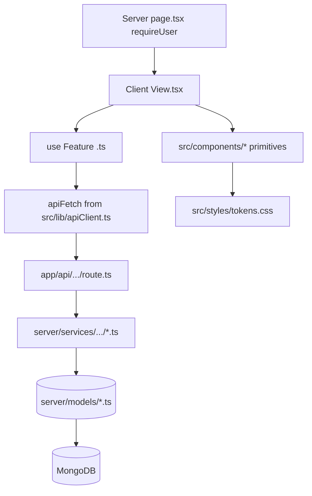

# Feature Development Plan — Frontend Architecture

## Source studied (Rule 12)

- [docs/Next_Phase1.docx](../docs/Next_Phase1.docx) — Frontend Dashboard.
- [docs/Next_Phase2.docx](../docs/Next_Phase2.docx) § Task 16 — Frontend Architecture.

---

## Step 1 — What is the feature

**a.** Documents the canonical frontend layout: which pages exist, where shared components live, what primitives are available, and how new feature pages plug in.

**b. Source citation (docs/Next_Phase2.docx § Task 16):**
> Pages: Login · Signup · Dashboard · Settings · Connected Accounts · Job Search · Job Details · AI Email Composer · Saved Answers · API Usage Dashboard · Auto Apply Dashboard · Components: Navbar · Sidebar · Job Cards · Filters · AI Suggestions Panel · Usage Cards · Status Badges.

**c. Status: Built (architecture meta-doc).** Most pages exist; gaps (Auto Apply page, Learning page, Connected Platforms page) are covered by their individual plans.

---

## Step 2 — Pages

Canonical page list (this consolidates per-plan pages):

| URL                          | Plan                  | Status            | Notes |
|------------------------------|-----------------------|-------------------|-------|
| `/`                          | (existing landing)   | EXISTING          | Public marketing. |
| `/login`                     | plan/02              | EXISTING (mod)    | Add Google + mobile choices. |
| `/register`                  | plan/01              | EXISTING (mod)    | Add Google entry. |
| `/register/complete`         | plan/01              | NEW               | Nylas post-OAuth completion. |
| `/dashboard`                 | (existing)           | EXISTING          | Personal overview. |
| `/jobs`                      | plan/06              | EXISTING (mod)    | Filter system overhaul. |
| `/jobs/[id]`                 | (existing)           | EXISTING (mod)    | Compose-email + add-to-queue CTAs. |
| `/jobs/[id]/interview`       | (existing)           | EXISTING          | Interview prep. |
| `/resume`                    | (existing)           | EXISTING          | Upload + ATS. |
| `/answers`                   | plan/10              | EXISTING (mod)    | Categories, seed, usage. |
| `/email`                     | plan/07              | EXISTING (mod)    | Subject + attach + log. |
| `/email/test`                | plan/08              | NEW               | Email connectivity test. |
| `/settings`                  | plan/03              | EXISTING (mod)    | Reconnect banner; show timestamps. |
| `/settings/platforms`        | plan/05              | NEW               | Connected job platforms. |
| `/auto-apply`                | plan/12              | NEW               | Runs dashboard. |
| `/auto-apply/[runId]`        | plan/12              | NEW               | Run detail. |
| `/learning`                  | plan/13              | NEW               | Confidence + learning insights. |
| `/admin`                     | plan/14              | EXISTING (mod)    | Split into cards + Users table. |
| `/admin/users/[userId]`      | plan/14              | NEW               | User detail. |

### Page → docs mapping

Each per-plan file already cites its source. This doc is the index.

---

## Step 3 — User Journey (canonical app map)

```mermaid
flowchart LR
    Landing[/] --> Login[/login/]
    Landing --> Register[/register/]
    Register --> Complete[/register/complete/]
    Login --> Dashboard[/dashboard/]
    Complete --> Dashboard
    Dashboard --> Jobs[/jobs/]
    Dashboard --> Resume[/resume/]
    Dashboard --> Answers[/answers/]
    Dashboard --> Email[/email/]
    Dashboard --> AutoApply[/auto-apply/]
    Dashboard --> Learning[/learning/]
    Dashboard --> Settings[/settings/]
    Settings --> Platforms[/settings/platforms/]
    Jobs --> JobDetail[/jobs/id/]
    JobDetail --> Interview[/jobs/id/interview/]
    Email --> EmailTest[/email/test/]
    AutoApply --> RunDetail[/auto-apply/runId/]
    Dashboard --> Admin[/admin/]
    Admin --> UserDetail[/admin/users/userId/]
```

---

## Step 4 — Database schema

N/A.

---

## Step 5 — Auth guard / cross-cutting identification

Page guards (Rule 2): `await requireUser()` at the top of every protected `page.tsx`; `await requireAdmin()` for admin pages; `await requireFeatureFlag("autoApply")` for Auto-Apply (plan/12).

---

## Step 6 — Routes

See Step 2.

---

## Step 7 — Components

**a. Shared primitives (`src/components/`)** — existing:

- Layout: `AppShell`, `AuthShell`, `NavBar`, `Logo`
- Forms: `Input`, `Button`, `FormMessage`
- Display: `Card`, `Badge`, `Notice`, `ErrorState`, `PageLoading`, `Spinner`, `Reveal`, `Icon`
- Brand: `GoogleAuthButton`
- Domain: `ScoreRing`, `SkillTags`

**b. Shared primitives — NEW across plans (consolidated):**

| File                                     | Plan      | Purpose                                 |
|------------------------------------------|-----------|-----------------------------------------|
| `src/components/StatusBadge.tsx`         | plan/05   | Color-coded status pill                  |
| `src/components/Slider.tsx`              | plan/06   | Range slider                             |
| `src/components/ConfidencePill.tsx`      | plan/12   | 0–100 confidence pill                    |
| `src/components/MiniChart.tsx`           | plan/13   | Sparkline / mini SVG chart               |
| `src/components/Table.tsx`               | plan/14   | Generic sortable table                   |
| `src/components/SilentRefresh.tsx`       | plan/02   | Background access-token refresher        |

**c. Sidebar.** Not in current code. Recommended NEW — `src/components/SideNav.tsx`, wired into [src/components/AppShell.tsx](../src/components/AppShell.tsx). Visible only when authenticated; hides on auth pages.

---

## Step 8 — Third-party integrations

None new at the architecture layer; per-page integrations live in their plans.

---

## Step 9 — End-to-end Mermaid flow



---

## Step 10 — Frontend rules

Re-stated from CLAUDE.md and the slash command template:

1. **`page.tsx` ≤ 30 lines.** Thin shell. Server component by default. Calls `await requireUser()` (or whichever guard).
2. **`loading.tsx` and `error.tsx` ARE REQUIRED for every route folder.** 3-line shells re-exporting [src/components/PageLoading.tsx](../src/components/PageLoading.tsx) / [src/components/ErrorState.tsx](../src/components/ErrorState.tsx) unless the route needs custom UI.
3. **One component per file. PascalCase.tsx + matching .module.css.** No raw DOM in `page.tsx`.
4. **400 LOC ceiling.** If a component approaches it, split.
5. **Single-page components live in `src/app/<feature>/_components/`.** Multi-page components live in `src/components/<Name>.tsx` (Rule 8).
6. **Form primitives only** — `<Button/>`, `<Input/>`, etc. from `src/components/`. No raw `<button>` / `<input>`.
7. **No Mongoose / LLM SDK / `@google/genai` imports in `'use client'` files** (Rule 5).
8. **All API calls via `apiFetch` from [src/lib/apiClient.ts](../src/lib/apiClient.ts).** No raw `fetch` (centralizes auth, 401 handling, error shape).
9. **CSS Modules only.** Tokens from [src/styles/tokens.css](../src/styles/tokens.css). No Tailwind / inline styles.
10. **`useMemo` / `useCallback`** are not allowed unless profiling shows a measurable win (React Compiler covers most cases). State this in the PR description if you add one.

---

## Step 11 — Output frontend folder structure (canonical)

```
src/
├── app/
│   ├── layout.tsx                            # root layout with AppShell
│   ├── page.tsx                              # landing
│   ├── globals.css
│   ├── _components/                          # landing-only components (HeroSection, FeatureSection, …)
│   ├── (auth)/                               # auth group — bare AuthShell
│   │   ├── login/{page,error,loading}.tsx + _components/
│   │   └── register/{page,error,loading}.tsx + _components/ + complete/
│   ├── dashboard/{page,error,loading}.tsx + _components/
│   ├── jobs/{page,error,loading}.tsx + _components/ + [id]/{page,...,interview/}
│   ├── resume/{page,error,loading}.tsx + _components/
│   ├── answers/{page,error,loading}.tsx + _components/
│   ├── email/{page,error,loading}.tsx + _components/ + test/{page,error,loading}.tsx + _components/
│   ├── settings/{page,error,loading}.tsx + _components/ + platforms/{page,...}
│   ├── auto-apply/{page,error,loading}.tsx + _components/ + [runId]/{page,...}
│   ├── learning/{page,error,loading}.tsx + _components/
│   └── admin/{page,error,loading}.tsx + _components/ + users/[userId]/{page,...}
│
├── components/                               # shared primitives + domain-shared
│   ├── AppShell.tsx                          # MODIFIED — mount SideNav + SilentRefresh
│   ├── AuthShell.tsx
│   ├── NavBar.tsx
│   ├── SideNav.tsx                           # NEW
│   ├── Logo.tsx
│   ├── Button.tsx + .module.css
│   ├── Input.tsx + .module.css
│   ├── Badge.tsx + .module.css
│   ├── Card.tsx + .module.css
│   ├── ErrorState.tsx + .module.css
│   ├── FormMessage.tsx + .module.css
│   ├── GoogleAuthButton.tsx + .module.css
│   ├── Icon.tsx
│   ├── Notice.tsx + .module.css
│   ├── PageLoading.tsx + .module.css
│   ├── Reveal.tsx + .module.css
│   ├── ScoreRing.tsx + .module.css
│   ├── SkillTags.tsx + .module.css
│   ├── Spinner.tsx + .module.css
│   ├── StatusBadge.tsx                       # NEW (plan/05)
│   ├── Slider.tsx                            # NEW (plan/06)
│   ├── ConfidencePill.tsx                    # NEW (plan/12)
│   ├── MiniChart.tsx                         # NEW (plan/13)
│   ├── Table.tsx                             # NEW (plan/14)
│   └── SilentRefresh.tsx                     # NEW (plan/02)
│
├── lib/
│   ├── env.ts
│   ├── apiClient.ts
│   └── http.ts
│
├── types/index.ts
└── styles/tokens.css
```

### Delta table

| File                                  | Plan      | Status |
|---------------------------------------|-----------|--------|
| src/components/SideNav.tsx            | plan/16   | NEW    |
| src/components/AppShell.tsx           | plan/16   | MOD (mount SideNav + SilentRefresh) |
| (all other shared primitives)         | various   | See per-plan delta tables. |

---

## Open questions

1. Should the sidebar collapse on narrow viewports? Recommended: yes, becomes a top drawer below `768px`.
2. Should we add a global keyboard-shortcut layer (e.g. `g j` → jobs)? Defer to Phase 4 (nice-to-have).
3. Should pages use React Server Components for initial data load, or always client-side `apiFetch`? Current pattern is **server-component for static-ish data + client for interactive views.** Keep as-is.
