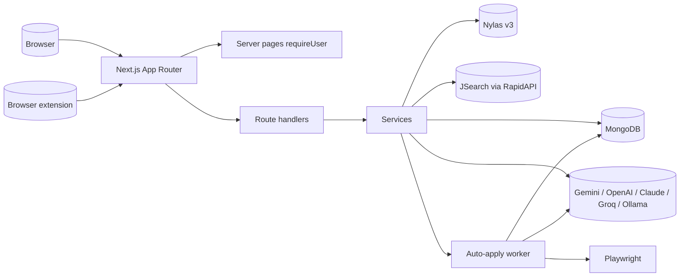

# Feature Development Plan — Tech Stack

## Source studied (Rule 12)

- [docs/Next_Phase1.docx](../docs/Next_Phase1.docx) — Recommended Technology Stack.
- [docs/Next_Phase2.docx](../docs/Next_Phase2.docx) § Task 17 — Suggested Tech Stack.

---

## Step 1 — What is the feature

**a.** Documents the chosen runtime, frameworks, libraries, and SaaS this project uses, plus what's deferred. The docs propose a multi-app architecture (`apps/frontend` + `apps/backend` + microservices); the implemented architecture diverges (and intentionally so): a single Next.js App Router project where route handlers ARE the backend. This plan reconciles the two.

**b. Source citation (docs/Next_Phase2.docx § Task 17):**
> Frontend: Next.js, TypeScript, Redux Toolkit, Tailwind CSS · Backend: Node.js, Express.js · Database: PostgreSQL, MongoDB · Authentication: JWT, Nylas OAuth · AI: Gemini API, OpenAI API · Queue: BullMQ, Redis, Cron Jobs · File Storage: AWS S3, Cloudinary.

**c. Status: Built (with divergences from docs — intentional).**

---

## Step 2 — Pages

N/A.

---

## Step 3 — Stack reconciliation

| Layer        | docs/Next_Phase2 proposal      | Implemented choice                                       | Why                                                                                            |
|--------------|--------------------------------|----------------------------------------------------------|------------------------------------------------------------------------------------------------|
| Framework    | Next.js + separate Express     | **Next.js 15 App Router (route handlers = backend)**     | Single deploy; fewer moving parts; route handlers cover every requirement so far.              |
| Language     | TypeScript                     | **TypeScript**                                           | Same.                                                                                          |
| State mgmt   | Redux Toolkit                  | **React 19 + Server Components + small client hooks**    | Server-component-first reduces client state; Redux unnecessary at current scope.               |
| Styling      | Tailwind CSS                   | **CSS Modules + CSS-variable design tokens**             | Avoids utility-class proliferation; primitives + tokens keep concerns local.                   |
| DB           | PostgreSQL OR MongoDB          | **MongoDB + Mongoose**                                   | Schema is document-friendly (resumes, match artifacts, nested Q&A); easy to evolve.            |
| Auth         | JWT + Nylas                    | **HS256 JWT in HttpOnly `aja_session` + Nylas OAuth**    | Same.                                                                                          |
| AI providers | Gemini + OpenAI                | **Gemini + OpenAI + Claude + Groq + (Ollama planned)**   | More provider choice for users (Task 4).                                                       |
| Queue        | BullMQ + Redis                 | **Deferred — phase 3/4**                                 | Phase 1 needs no queue; auto-apply will introduce it.                                          |
| Cron         | Cron jobs                      | **Deferred**                                             | Same.                                                                                          |
| File storage | AWS S3 / Cloudinary            | **Deferred — currently raw resume text stored inline**   | Object storage arrives with auto-apply (need to attach actual PDF). See [plan/07 OQ1](07-ai-email-generator.md). |
| Email infra  | (not specified)                | **Nylas v3 SDK** for OAuth + send                        | One vendor for both Gmail + Outlook.                                                           |
| Encryption   | (not specified)                | **AES-256-GCM via [secretBox.ts](../src/server/crypto/secretBox.ts)** | User-provided API keys.                                                       |
| Resume parse | (not specified)                | **pdf-parse + mammoth**                                  | PDF + DOCX support.                                                                            |
| Validation   | (not specified)                | **zod + zod-to-json-schema** (LLM structured output)     | One library for HTTP validation + LLM schemas.                                                 |

---

## Step 4 — Database schema

N/A — see [plan/18](18-database-schema.md).

---

## Step 5 — Auth guard / cross-cutting identification

N/A.

---

## Step 6 — Routes

N/A.

---

## Step 7 — Components

N/A.

---

## Step 8 — Third-party integrations

Consolidated list of all third-party dependencies the project depends on (after all 19 plans land):

```
### Runtime
- Node.js 20.x

### Framework
- next ^15.1
- react / react-dom ^19

### Database
- mongoose ^8.9
- (Phase 3) redis + bullmq

### Auth
- jsonwebtoken ^9 + bcryptjs ^2
- nylas ^8.1 (v3 SDK)

### LLM
- @google/genai ^1
- openai ^6 (covers OpenAI + Groq)
- @anthropic-ai/sdk ^0.99 (Claude)
- (Ollama is plain fetch)

### File processing
- pdf-parse ^1.1
- mammoth ^1.8

### Validation
- zod ^3.24 + zod-to-json-schema ^3.24

### Browser automation (plan/12)
- playwright (NEW)

### HTML parsing (plan/05)
- cheerio (NEW)

### Edit distance (plan/13)
- fast-levenshtein (NEW)

### Logging (optional, plan/14)
- winston + winston-daily-rotate-file

### Env validation
- zod schema in src/lib/env.ts
```

### Env vars catalog (after all plans land)

```
# Required today
MONGODB_URI
JWT_SECRET
ENCRYPTION_KEY
GEMINI_API_KEY
GEMINI_MODEL
NYLAS_API_KEY
NYLAS_CLIENT_ID
NYLAS_API_URI
APP_URL

# Added by plans
AUTO_APPLY_ENABLED          # plan/12
PLAYWRIGHT_HEADLESS         # plan/12
AUTO_APPLY_SCREENSHOT_DIR   # plan/12

# Phase 3
REDIS_URL                   # plan/19
S3_BUCKET_NAME              # plan/19
S3_ACCESS_KEY               # plan/19
S3_SECRET_KEY               # plan/19
```

---

## Step 9 — Architecture decision record



---

## Step 10 — When to revisit choices

- **PostgreSQL** instead of MongoDB if: needs heavy relational reporting, or admin requires SQL-friendly tooling. Not now.
- **Tailwind** if: design system grows to >50 primitives and tokens become unwieldy. Not now.
- **Redux Toolkit** if: cross-page client state grows complex (more than a handful of unrelated hooks). Not now.
- **Separate backend (Express)** if: a service needs to scale independently or run on a different lifecycle (e.g. long-running scrapers). Auto-apply is the trigger — see [plan/12 OQ1](12-auto-apply-system.md).
- **BullMQ + Redis** when: auto-apply runs queue more than ~10 jobs at once.

---

## Step 11 — Output folder structure

N/A — see [plan/15](15-backend-architecture.md) and [plan/16](16-frontend-architecture.md).

---

## Open questions

1. Should we hard-pin Node 20 (LTS) via `engines` in package.json? Recommended yes.
2. Tailwind: keep deferred, or add later for marketing pages only? Recommended: keep deferred uniformly.
3. Cloudinary vs S3 for storage? Recommended S3 (open standard, cheaper at scale, integrates with Nylas attachment uploads).
