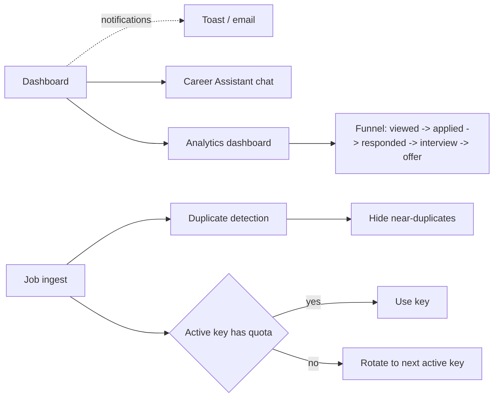

# Feature Development Plan — Future Enhancements

## Source studied (Rule 12)

- [docs/Next_Phase1.docx](../docs/Next_Phase1.docx) — Conclusion + MVP Roadmap.
- [docs/Next_Phase2.docx](../docs/Next_Phase2.docx) § Task 19 — Future Enhancements.

---

## Step 1 — What is the feature

**a.** Backlog of "nice-to-have" features and Phase 3/4 work. Each is captured here as a stub — when one is picked up, run `/feature-plan <name>` to generate a full plan in `plan/<slug>.md`.

**b. Source citation (docs/Next_Phase2.docx § Task 19):**
> AI Resume Optimization · AI Cover Letter Generator · AI Interview Preparation · Browser Extension Auto-fill · ATS Score Checker · Multi-language Applications · Smart API Rotation · Real-time Notifications · Duplicate Job Detection · AI Career Assistant · Analytics Dashboard · Application Success Tracking.

**c. Status: Mostly built (audit below).**

---

## Step 2 — Backlog audit

| # | Item                              | Status   | Notes |
|---|-----------------------------------|----------|-------|
| 1 | AI Resume Optimization            | Built    | [services/llm/tailorResume.ts](../src/server/services/llm/tailorResume.ts) — per-job ATS optimization. |
| 2 | AI Cover Letter Generator         | Built    | [services/llm/generateCoverLetter.ts](../src/server/services/llm/generateCoverLetter.ts) — Markdown letter per job. |
| 3 | AI Interview Preparation          | Built    | [services/llm/generateInterviewQuestions.ts](../src/server/services/llm/generateInterviewQuestions.ts) + [/jobs/[id]/interview](../src/app/jobs/[id]/interview/page.tsx). |
| 4 | Browser Extension Auto-fill       | Built    | [browser-extension/](../browser-extension/) — content script + popup. |
| 5 | ATS Score Checker                 | Built    | [services/llm/atsScoreResume.ts](../src/server/services/llm/atsScoreResume.ts) + [/api/resume/ats](../src/app/api/resume/ats/route.ts) + [_components/AtsCheckPanel.tsx](../src/app/resume/_components/AtsCheckPanel.tsx). |
| 6 | Multi-language Applications        | New      | Stub below. |
| 7 | Smart API Rotation                | New      | Stub below. |
| 8 | Real-time Notifications           | New      | Stub below. |
| 9 | Duplicate Job Detection            | Partial  | Existing dedup via `externalId` + `(title, company)` partial index ([Job.ts](../src/server/models/Job.ts)). Could add fuzzy URL canonicalization. |
| 10 | AI Career Assistant               | New      | Stub below. |
| 11 | Analytics Dashboard               | Partial  | User stats via [getUserStats](../src/server/services/stats/getUserStats.ts); admin via [getAdminStats](../src/server/services/stats/getAdminStats.ts). Learning insights — see [plan/13](13-smart-learning.md). |
| 12 | Application Success Tracking      | Partial  | `Match.status` + `statusHistory` cover the pipeline; no "outcome" reporting page yet. |

---

## Step 3 — User Journey



---

## Step 4–10 — Per-item stubs

### S6. Multi-language Applications
- Detect job-posting language (Gemini `generateJson` with `{ languageCode }`).
- Translate user's resume + Q&A on the fly into the detected language before applying.
- Storage: add `defaultLanguage` to `User`; cache translated Q&As keyed by `(qnaId, languageCode)`.
- LLM functions: `services/llm/detectLanguage.ts` + `services/llm/translate.ts`.

### S7. Smart API Rotation
- When an active LLM provider key fails (rate-limit / invalid), automatically rotate through other `aiproviders` rows for that user (preserving last-known-good order).
- Schema change: `AiProvider.lastErrorAt` + `failureCount`.
- Service: extend [resolver.ts](../src/server/services/llm/resolver.ts) to accept a fallback list.
- Similarly for `JsearchKey`: support multiple keys per user (drop unique constraint on `userId`; add unique on `(userId, lastFour)`).

### S8. Real-time Notifications
- Email digests via Nylas (already wired).
- In-app via Server-Sent Events at `/api/notifications/stream` (no socket server needed).
- Channels: auto-apply run completed, match status changed, JSearch quota low, suspicious admin signal.
- Storage: `notifications` collection: `{ userId, channel, payload, readAt, createdAt }`.

### S9. Duplicate Job Detection (extended)
- Add URL canonicalization (strip tracking params) and a `urlHash` index on `Job`.
- Add fuzzy `(company, title)` blocking with normalized lowercased keys.
- Service: `services/jobs/dedupe.ts` runs after `ingestJobs`; merges duplicates by promoting the earliest `postedAt`.

### S10. AI Career Assistant
- Conversational sidebar — given resume + matches + saved Q&As, answer career questions ("What should I improve to land senior backend roles?").
- LLM function: `services/llm/careerAssistant.ts` (streaming SSE).
- Storage: `careerThreads` collection (turns appended).
- Page: `/career` (new).

### S11/S12. Analytics + Application Success Tracking
- Dashboard already shows counters. Add funnel view per stage of `Match.status` (`new → tailored → applied → responded → interview → offer`).
- Time-to-event metrics: median days `applied → responded`, conversion rates.
- Page: `/dashboard/funnel` (new sub-route).
- Service: `services/stats/getFunnelStats.ts`.

---

## Step 11 — Phase 3/4 infrastructure stubs

When the auto-apply queue and notifications need real workers, the infrastructure plan:

```
### Redis + BullMQ (NEW)
- redis ^4 + bullmq ^5
- Env: REDIS_URL
- Queues:
  - autoApplyRuns        (concurrency 1 per user)
  - emailDigests         (cron: daily 09:00 user-tz)
  - jobIngest            (cron: every 30 min per active platform)
- Worker process: scripts/worker.ts launched alongside next dev / next start
- Pattern: BullMQ Job data refers to a Mongo doc by id; never embeds large payloads in the queue

### Object storage (NEW)
- AWS S3 via @aws-sdk/client-s3
- Env: S3_BUCKET_NAME, S3_ACCESS_KEY, S3_SECRET_KEY, S3_REGION
- Used for: original resume file, auto-apply screenshots, generated PDFs
- Service: services/storage/s3.ts — putObject, getSignedUrl

### Email digests + transactional notifications
- Reuses Nylas v3 send
- Templates in services/notifications/templates/* (handlebars-style)
```

---

## Open questions

1. **Smart API Rotation: cost vs reliability.** Rotating providers silently means costs become unpredictable. Recommended: rotate only on hard failure, never on cost; surface "rotated" badge in UI.
2. **Career Assistant: privacy.** Sending the full resume + matches to a third-party LLM each turn is data-heavy and PII-sensitive. Recommended: gate behind explicit consent; cap context window.
3. **Application Success Tracking: how do we detect a "responded" job?** Manual marking in UI is the simplest. Optional Phase 4: scan inbox for replies via Nylas messages.list filtered to the company domain.
4. **Funnel granularity: per-source?** Recommended yes — useful to see which platform converts best.
