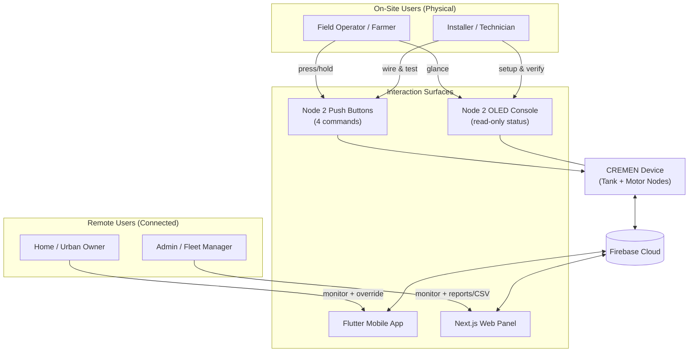
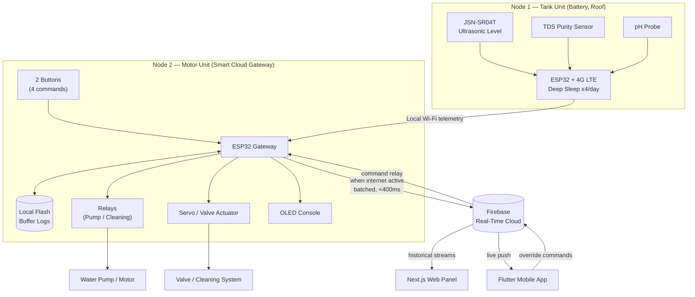

# CREMEN Smart Water IoT Ecosystem — Documentation

> **Project Core:** Dual-Node Local Wi-Fi Control with Full-Stack Cloud Sync
> **Markets:** India — Agricultural (Frugal Retrofit) & Urban (Advanced Infrastructure)
> **System Revision:** 2026.05.29-FINAL
> **Spec format:** `.cdcos` (Central Device Cloud Operating Specification)

---

## 1. System Overview

CREMEN is a two-node smart water management system that automates a water tank and its pump/motor over local Wi-Fi, while syncing all telemetry to the cloud for remote monitoring and control.

1. **Tank Node (Node 1)** — battery-powered sensor unit mounted on the roof/tank. Reads water level, purity, and chemistry; sends data over local Wi-Fi.
2. **Motor Node (Node 2)** — mains-powered **Smart Cloud Gateway**. Switches the relays, drives the valve/cleaning system, shows local status on an OLED, buffers data to flash, and syncs to Firebase.
3. **Cloud + Apps** — Firebase real-time database feeds a **Next.js Web Panel** and a **Flutter Mobile App**.

---

## 2. System Evolution Strategy

### 2.1 Local Persistent Buffering (Fail-Safe Storage)
- Telemetry is written directly to the Motor ESP32's **internal non-volatile flash file system**.
- If the home internet/router drops offline, reports are **safely buffered in local hardware storage** so no data is lost.

### 2.2 Asynchronous Cloud Sync (Reporting Engine)
- When internet connectivity is active, the Gateway **packages accumulated logs and batches them to Firebase**.
- Provides historical data streams to the Next.js Web Panel.
- Updates the Flutter App in **under 400 ms**.

### 2.3 Single-Use Industrial Battery System
- Node 1 sits on open roofs where **power sockets are absent**.
- Uses **Lithium Thionyl Chloride (Li-SOCl₂)** chemistry + a **supercapacitor** for pulse loads.
- Extreme **Deep Sleep** rules — wakes only **4 times a day**.
- Runs **2–3 years** without external cords or solar panels.

---

## 3. Product Models

The system ships in two market-specific variants. **Node 1 (Tank Unit) is identical in both models** — only Node 2 (control strategy) differs.

### 3.1 Model A — Frugal Retrofit Framework (Agricultural / Village)
- **Motor Control (Pulse Method):** Two 5 V signal relays wired in parallel inside the existing manual starter box (Green/Red buttons). A **1-second pulse** "presses" the button safely without handling heavy current.
- **Valve Control (Clamp-On Actuator):** An **MG996R metal-gear servo** clamps over the existing manual PVC ball valve handle and rotates it 90° — no pipe cutting.
- **Cleaning Strategy (Bottom Siphon Flush):** A perforated PVC pipe on the tank floor. When turbidity flags mud, the servo opens the valve for **45 seconds**; water weight creates a vacuum siphon that flushes silt **without pump power and without emptying the tank**.

### 3.2 Model B — Premium Advanced Grid (Urban Residential)
- **Motor Control (Direct Switching):** Bypasses legacy panels; runs the pump's **direct AC mains** through a **30 A power relay**.
- **Valve Control (Inline Actuator):** A commercial **12 V motorized inline valve** built straight into the pipe.
- **Cleaning Strategy (Active Closed Filter Loop):** **100% zero water wastage.** When turbidity registers mud, a relay starts a **12 V DC circulation pump** that pulls muddy water from the bottom, runs it through an external filter box (sand, mesh, activated charcoal), and returns clean water to the top.

---

## 4. Node 2 — User Interface & Manual Override Timings

Two physical push buttons execute **four unique commands**, instantly overriding automation rules:

| Button | Action | Result |
|--------|--------|--------|
| **Button 1 — Pump Master** | Quick single click | Instant **SHUTDOWN** pulse — pump OFF |
| | Long press (hold 2s) | Override sensor rules — force pump **ON** |
| **Button 2 — Mud Cleaner Captain** | Quick single click | Cancel/cut off active cleaning cycle |
| | Long press (hold 2s) | Override turbidity rules — trigger **45 s flush** |

---

## 5. Software Interface Specifications

### 5.1 Local OLED Screen Layout (6 lines)
1. **Header:** `--- CREMEN SMART WATER ---`
2. **Tank Volumetric Graph:** loading bar + live capacity %
3. **Water Purity Row:** live TDS purity output (PPM)
4. **Chemical Metric Row:** evaluated pH acidity status
5. **Conditional Status:** alternates `ALERT: MUD!` / `STATUS: OPTIMAL`
6. **Actuator State Grid:** Pump (ON/OFF) + Cleaning System (ACTIVE/READY)

### 5.2 Next.js Web Control Application
- **Header Module:** global network identity keys, dynamic sync-status timestamps, connectivity signal lights.
- **Telemetry Matrix Cards:** high-contrast gauges/block charts for live Water Level, TDS, and pH.
- **Reporting Engine:** aggregates historical cloud logs into **downloadable CSV** sheets (cumulative monthly motor runtime + sensor health trends).

### 5.3 Flutter Mobile Application
- **Real-Time Level Gauge:** progress bar + bold % text for current fluid level.
- **Water Purity Log Card:** live water-hardness and chemical-safety metrics.
- **Manual Ignition Override Button:** high-visibility CTA to send emergency motor stop/start commands over the cloud.

---

## 6. Cloud & Hosting (Cost = ₹0 / month)

| # | Service | Tier / Allocation |
|---|---------|-------------------|
| 1 | **Google Firebase** (Real-time DB) | Free — 1 GiB storage, 50,000 reads + 20,000 writes/day |
| 2 | **Firebase Authentication** | Free — up to 50,000 Monthly Active Users |
| 3 | **Vercel Core** (Next.js host) | Free Hobby tier — global edge CDN |
| 4 | **Domain (GoDaddy/Hostinger)** | ~₹600 / year |
| 5 | **Google Play Console** | ~₹2,100 one-time |

**Total ongoing software cost: ₹0 / month.**

---

## 7. Cost Summary

| Model | Node 1 (Tank) | Node 2 (Control) | **Total** |
|-------|--------------:|-----------------:|----------:|
| **Model A** — Frugal Retrofit | ₹3,740 | ₹1,310 | **₹5,050** |
| **Model B** — Premium Urban | ₹3,740 | ₹2,490 | **₹6,230** |

---

## 8. Diagram — User-Wise View

Shows who interacts with the system and through which surface.



**Roles**
- **Field Operator / Farmer** — uses physical buttons + OLED at the panel (works even with no internet).
- **Installer / Technician** — wires nodes, tests relays/valve, confirms OLED readings during commissioning.
- **Home / Urban Owner** — monitors live levels & purity, sends manual stop/start from the Flutter app.
- **Admin / Fleet Manager** — uses the Web Panel for telemetry gauges + downloadable CSV reports.

---

## 9. Diagram — End-to-End Telemetry Flow



**Flow summary**
1. Tank Node reads level/TDS/pH → sends over **local Wi-Fi** to the Motor Node.
2. Motor Node drives **relays, valve, OLED** locally and **writes backup logs to flash**.
3. When internet is up, the Gateway **batches logs to Firebase** (<400 ms updates).
4. Firebase fans out to the **Web Panel** (history/CSV) and **Mobile App** (live).
5. App/Web **override commands** travel back through Firebase to the Gateway.

---

## 10. Detailed Component List

### 10.1 Node 1 — Tank Unit (identical in Model A & B) — ₹3,740

| Component | Spec / Role | Cost |
|-----------|-------------|-----:|
| ESP32-WROOM-32D Dev Board | Main MCU; reads sensors, manages deep sleep | ₹400 |
| A7670C 4G LTE Breakout | Cloud-ready cellular uplink | ₹1,160 |
| ER14505 3.6V Li-SOCl₂ Battery (AA) | High-density single-use industrial cell | ₹250 |
| SPC1520 Supercapacitor / HLC Pulse Pack | Handles transmit pulse current spikes | ₹180 |
| JSN-SR04T Waterproof Ultrasonic Sensor | Measures tank water level | ₹450 |
| Analog TDS Sensor Module | Total Dissolved Solids (purity, PPM) | ₹350 |
| Analog pH Probe Assembly Kit | Water acidity / chemical safety | ₹300 |
| 12V DC ½" Latching Pulse Solenoid Valve | Low-power latching valve | ₹650 |

### 10.2 Node 2 — Model A (Agricultural Panel) — ₹1,310

| Component | Spec / Role | Cost |
|-----------|-------------|-----:|
| ESP32-WROOM-32D Dev Board | Gateway MCU + cloud sync + buffering | ₹400 |
| 0.96" I2C SSD1306 OLED | Local 6-line status display | ₹220 |
| Rugged Tactile Micro-Switches | 2 physical override buttons | ₹20 |
| 2-Channel 5V Low-Level Relay | Pulse-press existing starter buttons | ₹120 |
| MG996R Metal-Gear Servo | Clamp-on valve actuator (90° rotation) | ₹300 |
| 5V 3A Heavy-Duty Wall Adapter | Mains power supply | ₹250 |

### 10.3 Node 2 — Model B (Urban Panel) — ₹2,490

| Component | Spec / Role | Cost |
|-----------|-------------|-----:|
| ESP32-WROOM-32D Dev Board | Gateway MCU + cloud sync + buffering | ₹400 |
| 0.96" I2C SSD1306 OLED | Local 6-line status display | ₹220 |
| Ring-LED Lit Metallic Push Buttons | 2 premium override buttons | ₹120 |
| 30A High-Power Direct Switching Relay | Switches pump AC mains directly | ₹250 |
| 12V Motorized Inline Valve Actuator | In-pipe water redirection | ₹650 |
| 12V DC Mini Submersible Circulation Pump | Drives closed filter loop | ₹300 |
| DIY Layered Acrylic Filter Box Kit | Sand / mesh / activated charcoal filter | ₹250 |
| 5V/12V Dual Output SMPS Power Board | Dual-rail mains power supply | ₹250 |

### 10.4 Software / Cloud Components

| Component | Role |
|-----------|------|
| Firebase Firestore | Real-time DB + historical log storage |
| Firebase Authentication | User account security (up to 50k MAU) |
| Next.js Web Panel (Vercel) | Desktop dashboard, gauges, CSV reporting |
| Flutter Mobile App | Cross-platform live monitoring + override |
| ESP32 Flash File System | On-device fail-safe telemetry buffer |
```
